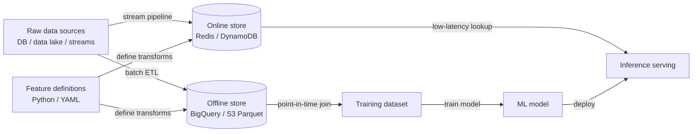

# 特征存储

## 定义

特征存储（feature store）是一种专门用于管理 ML 特征生命周期的数据系统——从原始数据转换，经过存储，到低延迟服务——并在模型训练和生产推断之间保持一致。没有特征存储，团队通常会遇到**训练-服务偏差（training-serving skew）**：在训练期间离线执行的特征计算逻辑与服务时使用的逻辑存在细微差异，导致生产模型相对于离线评估表现不佳。

特征存储通过将特征定义存储为代码，并在两种上下文中运行相同的转换逻辑来解决这个问题。它们维护两个互补的存储层：**离线存储**（数据仓库或数据湖，例如 BigQuery、Redshift、S3 上的 Parquet 文件），保存用于训练和批量评分的大型历史数据集；以及**在线存储**（低延迟键值数据库，例如 Redis、DynamoDB、Cassandra），在推断时以毫秒以下的延迟向模型提供预计算的特征值。

训练-服务偏差问题和特征复用需求在规模化时变得尤为突出。一个大型组织可能有数十个团队各自独立计算类似特征（最近 7 天的客户消费、会话时长、设备类型），且业务逻辑存在细微差异。特征存储提供一个有治理的目录，特征在其中被定义一次、验证并跨团队和模型复用，从而大幅减少重复的工程工作和特征逻辑不一致的风险。

## 工作原理

### 特征定义和转换管道

特征被定义为代码——Python 类或 YAML 清单——指定数据源、转换逻辑以及实体键（用于查找特征的标识符，例如 `user_id`、`product_id`）。批量转换管道按计划运行，将特征物化到离线存储中。流式转换管道（例如使用 Flink 或 Spark Structured Streaming）为实时欺诈信号等时间敏感的特征保持在线存储的新鲜度。

### 离线存储：训练数据检索

训练模型时，通过提供实体键列表和一组时间戳（"时间点连接"）来生成数据集。特征存储检索每个时间戳时刻正确的特征值，避免未来数据泄露（data leakage）。这种时间点正确性（point-in-time correctness）是没有特征存储时最难正确实现的事情之一，也是它提供的最有价值的保证之一。

### 在线存储：低延迟服务

在模型服务预测之前，它需要被评分实体（例如发出请求的用户）的特征值。特征存储客户端通过实体键查询在线存储，并在毫秒内返回特征向量。由于相同的特征定义支撑着离线和在线存储，这些值被保证以完全相同的方式计算。

### 特征注册表与治理

特征目录记录每个特征：其定义、所有者、数据类型、新鲜度保证以及哪些模型使用它。这个治理层支持可发现性——新团队可以在编写自己的特征之前浏览现有特征——以及影响分析——了解如果特征的上游数据源发生变化，哪些模型会受到影响。

### 物化作业

物化是运行转换管道并将结果写入存储的过程。离线物化作为定时批处理作业运行。在线物化将离线数据的子集复制到在线存储以便快速检索，或在需要实时新鲜度时由流式管道驱动。Feast、Tecton 和 Hopsworks 都提供 CLI 命令或编排集成来触发和监控物化。



## 何时使用 / 何时不使用

| 适合使用 | 避免使用 |
|----------|------------|
| 多个团队或模型共享相同的特征逻辑且一致性至关重要 | 只有一个模型，特征集小且稳定，从不更改 |
| 训练-服务偏差已导致生产事故或精度差距 | 推断延迟要求宽松且批量评分已足够 |
| 需要时间点正确的训练数据集以避免数据泄露 | 运行特征存储的工程开销超过项目规模的价值 |
| 特征必须以毫秒以下的延迟服务于实时预测 | 你处于早期探索阶段，特征还不够稳定以至于无法正式化 |
| 法规要求需要有治理的、可审计的特征目录 | 数据科学团队规模小且缺乏管理基础设施的 ML 工程支持 |

## 工具比较

| 标准 | Feast | Tecton | Hopsworks |
|-----------|-------|--------|-----------|
| 开源 | 是（Apache 2.0） | 否（SaaS/托管） | 核心开源；企业版付费 |
| 托管服务 | 否（仅自托管） | 是（完全托管） | 是（云或本地部署） |
| 流式特征 | 有限（通过 Kafka 源） | 原生，生产级 | 原生，支持 Flink 集成 |
| 特征监控 | 基础 | 高级（内置漂移检测） | 高级 |
| 最适合 | 需要开源控制的团队 | 需要托管实时特征的企业 | 需要全栈开源的团队 |

## 优缺点

| 优点 | 缺点 |
|------|------|
| 通过共享转换逻辑消除训练-服务偏差 | 设置和运营需要大量工程投入 |
| 支持跨团队特征复用，减少重复工作 | 向服务路径添加了运营依赖（在线存储可用性） |
| 时间点连接防止训练数据中的数据泄露 | 如果治理过于僵化，特征定义可能成为瓶颈 |
| 集中特征治理和文档 | 对不熟悉该抽象的数据科学家有学习曲线 |
| 支持批量和实时特征服务 | 对于特征数量少且特征稳定的团队来说大材小用 |

## 代码示例

```python
# feast_feature_store_example.py
# Demonstrates defining, materializing, and retrieving features with Feast.
# Prerequisites:
#   pip install feast pandas scikit-learn
#   feast init my_feature_repo && cd my_feature_repo
#   (Adjust the data source path below to match your environment.)

# ── feature_repo/features.py ──────────────────────────────────────────────────
# This file defines the feature views and entities in your Feast registry.

from datetime import timedelta
import pandas as pd
from feast import (
    Entity,
    FeatureStore,
    FeatureView,
    Field,
    FileSource,
)
from feast.types import Float32, Int64

# 1. Define the entity — the primary key used to look up features
driver = Entity(
    name="driver",
    description="A taxi driver identified by driver_id",
)

# 2. Define the data source (parquet file for local demo; swap for BigQuery etc.)
driver_stats_source = FileSource(
    path="data/driver_stats.parquet",   # generated below
    timestamp_field="event_timestamp",
    created_timestamp_column="created",
)

# 3. Define a FeatureView — the transformation and storage spec
driver_stats_fv = FeatureView(
    name="driver_hourly_stats",
    entities=[driver],
    ttl=timedelta(days=7),              # how long features stay valid
    schema=[
        Field(name="conv_rate", dtype=Float32),
        Field(name="acc_rate", dtype=Float32),
        Field(name="avg_daily_trips", dtype=Int64),
    ],
    online=True,                        # materialize to online store
    source=driver_stats_source,
)


# ── generate_sample_data.py ───────────────────────────────────────────────────
# Run this once to create sample data before materializing.
def generate_driver_stats(path: str = "data/driver_stats.parquet") -> None:
    import os
    os.makedirs("data", exist_ok=True)

    rng = pd.date_range(end=pd.Timestamp.now(tz="UTC"), periods=48, freq="h")
    df = pd.DataFrame({
        "driver_id": [1001, 1002, 1003] * 16,
        "event_timestamp": list(rng[:48]),
        "created": pd.Timestamp.now(tz="UTC"),
        "conv_rate": [0.8, 0.6, 0.9] * 16,
        "acc_rate": [0.95, 0.88, 0.92] * 16,
        "avg_daily_trips": [150, 200, 175] * 16,
    })
    df.to_parquet(path, index=False)
    print(f"Sample data written to {path}")


# ── training_data_retrieval.py ────────────────────────────────────────────────
# Retrieve a point-in-time correct training dataset.
def get_training_data(repo_path: str = ".") -> pd.DataFrame:
    store = FeatureStore(repo_path=repo_path)

    # Entity DataFrame: the entities and timestamps we want features for
    entity_df = pd.DataFrame({
        "driver_id": [1001, 1002, 1003],
        "event_timestamp": [
            pd.Timestamp("2024-01-15 10:00:00", tz="UTC"),
            pd.Timestamp("2024-01-15 11:00:00", tz="UTC"),
            pd.Timestamp("2024-01-15 12:00:00", tz="UTC"),
        ],
        "label": [1, 0, 1],   # target variable for supervised training
    })

    # Point-in-time join: retrieves feature values as-of each row's timestamp
    training_df = store.get_historical_features(
        entity_df=entity_df,
        features=[
            "driver_hourly_stats:conv_rate",
            "driver_hourly_stats:acc_rate",
            "driver_hourly_stats:avg_daily_trips",
        ],
    ).to_df()

    print("Training dataset:")
    print(training_df.to_string())
    return training_df


# ── online_serving.py ─────────────────────────────────────────────────────────
# Retrieve features for real-time inference after materialization.
def get_online_features(driver_ids: list, repo_path: str = ".") -> dict:
    store = FeatureStore(repo_path=repo_path)

    # Materialize features to the online store first:
    # store.materialize_incremental(end_date=pd.Timestamp.now(tz="UTC"))

    feature_vector = store.get_online_features(
        features=[
            "driver_hourly_stats:conv_rate",
            "driver_hourly_stats:acc_rate",
            "driver_hourly_stats:avg_daily_trips",
        ],
        entity_rows=[{"driver_id": did} for did in driver_ids],
    ).to_dict()

    print("Online feature vector:")
    for key, values in feature_vector.items():
        print(f"  {key}: {values}")
    return feature_vector


# ── main ──────────────────────────────────────────────────────────────────────
if __name__ == "__main__":
    generate_driver_stats()
    # After running `feast apply` to register the feature views:
    # training_df = get_training_data()
    # online_fv   = get_online_features([1001, 1002])
    print("Feature definitions ready. Run `feast apply` to register them.")
```

## 实践资源

- [Feast 文档](https://docs.feast.dev/) — 最广泛使用的开源特征存储的官方文档，包括快速入门、特征视图 API 和部署指南。
- [Tecton – 特征存储概念](https://docs.tecton.ai/docs/introduction/feature-store-concepts) — 来自构建了 Uber Michelangelo 团队的，关于在线/离线存储、时间点连接和特征管道的供应商中立概念概述。
- [Hopsworks 文档](https://docs.hopsworks.ai/) — 具有原生 Flink 流式处理、特征监控和模型注册表的全栈特征存储。
- [Feature Store for ML – O'Reilly](https://www.featurestore.org/) — 汇聚特征存储设计模式研究、博客文章和演讲的社区资源。
- [Chip Huyen – ML 系统的特征工程](https://huyenchip.com/2022/01/02/real-time-machine-learning-challenges-and-solutions.html) — 深入探讨实时特征计算的工程挑战以及特征存储如何解决这些问题。

## 另请参阅

- [MLOps](/docs/mlops)
- [MLflow](/docs/mlops/mlflow)
- [实验追踪（Experiment tracking）](/docs/mlops/experiment-tracking)
