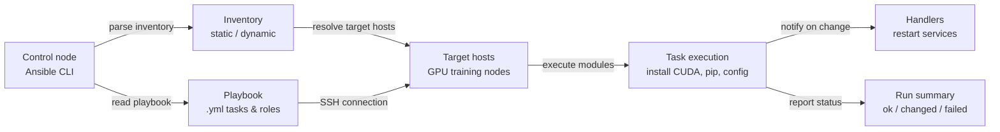

# Ansible

## 定义

Ansible 是由 Red Hat 创建的开源自动化工具，通过简单的、人类可读的 YAML 文件（称为 **playbook**）在服务器群中处理配置管理、应用部署和任务自动化。其决定性的架构选择是**无代理**（agentless）：Ansible 通过 SSH（Linux）或 WinRM（Windows）连接到被管理节点并直接执行任务，目标机器上不需要守护进程或代理软件。与基于代理的工具相比，这使得采用变得显著更容易——你可以开始管理现有服务器，而无需在目标机器上预安装任何软件，除了 Python 和 SSH 服务器。

Ansible 采用**推送模型**：操作员从控制节点运行 playbook，Ansible 连接到目标主机清单并按顺序执行任务。任务调用**模块**——幂等的工作单元，知道如何安装包、管理文件、启动服务、运行命令以及与云 API 交互。社区和官方模块几乎涵盖了每个 Linux 包管理器、服务、云提供商、网络设备和应用程序。Role 将相关任务、文件、模板和变量捆绑成可重用的、可共享的单元，可以发布到 Ansible Galaxy 或在内部 Git 仓库中维护。

在 ML 和数据工程场景中，Ansible 填补了 [Terraform](/docs/mlops/iac/terraform) 留下的空白。Terraform 提供基础设施（创建 GPU 实例、VPC、S3 桶）；Ansible 配置在该基础设施上运行的内容（安装正确的 CUDA 版本、配置 Python 环境、设置分布式训练依赖项，并确保 GPU 监控工具在运行）。这两个工具是互补的而非竞争的：典型的 MLOps 工作流使用 Terraform 提供云资源，使用 Ansible 将这些资源引导到训练就绪状态。

## 工作原理

### 清单（Inventory）

清单定义 Ansible 管理哪些主机。静态清单是一个 INI 或 YAML 文件，按角色列出主机名或 IP 地址（例如 `[gpu_training_nodes]`、`[model_serving]`）。动态清单在运行时查询云 API（AWS EC2、GCP Compute、Azure VMs）从实时基础设施构建主机列表——对于自动扩缩容环境至关重要。主机和组变量定义在 playbook 中引用的每主机或每组配置值。

### Playbook 和任务

Playbook 是包含一个或多个 **play** 的 YAML 文件。每个 play 针对一组主机和一个**任务**列表。每个任务用参数调用一个模块，并可选地定义条件（`when`）、循环（`loop`）和在变更时触发的 handler。任务在 play 中按顺序执行；play 可以跨主机并行运行。每个任务的结果是以下之一：`ok`（不需要变更）、`changed`（做了变更）、`failed` 或 `skipped`。Ansible 在每次 playbook 运行后打印这些结果的摘要。

### Role

Role 提供了一种标准化的目录结构来组织相关自动化：`tasks/`、`handlers/`、`templates/`、`files/`、`vars/`、`defaults/` 和 `meta/`。Role 可以应用于多个 playbook 中的多个 play，并且 role 可以依赖其他 role。Ansible Galaxy 托管了数千个社区 role（例如 `geerlingguy.docker`、`nvidia.nvidia_driver`），可以用 `ansible-galaxy install` 安装并直接在 playbook 中使用。

### 变量和模板

Ansible 在整个 playbook 和模板文件中使用 Jinja2 模板引擎。变量可以在多个级别定义（role 默认值、组变量、主机变量、playbook 变量、用 `-e` 传递的额外变量），有明确的优先级顺序。模板（`.j2` 文件）动态生成配置文件——例如，为每个环境生成具有正确主节点 IP、GPU 数量和批量大小的分布式训练配置文件。

### 幂等性和 handler

Ansible 模块被设计为幂等的：多次运行 playbook 会产生相同的最终状态，不会产生意外的副作用。如果包已经以正确版本安装，任务报告 `ok` 并不做任何操作。**Handler** 是特殊任务，只有在 play 结束时被 `changed` 状态的任务通知才会运行——用于仅在配置实际更改时重启服务（例如 CUDA 加速训练守护进程）。



## 何时使用 / 何时不使用

| 适合使用 | 避免使用 |
|----------|------------|
| 在现有服务器上配置软件：安装 CUDA、Python、pip 包、系统服务 | 从零开始提供新的云基础设施（为此使用 Terraform） |
| 在 Terraform 创建 GPU 训练节点后引导它们 | 需要跨数百个资源的细粒度状态追踪（Ansible 没有状态文件） |
| 跨开发、暂存和生产机器设置一致的 ML 环境 | 需要云资源之间具有自动排序的复杂依赖图 |
| 在服务器群中运行临时命令（例如，在所有地方更新配置文件） | 无法通过 SSH 或 WinRM 从控制节点访问目标机器 |
| 部署应用更新或跨多个节点推出配置更改 | 你正在提供云原生资源（VPC、IAM 角色、S3 桶）——使用 Terraform |
| 需要低门槛 IaC 工具，YAML 学习曲线浅的团队 | 需要非常快速的并行执行；Ansible 的 SSH 开销限制了数千个节点时的可扩展性 |

## 比较

| 标准 | Ansible | Terraform |
|-----------|---------|-----------|
| 范式 | 具有幂等模块的过程式——任务按顺序运行 | 声明式——描述期望状态，Terraform 计算差异 |
| 状态管理 | 无状态——没有内置的前次应用追踪 | 显式状态文件将配置映射到真实资源 ID |
| 主要用例 | 现有主机上的配置管理和软件部署 | 云基础设施提供（实例、网络、存储） |
| 云提供商支持 | 云模块存在，但不如 Terraform 提供商全面 | 1000+ 个提供商，具有深入的版本化 API 覆盖 |
| 幂等性 | 任务级——每个模块必须以幂等方式编写 | 原生——plan/apply 始终收敛到声明状态 |
| 学习曲线 | 低——YAML 任务可读；不需要学习新语言 | 中等——HCL 语法 + 状态/计划思维模型 |
| 需要代理 | 否——无代理，通过 SSH 连接 | 否——Terraform 在控制机器上运行，调用云 API |
| 何时一起使用 | Ansible 配置 Terraform 已提供的基础设施上的软件 | Terraform 提供资源；Ansible 处理 OS 和应用配置 |

## 优缺点

| 方面 | 优点 | 缺点 |
|--------|------|------|
| 无代理架构 | 无需在目标节点上安装软件；适用于现有 SSH | SSH 开销在非常大规模（10000+ 节点）时限制性能 |
| YAML playbook | 人类可读，自记录的自动化 | 复杂逻辑（循环、条件）在 YAML 中变得冗长 |
| 幂等模块 | 安全地重复运行；无副作用的漂移修正 | 幂等性取决于模块质量；shell/command 模块本身不是幂等的 |
| Ansible Galaxy | 常见软件的社区 role 大生态系统 | 社区 role 质量参差不齐；固定 role 版本对可重现性至关重要 |
| 无状态文件 | 简单，无状态管理开销 | 运行之间没有内置漂移检测；需要手动或第三方工具 |
| Jinja2 模板 | 强大的动态配置生成 | 模板调试比原生代码更难；错误在运行时才出现 |

## 代码示例

```yaml
# ml_environment_setup.yml
# Ansible playbook to configure a GPU training node for ML workloads.
# Installs CUDA toolkit, cuDNN, Python 3.11, pip packages, and sets up
# a systemd service for the Prometheus node exporter.
#
# Usage:
#   ansible-playbook -i inventory.ini ml_environment_setup.yml
#
# inventory.ini example:
#   [gpu_training_nodes]
#   10.0.1.10 ansible_user=ubuntu ansible_ssh_private_key_file=~/.ssh/ml-key.pem
#   10.0.1.11 ansible_user=ubuntu ansible_ssh_private_key_file=~/.ssh/ml-key.pem

---
- name: Configure GPU training nodes for ML workloads
  hosts: gpu_training_nodes
  become: true  # Run tasks as root via sudo
  vars:
    cuda_version: "12.1"
    python_version: "3.11"
    pip_packages:
      - torch==2.3.0
      - torchvision==0.18.0
      - torchaudio==2.3.0
      - numpy==1.26.4
      - pandas==2.2.2
      - scikit-learn==1.4.2
      - mlflow==2.13.0
      - evidently==0.4.30
      - prometheus-client==0.20.0
    node_exporter_version: "1.8.1"
    ml_user: "mlops"
    ml_workdir: "/opt/ml"

  handlers:
    - name: restart node_exporter
      ansible.builtin.systemd:
        name: node_exporter
        state: restarted
        daemon_reload: true

  tasks:
    # --- System prerequisites ---

    - name: Update apt package cache
      ansible.builtin.apt:
        update_cache: true
        cache_valid_time: 3600  # Skip update if cache is less than 1 hour old

    - name: Install system dependencies
      ansible.builtin.apt:
        name:
          - build-essential
          - git
          - wget
          - curl
          - htop
          - nvtop          # GPU monitoring in terminal
          - python{{ python_version }}
          - python{{ python_version }}-dev
          - python{{ python_version }}-venv
          - python3-pip
        state: present

    # --- CUDA installation ---

    - name: Check if CUDA {{ cuda_version }} is already installed
      ansible.builtin.command: nvcc --version
      register: nvcc_check
      changed_when: false
      failed_when: false

    - name: Add CUDA repository keyring
      ansible.builtin.shell: |
        wget -qO /tmp/cuda-keyring.deb \
          https://developer.download.nvidia.com/compute/cuda/repos/ubuntu2204/x86_64/cuda-keyring_1.1-1_all.deb
        dpkg -i /tmp/cuda-keyring.deb
      when: cuda_version not in (nvcc_check.stdout | default(''))
      args:
        creates: /usr/share/keyrings/cuda-archive-keyring.gpg

    - name: Install CUDA toolkit {{ cuda_version }}
      ansible.builtin.apt:
        name: cuda-toolkit-{{ cuda_version | replace('.', '-') }}
        state: present
        update_cache: true
      when: cuda_version not in (nvcc_check.stdout | default(''))

    - name: Set CUDA environment variables in /etc/environment
      ansible.builtin.lineinfile:
        path: /etc/environment
        line: "{{ item }}"
        state: present
      loop:
        - 'CUDA_HOME=/usr/local/cuda'
        - 'PATH=/usr/local/cuda/bin:$PATH'
        - 'LD_LIBRARY_PATH=/usr/local/cuda/lib64:$LD_LIBRARY_PATH'

    # --- ML user and workspace ---

    - name: Create dedicated ML user
      ansible.builtin.user:
        name: "{{ ml_user }}"
        shell: /bin/bash
        home: "/home/{{ ml_user }}"
        create_home: true
        state: present

    - name: Create ML working directory
      ansible.builtin.file:
        path: "{{ ml_workdir }}"
        state: directory
        owner: "{{ ml_user }}"
        group: "{{ ml_user }}"
        mode: "0755"

    # --- Python virtual environment and packages ---

    - name: Create Python virtual environment
      ansible.builtin.command:
        cmd: python{{ python_version }} -m venv {{ ml_workdir }}/venv
        creates: "{{ ml_workdir }}/venv/bin/python"
      become_user: "{{ ml_user }}"

    - name: Upgrade pip in virtual environment
      ansible.builtin.pip:
        name: pip
        state: latest
        virtualenv: "{{ ml_workdir }}/venv"
      become_user: "{{ ml_user }}"

    - name: Install ML Python packages
      ansible.builtin.pip:
        name: "{{ pip_packages }}"
        virtualenv: "{{ ml_workdir }}/venv"
        state: present
      become_user: "{{ ml_user }}"

    - name: Write requirements.txt for reproducibility
      ansible.builtin.copy:
        dest: "{{ ml_workdir }}/requirements.txt"
        content: "{{ pip_packages | join('\n') }}\n"
        owner: "{{ ml_user }}"
        group: "{{ ml_user }}"
        mode: "0644"

    # --- Prometheus Node Exporter for infrastructure monitoring ---

    - name: Check if node_exporter is already installed
      ansible.builtin.stat:
        path: /usr/local/bin/node_exporter
      register: node_exporter_stat

    - name: Download Prometheus node_exporter {{ node_exporter_version }}
      ansible.builtin.get_url:
        url: "https://github.com/prometheus/node_exporter/releases/download/v{{ node_exporter_version }}/node_exporter-{{ node_exporter_version }}.linux-amd64.tar.gz"
        dest: /tmp/node_exporter.tar.gz
        mode: "0644"
      when: not node_exporter_stat.stat.exists

    - name: Extract and install node_exporter
      ansible.builtin.unarchive:
        src: /tmp/node_exporter.tar.gz
        dest: /tmp
        remote_src: true
      when: not node_exporter_stat.stat.exists

    - name: Copy node_exporter binary to /usr/local/bin
      ansible.builtin.copy:
        src: "/tmp/node_exporter-{{ node_exporter_version }}.linux-amd64/node_exporter"
        dest: /usr/local/bin/node_exporter
        mode: "0755"
        remote_src: true
      when: not node_exporter_stat.stat.exists
      notify: restart node_exporter

    - name: Create node_exporter systemd service
      ansible.builtin.copy:
        dest: /etc/systemd/system/node_exporter.service
        content: |
          [Unit]
          Description=Prometheus Node Exporter
          After=network.target

          [Service]
          User=nobody
          ExecStart=/usr/local/bin/node_exporter \
            --collector.systemd \
            --collector.processes
          Restart=on-failure

          [Install]
          WantedBy=multi-user.target
        mode: "0644"
      notify: restart node_exporter

    - name: Enable and start node_exporter
      ansible.builtin.systemd:
        name: node_exporter
        enabled: true
        state: started
        daemon_reload: true

    # --- Verification ---

    - name: Verify GPU is visible to CUDA
      ansible.builtin.command: nvidia-smi
      register: nvidia_smi_output
      changed_when: false
      failed_when: nvidia_smi_output.rc != 0

    - name: Print GPU info
      ansible.builtin.debug:
        var: nvidia_smi_output.stdout_lines

    - name: Verify PyTorch can see the GPU
      ansible.builtin.command:
        cmd: "{{ ml_workdir }}/venv/bin/python -c \"import torch; print('CUDA available:', torch.cuda.is_available()); print('GPU count:', torch.cuda.device_count())\""
      register: torch_check
      changed_when: false
      become_user: "{{ ml_user }}"

    - name: Print PyTorch GPU availability
      ansible.builtin.debug:
        var: torch_check.stdout_lines
```

## 实践资源

- [Ansible 文档](https://docs.ansible.com/ansible/latest/index.html) — 涵盖 playbook、模块、role、清单和最佳实践的官方文档。
- [Ansible Galaxy](https://galaxy.ansible.com/) — 可重用 Ansible role 和集合的社区中心，包括 NVIDIA GPU 驱动程序、Docker 和 Kubernetes role。
- [Jeff Geerling — Ansible for DevOps](https://www.ansiblefordevops.com/) — 涵盖从基础到生产模式的 Ansible 综合书籍和配套 GitHub 仓库。
- [NVIDIA Ansible 集合](https://github.com/nvidia/ansible-collection-nvidia-gpu) — 用于管理 GPU 驱动程序、CUDA 和 NCCL 安装的官方 NVIDIA Ansible 集合。
- [Ansible 最佳实践指南](https://docs.ansible.com/ansible/latest/tips_tricks/ansible_tips_tricks.html) — 涵盖目录结构、变量管理和性能优化的官方技巧和窍门。

## 另请参阅

- [Terraform](/docs/mlops/iac/terraform)
- [Kubernetes 上的 ML](/docs/mlops/deployment/ml-kubernetes)
- [MLOps](/docs/mlops)
