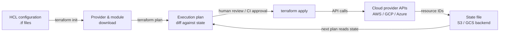

# Terraform

## 定义

Terraform 是由 HashiCorp 创建的开源基础设施即代码（IaC）工具，允许你使用称为 HCL（HashiCorp 配置语言）的声明式配置语言来定义、提供和管理云和本地基础设施。你描述基础设施的期望最终状态——哪些资源应该存在、它们应该如何配置以及它们如何相互关联——Terraform 计算出需要创建、更新或销毁什么才能达到该状态。这种声明式模型与命令式脚本方法根本不同，后者描述要执行的步骤序列。

Terraform 架构的基石是其**提供商**（provider）生态系统。提供商是将 HCL 资源定义转换为针对特定平台的 API 调用的插件：AWS、Google Cloud、Azure、Kubernetes、Datadog、GitHub 等数百种。每个提供商维护自己的版本化发布周期，Terraform 根据 `required_providers` 块自动下载提供商。这意味着单个 Terraform 配置可以同时提供 AWS GPU 训练集群、用于训练数据的 GCS 桶、用于模型服务的 Kubernetes 命名空间和用于监控的 Grafana 仪表板——所有平台使用一致的工具。

**状态管理**（State management）使 Terraform 具有幂等性和可计划性。Terraform 维护一个状态文件，将配置中的每个资源映射到其真实世界的对应物（由云提供商资源 ID 标识）。当你运行 `terraform plan` 时，Terraform 将当前状态文件与你的配置和实时基础设施进行比较，在做任何更改之前生成一个 diff，准确显示将要更改什么。对于团队工作流，状态存储在共享后端（S3、GCS、Terraform Cloud）中，带有锁定以防止并发修改。这种可审计性和可预测性使 Terraform 成为在受监管和协作环境中提供 ML 训练和服务基础设施的主导 IaC 工具。

## 工作原理

### 编写配置

工程师编写声明资源、数据源、变量、输出和模块的 HCL 文件（`.tf`）。资源对应基础设施对象（EC2 实例、S3 桶、Kubernetes 部署）。数据源读取现有基础设施而不管理它。变量将配置参数化以便跨环境重用。模块封装可重用的资源集——一个"GPU 训练集群"模块可以用不同的实例类型和区域多次实例化。

### 初始化和计划

运行 `terraform init` 下载所需的提供商和模块并初始化后端。运行 `terraform plan` 生成一个人类可读的执行计划：要添加（+）、更改（~）或销毁（-）的资源列表。计划阶段是只读的——它不对基础设施做任何更改。团队通常将 `terraform plan` 集成到 CI 管道中，在合并之前在拉取请求中审查更改。

### 应用和状态管理

`terraform apply` 执行计划，按依赖顺序调用提供商 API 创建、更新或删除资源。Terraform 根据资源之间的引用（例如，引用 VPC ID 的子网）自动解析依赖图。应用后，状态文件被更新以反映新的基础设施状态。对于 ML 基础设施，这意味着 GPU 实例、存储桶、IAM 角色和 Kubernetes 集群都以正确的配置以正确的顺序在单个命令中创建。

### 销毁和生命周期管理

`terraform destroy` 拆除配置管理的所有资源——对于不应在训练作业之间运行（并花费金钱）的临时训练环境很有用。生命周期元参数（`create_before_destroy`、`prevent_destroy`、`ignore_changes`）对 Terraform 如何处理敏感资源（如永远不应意外删除的模型制品存储桶）提供细粒度控制。



## 何时使用 / 何时不使用

| 适合使用 | 避免使用 |
|----------|------------|
| 提供必须跨环境可重现的云基础设施 | 配置现有实例内的软件（为此使用 Ansible） |
| 大规模管理 ML 基础设施：GPU 集群、存储、网络、Kubernetes | 你的团队没有云基础设施需要管理（没有服务器，没有云账户） |
| 多名团队成员需要在同一基础设施上协作 | 你需要在实例上运行任意 shell 命令或配置 OS 级设置 |
| 你希望在应用之前通过拉取请求审查基础设施更改 | 你现有的基础设施不是用 Terraform 创建的，迁移成本过高 |
| 基础设施需要可靠地版本化、审计和回滚 | 开发过程中需要对应用配置进行快速迭代更改 |
| 你在多个云提供商中运营并需要统一的工作流 | 你的组织已经在具有机构知识的竞争 IaC 工具（Pulumi、CDK）上标准化 |

## 比较

| 标准 | Terraform | Ansible |
|-----------|-----------|---------|
| 范式 | 声明式——描述期望状态 | 过程式——描述达到状态的步骤 |
| 状态管理 | 显式状态文件；追踪资源 ID | 无状态——没有内置状态追踪 |
| 主要用例 | 云资源提供（实例、网络、存储） | 现有实例上的配置管理和应用部署 |
| 云提供商支持 | 通过插件生态系统 1000+ 个提供商 | 主要云的模块；不如 Terraform 全面 |
| 幂等性 | 原生——plan/apply 始终收敛到期望状态 | 任务级——每个任务必须编写为幂等 |
| 学习曲线 | HCL 语法 + 状态/计划思维模型 | YAML playbook；初始门槛更低 |
| 何时一起使用 | Terraform 提供基础设施；Ansible 在其上配置软件——它们互补 | 见上文 |

## 优缺点

| 方面 | 优点 | 缺点 |
|--------|------|------|
| 声明式模型 | 意图清晰；计划在应用前显示确切更改 | 无法轻松表达条件逻辑或复杂循环（尽管 HCL 已改进） |
| 状态文件 | 支持准确的计划和漂移检测 | 状态文件敏感；损坏或丢失是严重事故 |
| 提供商生态系统 | 覆盖几乎每项云服务和 SaaS 工具 | 提供商质量参差不齐；一些社区提供商维护不善 |
| 计划/应用工作流 | 更改在执行前可审查 | 与命令式脚本相比，快速原型迭代周期更慢 |
| 模块重用 | 通过已发布或内部模块实现 DRY 基础设施模式 | 大型模块图初始化和计划可能很慢 |
| 幂等性 | 可以安全地重复运行；收敛行为 | 某些资源更改（例如重命名）的销毁/重建周期会导致停机 |

## 代码示例

```hcl
# ml_infrastructure.tf
# Provisions an AWS GPU training instance and S3 bucket for ML artifacts.
# Prerequisites: AWS CLI configured, Terraform >= 1.5, appropriate IAM permissions.
# Run: terraform init && terraform plan && terraform apply

terraform {
  required_version = ">= 1.5"
  required_providers {
    aws = {
      source  = "hashicorp/aws"
      version = "~> 5.0"
    }
  }
  # Remote state backend — replace with your bucket and key
  backend "s3" {
    bucket         = "my-org-terraform-state"
    key            = "mlops/training/terraform.tfstate"
    region         = "us-east-1"
    dynamodb_table = "terraform-state-lock"
    encrypt        = true
  }
}

provider "aws" {
  region = var.aws_region
}

# --- Variables ---

variable "aws_region" {
  description = "AWS region for all resources"
  type        = string
  default     = "us-east-1"
}

variable "environment" {
  description = "Deployment environment: dev, staging, prod"
  type        = string
  default     = "dev"
}

variable "gpu_instance_type" {
  description = "EC2 instance type for GPU training. p3.2xlarge has 1x V100."
  type        = string
  default     = "p3.2xlarge"
}

variable "key_pair_name" {
  description = "Name of an existing EC2 key pair for SSH access"
  type        = string
}

# --- Data sources ---

# Use the latest Deep Learning AMI (GPU) for the region
data "aws_ami" "dl_ami" {
  most_recent = true
  owners      = ["amazon"]

  filter {
    name   = "name"
    values = ["Deep Learning AMI GPU PyTorch*"]
  }

  filter {
    name   = "architecture"
    values = ["x86_64"]
  }
}

# Default VPC for simplicity — use a dedicated VPC in production
data "aws_vpc" "default" {
  default = true
}

# --- S3 bucket for training artifacts ---

resource "aws_s3_bucket" "ml_artifacts" {
  bucket = "ml-artifacts-${var.environment}-${random_id.suffix.hex}"

  tags = {
    Environment = var.environment
    Purpose     = "ml-training-artifacts"
    ManagedBy   = "terraform"
  }
}

resource "random_id" "suffix" {
  byte_length = 4
}

# Block all public access to the artifacts bucket
resource "aws_s3_bucket_public_access_block" "ml_artifacts" {
  bucket                  = aws_s3_bucket.ml_artifacts.id
  block_public_acls       = true
  block_public_policy     = true
  ignore_public_acls      = true
  restrict_public_buckets = true
}

# Enable versioning so artifact overwrites can be recovered
resource "aws_s3_bucket_versioning" "ml_artifacts" {
  bucket = aws_s3_bucket.ml_artifacts.id
  versioning_configuration {
    status = "Enabled"
  }
}

# --- IAM role for the training instance ---

resource "aws_iam_role" "ml_training" {
  name = "ml-training-role-${var.environment}"

  assume_role_policy = jsonencode({
    Version = "2012-10-17"
    Statement = [{
      Action    = "sts:AssumeRole"
      Effect    = "Allow"
      Principal = { Service = "ec2.amazonaws.com" }
    }]
  })

  tags = {
    Environment = var.environment
    ManagedBy   = "terraform"
  }
}

resource "aws_iam_role_policy" "ml_s3_access" {
  name = "ml-s3-access"
  role = aws_iam_role.ml_training.id

  policy = jsonencode({
    Version = "2012-10-17"
    Statement = [{
      Effect = "Allow"
      Action = [
        "s3:GetObject",
        "s3:PutObject",
        "s3:ListBucket",
        "s3:DeleteObject"
      ]
      Resource = [
        aws_s3_bucket.ml_artifacts.arn,
        "${aws_s3_bucket.ml_artifacts.arn}/*"
      ]
    }]
  })
}

resource "aws_iam_instance_profile" "ml_training" {
  name = "ml-training-profile-${var.environment}"
  role = aws_iam_role.ml_training.name
}

# --- Security group for training instance ---

resource "aws_security_group" "ml_training" {
  name        = "ml-training-sg-${var.environment}"
  description = "Security group for ML GPU training instances"
  vpc_id      = data.aws_vpc.default.id

  # SSH access — restrict to your IP in production
  ingress {
    from_port   = 22
    to_port     = 22
    protocol    = "tcp"
    cidr_blocks = ["0.0.0.0/0"]
    description = "SSH — restrict to known IPs in production"
  }

  # JupyterLab access
  ingress {
    from_port   = 8888
    to_port     = 8888
    protocol    = "tcp"
    cidr_blocks = ["0.0.0.0/0"]
    description = "JupyterLab — restrict to known IPs in production"
  }

  egress {
    from_port   = 0
    to_port     = 0
    protocol    = "-1"
    cidr_blocks = ["0.0.0.0/0"]
    description = "Allow all outbound traffic"
  }

  tags = {
    Environment = var.environment
    ManagedBy   = "terraform"
  }
}

# --- GPU Training EC2 instance ---

resource "aws_instance" "ml_training" {
  ami                    = data.aws_ami.dl_ami.id
  instance_type          = var.gpu_instance_type
  key_name               = var.key_pair_name
  iam_instance_profile   = aws_iam_instance_profile.ml_training.name
  vpc_security_group_ids = [aws_security_group.ml_training.id]

  # 100 GB root volume for datasets and model checkpoints
  root_block_device {
    volume_type           = "gp3"
    volume_size           = 100
    delete_on_termination = true
    encrypted             = true
  }

  # Bootstrap script: export the S3 bucket name as an environment variable
  user_data = <<-EOF
    #!/bin/bash
    echo "export ML_ARTIFACTS_BUCKET=${aws_s3_bucket.ml_artifacts.bucket}" >> /etc/environment
    echo "export AWS_DEFAULT_REGION=${var.aws_region}" >> /etc/environment
  EOF

  tags = {
    Name        = "ml-training-${var.environment}"
    Environment = var.environment
    Purpose     = "gpu-training"
    ManagedBy   = "terraform"
  }

  # Prevent accidental destruction in production
  lifecycle {
    prevent_destroy = false # Set to true for production instances
  }
}

# --- Outputs ---

output "training_instance_id" {
  description = "EC2 instance ID of the GPU training instance"
  value       = aws_instance.ml_training.id
}

output "training_instance_public_ip" {
  description = "Public IP address of the GPU training instance"
  value       = aws_instance.ml_training.public_ip
}

output "ml_artifacts_bucket_name" {
  description = "Name of the S3 bucket for ML artifacts"
  value       = aws_s3_bucket.ml_artifacts.bucket
}

output "ml_artifacts_bucket_arn" {
  description = "ARN of the S3 bucket for ML artifacts"
  value       = aws_s3_bucket.ml_artifacts.arn
}
```

## 实践资源

- [Terraform 文档](https://developer.hashicorp.com/terraform/docs) — 涵盖 HCL 语法、提供商、状态、工作区和模块的官方 HashiCorp 文档。
- [Terraform AWS 提供商文档](https://registry.terraform.io/providers/hashicorp/aws/latest/docs) — Terraform AWS 提供商中所有 AWS 资源和数据源的综合参考。
- [Terraform 最佳实践](https://developer.hashicorp.com/terraform/language/style) — 涵盖模块结构、命名约定和状态管理模式的官方风格指南。
- [Gruntwork — Terraform: Up and Running](https://www.terraformupandrunning.com/) — 广受推荐的生产 Terraform 模式、模块和测试书籍。
- [Terraform Registry](https://registry.terraform.io/) — 已发布提供商和模块的官方注册表，包括 Kubernetes、EKS 和 GPU 实例配置的社区模块。

## 另请参阅

- [Ansible](/docs/mlops/iac/ansible)
- [Kubernetes 上的 ML](/docs/mlops/deployment/ml-kubernetes)
- [MLOps](/docs/mlops)
