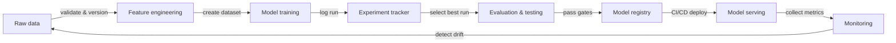

# MLOps

## 定义

MLOps——机器学习运维——是将 DevOps 原则和实践应用于机器学习生命周期的学科。它提供了在生产环境中可靠地构建、部署和维护 ML 模型所需的工具、流程和文化规范。没有 MLOps，团队往往交付在 notebook 中运行良好但在生产中悄然退化的模型，这些模型六个月后无法复现，或需要数周才能更新。

MLOps 的核心原则是**可复现性**（每个实验和部署都可以精确重现）、**自动化**（数据管道、训练、评估和部署由代码触发，而非手动步骤）、**监控**（模型性能在生产中持续追踪）和**协作**（数据科学家、ML 工程师和平台团队共享工具、标准和所有权）。这些原则直接对应 DevOps 的支柱——持续集成、交付和反馈——应用于数据和模型工件，而不仅仅是代码。

MLOps 的兴起源于团队发现，驾驭软件复杂性的软件工程实践并不能自动迁移到 ML 领域。代码只是一个输入：数据分布会发生偏移，模型精度会衰减，实验会不断增多，一月份在验证集上表现良好的模型到七月份可能行为难以预测。MLOps 提供了系统性地检测和应对这些问题的脚手架。

## 工作原理

### 数据管理

原始数据被摄取、验证、版本化并存储在 feature store 或数据湖中。数据验证在破坏训练运行之前捕获模式漂移和分布偏移。版本化确保模型可以使用产生先前版本的精确数据进行重新训练。

### 实验与训练

数据科学家运行实验——变化超参数、架构和特征集——所有运行都记录到实验追踪器中。最佳运行被提升以进行进一步评估。自动化训练管道（由新数据或代码提交触发）消除了手动步骤，并允许持续重训练。

### 评估与验证

候选模型在进入生产之前针对保留的测试集、公平性检查和延迟预算进行评估。评估门禁防止回归进入生产。A/B 测试或影子部署可以在实时流量上比较候选模型和生产模型。

### 部署与服务

经批准的模型被打包、注册到模型注册表中，并通过 CI/CD 管道部署到服务基础设施。金丝雀部署和回滚机制降低风险。基础设施即代码确保服务环境可复现。

### 监控与反馈

生产指标——预测分布、数据漂移、延迟、错误率——被收集并反馈给团队。告警触发重训练管道或模型回滚。反馈循环闭合 ML 生命周期，将生产信号转化为新的训练数据。



## 何时使用 / 何时不使用

| 使用场景 | 避免场景 |
|----------|------------|
| 模型部署到生产环境并服务于真实用户 | 项目是一次性分析或研究原型 |
| 多名团队成员在同一模型上协作 | 团队少于两人且只有单一模型 |
| 随着数据漂移，模型需要定期重训练 | 模型是静态的，永远不会更新 |
| 法规或审计要求需要可复现性 | 探索速度是唯一优先级，且不计划进行生产部署 |
| 需要管理多个生产模型 | 工具开销超过项目预期生命周期的价值 |

## 代码示例

```python
# mlflow_quickstart.py
# Demonstrates basic MLflow experiment tracking for a simple classifier.
# Run: pip install mlflow scikit-learn

import mlflow
import mlflow.sklearn
from sklearn.datasets import load_iris
from sklearn.ensemble import RandomForestClassifier
from sklearn.model_selection import train_test_split
from sklearn.metrics import accuracy_score, f1_score

# Load data
X, y = load_iris(return_X_y=True)
X_train, X_test, y_train, y_test = train_test_split(
    X, y, test_size=0.2, random_state=42
)

# Define hyperparameters to log
params = {
    "n_estimators": 100,
    "max_depth": 5,
    "random_state": 42,
}

# Start an MLflow experiment run
mlflow.set_experiment("iris-classification")

with mlflow.start_run(run_name="random-forest-baseline"):
    # Log hyperparameters
    mlflow.log_params(params)

    # Train the model
    clf = RandomForestClassifier(**params)
    clf.fit(X_train, y_train)

    # Evaluate
    y_pred = clf.predict(X_test)
    accuracy = accuracy_score(y_test, y_pred)
    f1 = f1_score(y_test, y_pred, average="weighted")

    # Log metrics
    mlflow.log_metric("accuracy", accuracy)
    mlflow.log_metric("f1_score", f1)

    # Log the trained model with a registered name
    mlflow.sklearn.log_model(
        clf,
        artifact_path="model",
        registered_model_name="iris-random-forest",
    )

    print(f"Accuracy: {accuracy:.4f} | F1: {f1:.4f}")
    print(f"Run ID: {mlflow.active_run().info.run_id}")
```

## 实用资源

- [Google – Practitioners Guide to MLOps](https://services.google.com/fh/files/misc/practitioners_guide_to_mlops_whitepaper.pdf) — 全面的白皮书，涵盖 MLOps 成熟度级别、工具选择和 Google Cloud 的组织模式。
- [MLflow Documentation](https://mlflow.org/docs/latest/index.html) — 最广泛采用的开源 MLOps 平台的官方文档，涵盖追踪、注册表、项目和部署。
- [Made With ML – MLOps Course](https://madewithml.com/) — 免费的基于项目的 MLOps 课程，用真实代码贯穿完整生命周期。
- [Chip Huyen – Designing Machine Learning Systems](https://www.oreilly.com/library/view/designing-machine-learning/9781098107956/) — O'Reilly 图书，涵盖生产 ML 系统设计、数据管道、特征存储和监控。
- [CD Foundation – MLOps SIG](https://github.com/cdfoundation/sig-mlops) — 社区驱动的 MLOps 定义、全景图和最佳实践。

## 另请参阅

- [Experiment tracking](/docs/mlops/experiment-tracking)
- [MLflow](/docs/mlops/mlflow)
- [Weights & Biases](/docs/mlops/wandb)
- [Feature stores](/docs/mlops/feature-stores)
