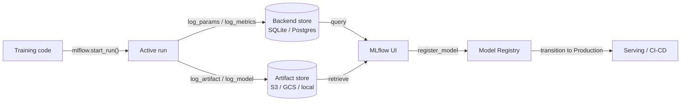

# MLflow

## 定义

MLflow 是一个专为管理端到端机器学习生命周期而设计的开源平台。最初由 Databricks 于 2018 年发布，由于其简洁性、框架无关性以及可以完全在本地运行而无需任何云依赖的特点，已成为最广泛采用的 MLOps 工具之一。只需一个 `pip install mlflow` 和两行代码更改，就可以开始跟踪实验。

MLflow 将功能组织为四个紧密集成的组件。**Tracking** 记录每次训练运行的参数、指标和工件。**Projects** 将 ML 代码打包为由 `MLproject` 文件定义的可复现、可运行单元。**Models** 提供用于打包模型的标准格式，可由任何支持的部署目标提供服务。**Model Registry** 提供具有生命周期管理（Staging、Production、Archived 状态）和版本历史的集中式模型存储。这些组件共同覆盖了从原始实验到生产部署的整个旅程。

MLflow 可以在本地运行（SQLite 后端，本地文件系统工件），也可以在自管理服务器（PostgreSQL + S3）上运行，或通过 Databricks Managed MLflow 作为完全托管服务运行。开源核心采用 Apache 2.0 许可，使其适合数据不能离开本地基础设施的受监管行业。

## 工作原理

### 追踪服务器

调用 `mlflow.start_run()` 时，客户端在追踪服务器上打开一个运行，并开始缓冲日志。参数（`log_param`、`log_params`）和指标（`log_metric`、`log_metrics`）被写入后端存储（SQLite 或 PostgreSQL）。工件上传到工件存储（本地文件系统、S3、GCS、Azure Blob、HDFS）。服务器公开一个由客户端 SDK 和 Web UI 使用的 REST API。

### MLflow Projects

项目是一个包含 `MLproject` YAML 文件的目录（或 git 仓库），该文件声明入口点、参数和 conda/pip 环境。运行 `mlflow run . -P lr=0.01` 会解析环境，设置参数，并启动入口点——自动产生一个被追踪的运行。这使任何可以访问该仓库的人都能复现实验。

### MLflow Models

用 `mlflow.<flavor>.log_model()` 保存的模型以 MLmodel 格式存储：一个包含序列化模型、`MLmodel` YAML 描述符以及 `conda.yaml` / `requirements.txt` 的目录。`pyfunc` 风味提供了统一的 `model.predict(data)` 接口，无论底层框架如何，使同一模型能够被不同的服务后端加载。

### 模型注册表

注册表存储具有过渡状态的命名模型版本。自动化 CI/CD 系统查询注册表以获取最新的 `Production` 版本进行部署。人工审批者或自动化验证作业在状态之间转换版本。每个版本链接回其源运行，保留完整的来源记录。



## 何时使用 / 何时不使用

| 使用场景 | 避免场景 |
|----------|------------|
| 需要完全自托管的开源 MLOps 平台 | 团队需要开箱即用的丰富协作功能（共享报告、Slack 通知） |
| 数据不能离开基础设施（受监管行业） | 偏好无需管理基础设施的 SaaS 产品 |
| 已使用 Databricks 并希望原生集成 | 工作流仅为 notebook，不计划生产部署 |
| 框架无关性很重要（sklearn、XGBoost、PyTorch、TF 等） | 需要内置的高级超参数优化 |
| 成本控制至关重要，需要开源许可 | 团队缺乏管理服务器和工件存储的工程能力 |

## 比较

| 标准 | MLflow | Weights & Biases (W&B) |
|-----------|--------|------------------------|
| 配置难易度 | 一个命令即可自托管；无需账户 | SaaS；需要免费账户；无需管理基础设施 |
| UI 质量 | 简洁但基础；专注于表格指标和运行比较 | 高度精致；优秀的媒体日志记录、自定义图表、报告 |
| 协作 | 需要共享服务器；OSS 中没有内置 RBAC | 内置团队工作区、分享链接和基于角色的访问 |
| 定价 | 免费开源；Databricks Managed MLflow 额外收费 | 个人免费；团队付费计划 |
| 超参数优化 | 通过 Optuna、Ray Tune 外部集成 | 内置 Sweeps，支持贝叶斯/网格/随机搜索 |

## 代码示例

```python
# mlflow_full_example.py
# Full MLflow tracking example: logs params, metrics, a custom artifact,
# and registers the model in the Model Registry.
# pip install mlflow scikit-learn matplotlib

import mlflow
import mlflow.sklearn
import matplotlib.pyplot as plt
import numpy as np
from sklearn.ensemble import GradientBoostingClassifier
from sklearn.datasets import load_breast_cancer
from sklearn.model_selection import train_test_split, cross_val_score
from sklearn.metrics import (
    accuracy_score, roc_auc_score, classification_report
)
import os, tempfile, json

X, y = load_breast_cancer(return_X_y=True)
X_train, X_test, y_train, y_test = train_test_split(
    X, y, test_size=0.2, stratify=y, random_state=0
)

params = {
    "n_estimators": 200,
    "learning_rate": 0.05,
    "max_depth": 4,
    "subsample": 0.8,
    "random_state": 0,
}

mlflow.set_experiment("breast-cancer-gbt")

with mlflow.start_run(run_name="gbt-tuned") as run:

    mlflow.log_params(params)
    clf = GradientBoostingClassifier(**params)
    clf.fit(X_train, y_train)

    y_pred = clf.predict(X_test)
    y_prob = clf.predict_proba(X_test)[:, 1]
    cv_scores = cross_val_score(clf, X_train, y_train, cv=5, scoring="roc_auc")

    metrics = {
        "accuracy": accuracy_score(y_test, y_pred),
        "roc_auc": roc_auc_score(y_test, y_prob),
        "cv_roc_auc_mean": cv_scores.mean(),
        "cv_roc_auc_std": cv_scores.std(),
    }
    mlflow.log_metrics(metrics)

    with tempfile.TemporaryDirectory() as tmp:
        fig, ax = plt.subplots(figsize=(8, 5))
        feat_imp = clf.feature_importances_
        top_idx = np.argsort(feat_imp)[-10:]
        ax.barh(range(10), feat_imp[top_idx])
        ax.set_title("Top 10 feature importances")
        fig.tight_layout()
        plot_path = os.path.join(tmp, "feature_importance.png")
        fig.savefig(plot_path)
        plt.close(fig)
        mlflow.log_artifact(plot_path, artifact_path="plots")

        report = classification_report(y_test, y_pred, output_dict=True)
        report_path = os.path.join(tmp, "classification_report.json")
        with open(report_path, "w") as f:
            json.dump(report, f, indent=2)
        mlflow.log_artifact(report_path, artifact_path="evaluation")

    mlflow.sklearn.log_model(
        clf,
        artifact_path="model",
        registered_model_name="breast-cancer-gbt",
    )

    print(f"Run ID  : {run.info.run_id}")
    for k, v in metrics.items():
        print(f"  {k}: {v:.4f}")
```

## 实用资源

- [MLflow Official Documentation](https://mlflow.org/docs/latest/index.html) — 涵盖所有四个组件、REST API 和部署目标的完整参考。
- [MLflow GitHub Repository](https://github.com/mlflow/mlflow) — 源代码、问题追踪器和示例；有助于理解内部机制和贡献。
- [Databricks – MLflow Tutorials](https://docs.databricks.com/en/mlflow/index.html) — 在 Databricks 上使用 MLflow 的生产级用法，包含 Unity Catalog 集成。
- [Towards Data Science – MLflow in Production](https://towardsdatascience.com/deploy-mlflow-with-docker-compose-8059f16b6039) — 使用 Docker Compose、PostgreSQL 和 MinIO 部署自托管 MLflow 服务器的社区教程。

## 另请参阅

- [Experiment tracking](/docs/mlops/experiment-tracking)
- [Weights & Biases](/docs/mlops/wandb)
- [MLOps](/docs/mlops)
