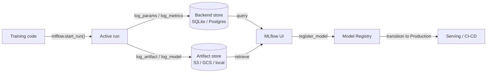

# MLflow

## 定义

MLflow 是一个开源平台，专为管理端到端的机器学习生命周期而设计。最初由 Databricks 于 2018 年发布，由于其简单性、框架无关性以及可以完全在本地部署而无需任何云依赖的特性，它已成为被最广泛采用的 MLOps 工具之一。只需 `pip install mlflow` 加两行代码修改，就足以开始追踪实验。

MLflow 将功能组织为四个紧密集成的组件。**追踪（Tracking）**记录每次训练运行的参数、指标和制品。**项目（Projects）**将 ML 代码打包成由 `MLproject` 文件定义的可重现、可运行单元。**模型（Models）**提供一种标准格式，用于打包可由任何支持的部署目标服务的模型。**模型注册表（Model Registry）**提供一个具有生命周期管理（暂存、生产、归档状态）和版本历史记录的集中式模型存储。这些组件共同覆盖了从原始实验到生产部署的整个过程。

MLflow 可以在本地运行（SQLite 后端、本地文件系统制品），在自管理服务器上运行（PostgreSQL + S3），或作为完全托管服务通过 Databricks Managed MLflow 运行。开源核心采用 Apache 2.0 许可，使其适合数据不能离开本地基础设施的受监管行业。

## 工作原理

### 追踪服务器

当你调用 `mlflow.start_run()` 时，客户端在追踪服务器上打开一个运行并开始缓冲日志。参数（`log_param`、`log_params`）和指标（`log_metric`、`log_metrics`）被写入后端存储（SQLite 或 PostgreSQL）。制品被上传到制品存储（本地文件系统、S3、GCS、Azure Blob、HDFS）。服务器公开一个 REST API，供客户端 SDK 和 Web UI 使用。

### MLflow 项目

项目是一个目录（或 git 仓库），其中包含一个声明入口点、参数和 conda/pip 环境的 `MLproject` YAML 文件。运行 `mlflow run . -P lr=0.01` 会解析环境、设置参数并启动入口点——自动生成一个追踪的运行。这使得任何能访问仓库的人都可以重现实验。

### MLflow 模型

用 `mlflow.<flavor>.log_model()` 保存的模型以 MLmodel 格式存储：一个包含序列化模型、`MLmodel` YAML 描述符以及 `conda.yaml`/`requirements.txt` 的目录。`pyfunc` 风格提供了统一的 `model.predict(data)` 接口，无论底层框架如何，使相同的模型可以被不同的服务后端加载。

### 模型注册表

注册表存储带有过渡状态的命名模型版本。自动化 CI/CD 系统查询注册表以获取要部署的最新 `Production` 版本。人工审批者或自动验证作业在状态之间转换版本。每个版本都链接回其源运行，保留完整的来源记录。



## 何时使用 / 何时不使用

| 适合使用 | 避免使用 |
|----------|------------|
| 需要完全自托管的开源 MLOps 平台 | 团队需要开箱即用的丰富协作功能（共享报告、Slack 通知） |
| 数据不能离开基础设施（受监管行业） | 倾向于使用无需管理任何基础设施的 SaaS 产品 |
| 已经使用 Databricks 且需要原生集成 | 工作流程仅限笔记本，没有生产部署计划 |
| 框架无关性很重要（sklearn、XGBoost、PyTorch、TF 等） | 需要内置的高级扫描/超参数优化 |
| 成本控制至关重要；需要开源许可 | 团队缺乏管理服务器和制品存储的工程带宽 |

## 工具比较

| 标准 | MLflow | Weights & Biases (W&B) |
|-----------|--------|------------------------|
| 配置简易度 | 一条命令可自托管；无需账户 | SaaS；需要免费账户；无需管理基础设施 |
| UI 质量 | 简洁但基础；专注于表格指标和运行比较 | 高度精美；出色的媒体记录、自定义图表、报告 |
| 协作 | 需要共享服务器；开源版无内置 RBAC | 内置团队工作区、共享链接和基于角色的访问 |
| 定价 | 免费开源；Databricks Managed MLflow 额外收费 | 个人免费；团队付费计划 |
| 超参数优化 | 需要外部集成 Optuna、Ray Tune | 内置 Sweeps，支持贝叶斯/网格/随机搜索 |

## 代码示例

```python
# mlflow_full_example.py
# Full MLflow tracking example: logs params, metrics, a custom artifact,
# and registers the model in the Model Registry.
# pip install mlflow scikit-learn matplotlib

import mlflow
import mlflow.sklearn
import matplotlib.pyplot as plt
import numpy as np
from sklearn.ensemble import GradientBoostingClassifier
from sklearn.datasets import load_breast_cancer
from sklearn.model_selection import train_test_split, cross_val_score
from sklearn.metrics import (
    accuracy_score, roc_auc_score, classification_report
)
import os, tempfile, json

# ── 1. Data ──────────────────────────────────────────────────────────────────
X, y = load_breast_cancer(return_X_y=True)
X_train, X_test, y_train, y_test = train_test_split(
    X, y, test_size=0.2, stratify=y, random_state=0
)

# ── 2. Hyperparameters ────────────────────────────────────────────────────────
params = {
    "n_estimators": 200,
    "learning_rate": 0.05,
    "max_depth": 4,
    "subsample": 0.8,
    "random_state": 0,
}

# ── 3. MLflow run ─────────────────────────────────────────────────────────────
mlflow.set_experiment("breast-cancer-gbt")

with mlflow.start_run(run_name="gbt-tuned") as run:

    # Log hyperparameters
    mlflow.log_params(params)

    # Train
    clf = GradientBoostingClassifier(**params)
    clf.fit(X_train, y_train)

    # Evaluate
    y_pred = clf.predict(X_test)
    y_prob = clf.predict_proba(X_test)[:, 1]
    cv_scores = cross_val_score(clf, X_train, y_train, cv=5, scoring="roc_auc")

    metrics = {
        "accuracy": accuracy_score(y_test, y_pred),
        "roc_auc": roc_auc_score(y_test, y_prob),
        "cv_roc_auc_mean": cv_scores.mean(),
        "cv_roc_auc_std": cv_scores.std(),
    }
    mlflow.log_metrics(metrics)

    # Log a feature importance plot as an artifact
    with tempfile.TemporaryDirectory() as tmp:
        fig, ax = plt.subplots(figsize=(8, 5))
        feat_imp = clf.feature_importances_
        top_idx = np.argsort(feat_imp)[-10:]
        ax.barh(range(10), feat_imp[top_idx])
        ax.set_title("Top 10 feature importances")
        fig.tight_layout()
        plot_path = os.path.join(tmp, "feature_importance.png")
        fig.savefig(plot_path)
        plt.close(fig)
        mlflow.log_artifact(plot_path, artifact_path="plots")

        # Log classification report as JSON
        report = classification_report(y_test, y_pred, output_dict=True)
        report_path = os.path.join(tmp, "classification_report.json")
        with open(report_path, "w") as f:
            json.dump(report, f, indent=2)
        mlflow.log_artifact(report_path, artifact_path="evaluation")

    # Log and register the model
    mlflow.sklearn.log_model(
        clf,
        artifact_path="model",
        registered_model_name="breast-cancer-gbt",  # creates registry entry
    )

    print(f"Run ID  : {run.info.run_id}")
    for k, v in metrics.items():
        print(f"  {k}: {v:.4f}")

# ── 4. Load a registered model (simulates downstream serving) ─────────────────
# model_uri = "models:/breast-cancer-gbt/1"
# loaded = mlflow.sklearn.load_model(model_uri)
# print(loaded.predict(X_test[:3]))
```

## 实践资源

- [MLflow 官方文档](https://mlflow.org/docs/latest/index.html) — 涵盖所有四个组件、REST API 和部署目标的完整参考。
- [MLflow GitHub 仓库](https://github.com/mlflow/mlflow) — 源代码、问题追踪器和示例；有助于理解内部机制和贡献代码。
- [Databricks – MLflow 教程](https://docs.databricks.com/en/mlflow/index.html) — 与 Unity Catalog 集成的 Databricks 生产级 MLflow 使用。
- [Towards Data Science – 生产中的 MLflow](https://towardsdatascience.com/deploy-mlflow-with-docker-compose-8059f16b6039) — 使用 Docker Compose、PostgreSQL 和 MinIO 部署自托管 MLflow 服务器的社区演练。

## 另请参阅

- [实验追踪（Experiment tracking）](/docs/mlops/experiment-tracking)
- [Weights & Biases](/docs/mlops/wandb)
- [MLOps](/docs/mlops)
