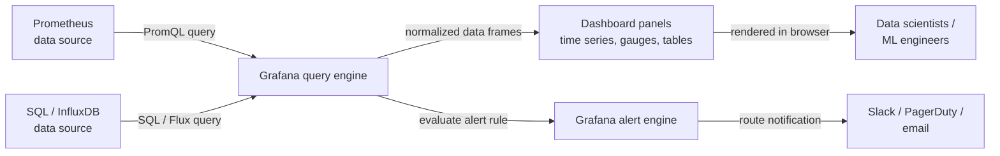

# Grafana

## 定义

Grafana 是一个开源分析和交互式可视化平台，连接到广泛的数据源——[Prometheus](/docs/mlops/monitoring/prometheus)、InfluxDB、Elasticsearch、Loki、PostgreSQL、云原生监控 API 以及更多——并将数据渲染为交互式的、可共享的仪表板。它本身不提供存储；它纯粹是一个查询和可视化层，位于现有数据基础设施之上。这种设计使 Grafana 与每个时间序列或日志存储系统互补，而不是替代其中任何一个。

在 ML 和 MLOps 场景中，Grafana 作为统一的可观测性界面。数据科学家和 ML 工程师使用它来追踪随时间变化的模型性能指标（准确率、F1、AUC），将预测延迟和吞吐量与基础设施资源使用情况一起可视化，并监控数据质量信号，如特征漂移分数。由于 Grafana 同时支持多个数据源，单个仪表板可以结合 Prometheus 指标、Loki 的应用日志以及 SQL 数据库中的业务 KPI——提供模型在生产中行为的完整、有上下文的视图。

Grafana 以自托管开源发行版、Grafana Cloud（托管 SaaS）以及具有附加企业功能的 Grafana Enterprise 提供。开源发行版功能完整，是已经运行 Kubernetes 或具有基础设施即代码工作流的团队最常见的选择，因为 Grafana 仪表板、数据源配置和告警规则都可以作为 JSON 管理，或通过 Terraform 提供商管理。

## 工作原理

### 数据源配置

Grafana 通过插件连接到数据源。数据源插件将 Grafana 的内部查询模型转换为后端的原生查询语言（Prometheus 的 PromQL、关系数据库的 SQL、Elasticsearch 的 Lucene 等），并以规范化格式返回数据。数据源在 Grafana UI 中配置或通过置备文件（YAML）配置，这允许在 Git 仓库中将配置作为代码管理。每个数据源都可以配置身份验证、TLS 和超时设置。

### 仪表板和面板组合

Grafana 仪表板是包含有序面板列表的 JSON 文档。每个面板定义针对数据源的查询、可视化类型（时间序列、仪表盘、条形图、表格、热力图、stat 等）以及显示选项（坐标轴、阈值、图例、覆盖）。面板可以链接到其他仪表板，支持变量（模板变量允许单个仪表板通过下拉列表在环境、模型版本或服务之间切换），并可以引用注释——叠加在时间序列图上的事件，用于标记部署、重训练运行或事故开始。

### 变量和模板

模板变量将静态仪表板转换为动态仪表板。变量查询数据源以获取值列表（例如，来自 Prometheus 的所有不同 `model_version` 标签值），并将选定的值插入仪表板上的每个面板查询中。这使得构建一个适用于所有模型和版本的单个 ML 模型仪表板成为可能，而不是为每个模型维护一个仪表板。

### 告警

Grafana 告警（Grafana 8+ 引入）提供统一的、多数据源告警规则，按计划评估面板查询，并将触发的告警路由到联系点（Slack、PagerDuty、电子邮件、webhooks）。告警规则被分组到通知策略中，确定路由、分组和静音行为。Grafana 告警可以与 Prometheus Alertmanager 共存或完全替代它，具体取决于团队偏好。

### 置备和基础设施即代码

Grafana 支持通过启动时加载的 YAML 和 JSON 文件对数据源、仪表板和告警规则进行声明式置备。结合 Grafana Terraform 提供商，整个 Grafana 配置可以进行版本控制并通过 CI/CD 管道部署——对于管理多个环境或需要可重现监控基础设施的团队来说，这是一个关键能力。



## 何时使用 / 何时不使用

| 适合使用 | 避免使用 |
|----------|------------|
| 需要 Prometheus 或其他时间序列数据上的交互式可共享仪表板 | 需要完整功能的 ML 实验追踪 UI（改用 MLflow 或 W&B） |
| 需要在一个视图中关联基础设施指标和模型性能 | 你的团队没有可连接的现有时间序列数据源 |
| 有多个数据源（Prometheus、SQL、Loki）需要在一个仪表板中统一 | 简单的文本或表格摘要已经足够，仪表板没有增加价值 |
| 需要通过 JSON 或 Terraform 将仪表板作为代码管理 | 你的组织已经在专有可观测性平台上标准化 |
| 需要跨多个数据源的告警 | 需要存储或分析原始预测日志（Grafana 查询，不存储） |

## 比较

Grafana 和 Prometheus 是互补的——Prometheus 收集和存储指标；Grafana 将其可视化。下表对比它们以帮助澄清各自的不同角色。

| 标准 | Grafana | Prometheus |
|-----------|---------|-----------|
| 主要角色 | 可视化和仪表板 | 指标收集、存储和告警 |
| 数据存储 | 无——查询外部后端 | 本地 TSDB（基于拉取的抓取） |
| 查询语言 | 取决于数据源（PromQL、SQL 等） | PromQL |
| 告警 | 统一的多数据源告警（Grafana 8+） | 基于 PromQL 的规则 + Alertmanager |
| 数据源 | 50+ 插件（Prometheus、SQL、Loki、云等） | 仅自身（TSDB） |
| 何时一起使用 | 始终——Grafana 是 Prometheus 数据的 UI | 始终——Prometheus 是 Grafana 仪表板的后端 |

## 优缺点

| 方面 | 优点 | 缺点 |
|--------|------|------|
| 多数据源 | 在一个仪表板中统一指标、日志和 SQL | 数据源数量增加时配置复杂性增长 |
| 仪表板即代码 | JSON 导出和 Terraform 提供商支持 GitOps 工作流 | JSON 仪表板冗长且难以手动对比差异 |
| 模板变量 | 一个仪表板覆盖所有模型、环境和版本 | 变量查询在仪表板加载时增加延迟 |
| 可视化库 | 丰富的、可自定义的面板类型 | 一些高级图表类型需要插件或 Grafana Enterprise |
| 告警 | 统一的、多数据源告警规则 | 通知策略和路由树有学习曲线 |
| 自托管选项 | 完全控制，数据不离开基础设施 | 需要运营工作：升级、备份、插件管理 |

## 代码示例

```json
// grafana_ml_dashboard.json
// Grafana dashboard definition for monitoring an ML model serving endpoint.
// Import this JSON via Grafana UI: Dashboards → Import → Upload JSON file.
// Prerequisites: Prometheus data source named "Prometheus" with ml_* metrics.
{
  "title": "ML Model Monitoring",
  "description": "Dashboard for monitoring ML model latency, throughput, confidence distribution, and data drift.",
  "uid": "ml-model-monitoring-v1",
  "schemaVersion": 36,
  "version": 1,
  "refresh": "30s",
  "time": { "from": "now-3h", "to": "now" },
  "templating": {
    "list": [
      {
        "name": "model_name",
        "label": "Model",
        "type": "query",
        "datasource": { "type": "prometheus", "uid": "Prometheus" },
        "query": "label_values(ml_predictions_total, model_name)",
        "includeAll": false,
        "multi": false,
        "current": {}
      },
      {
        "name": "model_version",
        "label": "Version",
        "type": "query",
        "datasource": { "type": "prometheus", "uid": "Prometheus" },
        "query": "label_values(ml_predictions_total{model_name=\"$model_name\"}, model_version)",
        "includeAll": true,
        "multi": true,
        "current": {}
      }
    ]
  },
  "panels": [
    {
      "id": 1,
      "title": "Prediction Throughput (req/s)",
      "type": "timeseries",
      "gridPos": { "x": 0, "y": 0, "w": 12, "h": 8 },
      "datasource": { "type": "prometheus", "uid": "Prometheus" },
      "targets": [
        {
          "expr": "sum(rate(ml_predictions_total{model_name=\"$model_name\", status=\"success\"}[2m])) by (model_version)",
          "legendFormat": "{{model_version}} — success",
          "refId": "A"
        },
        {
          "expr": "sum(rate(ml_predictions_total{model_name=\"$model_name\", status=\"error\"}[2m])) by (model_version)",
          "legendFormat": "{{model_version}} — error",
          "refId": "B"
        }
      ],
      "fieldConfig": {
        "defaults": {
          "unit": "reqps",
          "custom": { "lineWidth": 2, "fillOpacity": 10 }
        }
      }
    },
    {
      "id": 2,
      "title": "P50 / P95 / P99 Prediction Latency",
      "type": "timeseries",
      "gridPos": { "x": 12, "y": 0, "w": 12, "h": 8 },
      "datasource": { "type": "prometheus", "uid": "Prometheus" },
      "targets": [
        {
          "expr": "histogram_quantile(0.50, sum(rate(ml_prediction_latency_seconds_bucket{model_name=\"$model_name\"}[2m])) by (le, model_version))",
          "legendFormat": "p50 {{model_version}}",
          "refId": "A"
        },
        {
          "expr": "histogram_quantile(0.95, sum(rate(ml_prediction_latency_seconds_bucket{model_name=\"$model_name\"}[2m])) by (le, model_version))",
          "legendFormat": "p95 {{model_version}}",
          "refId": "B"
        },
        {
          "expr": "histogram_quantile(0.99, sum(rate(ml_prediction_latency_seconds_bucket{model_name=\"$model_name\"}[2m])) by (le, model_version))",
          "legendFormat": "p99 {{model_version}}",
          "refId": "C"
        }
      ],
      "fieldConfig": {
        "defaults": {
          "unit": "s",
          "thresholds": {
            "mode": "absolute",
            "steps": [
              { "color": "green", "value": null },
              { "color": "yellow", "value": 0.1 },
              { "color": "red", "value": 0.5 }
            ]
          }
        }
      }
    },
    {
      "id": 3,
      "title": "Data Drift Score",
      "type": "gauge",
      "gridPos": { "x": 0, "y": 8, "w": 8, "h": 6 },
      "datasource": { "type": "prometheus", "uid": "Prometheus" },
      "targets": [
        {
          "expr": "ml_data_drift_score{model_name=\"$model_name\"}",
          "legendFormat": "{{feature_set}}",
          "refId": "A"
        }
      ],
      "fieldConfig": {
        "defaults": {
          "unit": "none",
          "min": 0,
          "max": 1,
          "thresholds": {
            "mode": "absolute",
            "steps": [
              { "color": "green", "value": null },
              { "color": "yellow", "value": 0.1 },
              { "color": "red", "value": 0.25 }
            ]
          }
        }
      }
    },
    {
      "id": 4,
      "title": "Prediction Confidence Distribution (heatmap)",
      "type": "heatmap",
      "gridPos": { "x": 8, "y": 8, "w": 16, "h": 6 },
      "datasource": { "type": "prometheus", "uid": "Prometheus" },
      "targets": [
        {
          "expr": "sum(rate(ml_prediction_confidence_bucket{model_name=\"$model_name\"}[5m])) by (le)",
          "legendFormat": "{{le}}",
          "refId": "A",
          "format": "heatmap"
        }
      ]
    }
  ]
}
```

## 实践资源

- [Grafana 文档](https://grafana.com/docs/grafana/latest/) — 涵盖安装、数据源、仪表板、告警和置备的官方文档。
- [Grafana 仪表板最佳实践](https://grafana.com/docs/grafana/latest/dashboards/build-dashboards/best-practices/) — 关于构建有效仪表板、使用模板变量和组织面板的官方指南。
- [Grafana Terraform 提供商](https://registry.terraform.io/providers/grafana/grafana/latest/docs) — 将 Grafana 数据源、仪表板和告警规则作为基础设施即代码管理。
- [Awesome Grafana](https://github.com/monitoringartist/grafana-aws-cloudwatch-dashboards) — 常见基础设施栈的社区策划预建 Grafana 仪表板集合。
- [Grafana Labs 博客 — ML 可观测性](https://grafana.com/blog/2021/08/09/how-to-monitor-machine-learning-models-with-grafana/) — 使用 Grafana 和 Prometheus 设置 ML 模型监控仪表板的实践演练。

## 另请参阅

- [Prometheus](/docs/mlops/monitoring/prometheus)
- [ML 监控](/docs/mlops/monitoring)
- [MLOps](/docs/mlops)
