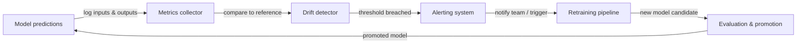

# ML 监控

## 定义

ML 监控是在部署后持续观察机器学习模型及其操作数据的实践。与传统软件不同，传统软件要么正常工作要么抛出错误，模型可以悄然退化：它仍然产生输出，但随着世界的变化，这些输出变得越来越错误。ML 监控提供早期预警系统，在业务受到损害之前检测到这种退化。

三种现象驱动了生产中大多数模型退化。**概念漂移**（Concept drift）发生在输入特征和目标变量之间的统计关系发生变化时——例如，在新攻击向量出现之前训练的欺诈检测模型将系统性地遗漏新模式。**数据漂移**（Data drift，也称为协变量偏移）发生在输入特征分布发生变化而目标关系没有相应变化时——季节性模式、人口变化和上游数据管道更改都会导致数据漂移。**模型衰减**（Model decay）是由这两种漂移中的一种或两种导致的累积性能损失；如果不加以控制，它会表现为错误率上升、收入下降和用户体验下降。

有效的 ML 监控跨越三个层次：**数据质量监控**（模式、空值率、值范围）、**分布监控**（特征和预测漂移的统计测试）以及**模型性能监控**（当标签可用时与真实标签对比计算的业务和 ML 指标）。三个层次的组合提供了纵深防御——在问题的来源和下游效果中提前发现问题。

## 工作原理

### 数据和预测收集

每个预测请求通过一个经过埋点的服务层，该层将输入、输出、时间戳和元数据记录到集中存储（对象存储、数据仓库或 Kafka 等流处理平台）。参考数据集——通常是训练或验证数据集——与生产日志一起存储，作为漂移计算的统计基线。标签管道摄取延迟的真实标签（标签通常在预测后数小时或数周才到达），并将其与记录的预测连接回来。

### 漂移检测

漂移检测器使用统计测试将当前生产分布与参考基线进行比较。对于连续特征，总体稳定性指数（PSI）、Kolmogorov-Smirnov 测试或 Wasserstein 距离测量分布变化。对于分类特征，卡方检验或 Jensen-Shannon 散度很常见。预测本身被视为特征：预测分布的偏移（例如，分类器突然 80% 的时间输出"正类"，而基线为 30%）是真实标签到达之前的强力早期信号。

### 性能指标计算

当真实标签可用时，在滚动窗口或基于时间的队列上计算性能指标。准确率、精确率、召回率、F1、RMSE 和 AUC-ROC 是常见的 ML 指标。业务指标——归因于模型驱动决策的收入、呼叫转移率、推荐点击率——通常更具可操作性。延迟、吞吐量和错误率是反映服务健康状况的基础设施指标，应与模型质量一起监控。

### 告警和升级

当指标越过边界时，阈值和异常检测规则触发告警。静态阈值简单但脆弱；统计过程控制（例如控制图）和基于 ML 的异常检测能适应季节性。告警根据严重性路由到 PagerDuty、Slack 或电子邮件。设计良好的告警层次结构区分：信息事件（仅记录日志）、警告（通知 ML 团队）和严重事件（呼叫值班人员，触发自动回滚或重训练）。

### 重训练反馈循环

监控是重训练循环的输入。当检测到漂移或性能降至阈值以下时，自动化管道（或人工决策）在新鲜数据上触发重训练作业。重训练后，新的候选模型在晋升之前通过评估关卡，从而闭合循环。



## 何时使用 / 何时不使用

| 适合使用 | 避免使用 |
|----------|------------|
| 模型已部署到生产环境并服务于真实用户 | 模型是一次性分析，永远不会再次使用 |
| 模型决策具有可量化的业务影响 | 预测量如此之低，以至于统计测试缺乏统计功效 |
| 真实标签最终会变得可用 | 你没有收集标签或业务结果的反馈机制 |
| 法规要求授权可审计的模型性能 | 监控工具的成本超过了已部署模型的预期价值 |
| 已知数据生成过程会随时间变化 | 模型无论如何都在持续重训练，漂移被隐式处理 |
| 多个模型同时在生产中 | 人工审查每个预测，使自动监控变得多余 |

## 比较

| 工具 | 主要关注点 | 漂移检测 | 性能追踪 | 托管方式 |
|------|--------------|-----------------|---------------------|---------|
| Evidently AI | 数据和模型质量报告 | 是（30+ 测试） | 是 | 自托管/云 |
| WhyLabs | LLM 和 ML 可观测性 | 是（统计） | 是 | SaaS |
| Arize AI | ML 可观测性平台 | 是 | 是 | SaaS |
| 自定义仪表板 | 完全定制 | 手动实现 | 手动实现 | 自托管 |
| MLflow | 实验追踪+基础监控 | 有限 | 是（离线） | 自托管/云 |

## 优缺点

| 方面 | 优点 | 缺点 |
|--------|------|------|
| 概念漂移检测 | 在业务影响之前捕获模型衰减 | 需要真实标签，而真实标签会延迟到达 |
| 数据漂移检测 | 无需标签即可工作——提前发现问题 | 良性分布变化可能产生误报 |
| 自动告警 | 将检测时间从数周缩短到数分钟 | 阈值调整不当会导致告警疲劳 |
| 工具生态系统 | 丰富的开源和 SaaS 选项 | 增加基础设施复杂性和维护负担 |
| 重训练触发器 | 自动闭合循环 | 如果重训练触发过于频繁，有训练不稳定的风险 |

## 代码示例

```python
# drift_detection.py
# Demonstrates concept and data drift detection using Evidently AI.
# Run: pip install evidently scikit-learn pandas numpy

import numpy as np
import pandas as pd
from sklearn.datasets import make_classification
from sklearn.ensemble import RandomForestClassifier
from sklearn.model_selection import train_test_split

from evidently.report import Report
from evidently.metric_preset import DataDriftPreset, ClassificationPreset
from evidently import ColumnMapping

# --- 1. Simulate reference (training) data ---
X, y = make_classification(
    n_samples=1000,
    n_features=10,
    n_informative=5,
    random_state=42,
)
feature_names = [f"feature_{i}" for i in range(10)]
df = pd.DataFrame(X, columns=feature_names)
df["target"] = y

X_train, X_test, y_train, y_test = train_test_split(
    df[feature_names], df["target"], test_size=0.2, random_state=42
)

# --- 2. Train a simple classifier ---
clf = RandomForestClassifier(n_estimators=100, random_state=42)
clf.fit(X_train, y_train)

# Build reference DataFrame with predictions
reference = X_test.copy()
reference["target"] = y_test.values
reference["prediction"] = clf.predict(X_test)

# --- 3. Simulate production data with drift ---
# Introduce feature shift: scale feature_0 to simulate distribution change
X_prod, y_prod = make_classification(
    n_samples=500,
    n_features=10,
    n_informative=5,
    random_state=99,  # Different seed = different distribution
)
df_prod = pd.DataFrame(X_prod, columns=feature_names)
df_prod["feature_0"] = df_prod["feature_0"] * 3.0  # Artificial drift on feature_0
df_prod["target"] = y_prod

production = df_prod[feature_names].copy()
production["target"] = df_prod["target"].values
production["prediction"] = clf.predict(df_prod[feature_names])

# --- 4. Run Evidently drift + performance report ---
column_mapping = ColumnMapping(
    target="target",
    prediction="prediction",
    numerical_features=feature_names,
)

report = Report(metrics=[DataDriftPreset(), ClassificationPreset()])
report.run(
    reference_data=reference,
    current_data=production,
    column_mapping=column_mapping,
)

# Save HTML report for inspection
report.save_html("drift_report.html")
print("Drift report saved to drift_report.html")

# --- 5. Extract drift results programmatically ---
result = report.as_dict()
drift_summary = result["metrics"][0]["result"]
n_drifted = drift_summary.get("number_of_drifted_columns", 0)
total = drift_summary.get("number_of_columns", 0)
share = drift_summary.get("share_of_drifted_columns", 0)

print(f"Drifted columns: {n_drifted}/{total} ({share:.1%})")
if share > 0.3:
    print("WARNING: Significant drift detected — consider retraining.")
else:
    print("Drift within acceptable bounds.")
```

## 实践资源

- [Evidently AI 文档](https://docs.evidentlyai.com/) — 领先的开源 ML 监控库的官方文档，涵盖漂移测试、报告和实时监控。
- [WhyLabs ML 可观测性平台](https://whylabs.ai/docs) — 使用统计分析和告警监控 LLM 和 ML 模型的 SaaS 平台文档。
- [Chip Huyen — 生产中的 ML 模型监控](https://huyenchip.com/2022/02/07/data-distribution-shifts-and-monitoring.html) — 深入探讨数据分布偏移、监控策略和实际权衡的博客文章。
- [Google — 机器学习规则：监控部分](https://developers.google.com/machine-learning/guides/rules-of-ml#monitoring) — Google 关于监控什么以及如何为生产 ML 设置告警的工程指导。
- [Arize AI — ML 可观测性指南](https://arize.com/ml-observability/) — 涵盖漂移、嵌入向量监控和 ML 可观测性栈的从业者指南。

## 另请参阅

- [Prometheus](/docs/mlops/monitoring/prometheus)
- [Grafana](/docs/mlops/monitoring/grafana)
- [模型服务（Model serving）](/docs/mlops/deployment/model-serving)
