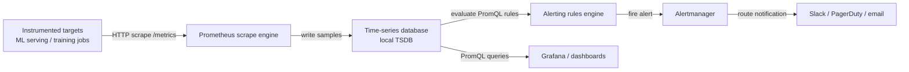

# Prometheus

## 定义

Prometheus 是一个开源系统监控和告警工具包，最初由 SoundCloud 构建，现在是一个已毕业的 CNCF 项目。它将所有数据存储为时间序列：由指标名称和一组键值标签标识的带时间戳的浮点值流。这种模型非常适合运营数据——CPU 使用率、请求计数、错误率——以及 ML 特定信号，如随时间变化的预测延迟、吞吐量和特征值分布。

Prometheus 的决定性架构选择是其**基于拉取的抓取模型**（pull-based scraping model）。Prometheus 不需要经过埋点的应用程序将指标推送到中央收集器，而是定期抓取目标暴露的 HTTP 端点（默认为 `/metrics`）。这种控制反转使服务发现、访问控制和调试变得显著更简单：你可以直接 curl 任何目标的指标端点来查看 Prometheus 将收集什么。目标通过静态配置或动态服务发现（Kubernetes、Consul、EC2 等）被发现。

Prometheus 在设计上不是长期存储解决方案。其本地时间序列数据库（TSDB）针对近期数据的快速摄取和查询进行了优化，通常保留 15 天。对于长期存储，Prometheus 可以远程写入到 Thanos、Cortex 或 VictoriaMetrics 等系统。在 ML 场景中，Prometheus 是收集和告警层；[Grafana](/docs/mlops/monitoring/grafana) 在其之上提供可视化和仪表板层。

## 工作原理

### 目标埋点

应用程序通过 HTTP `/metrics` 端点以 Prometheus 暴露格式暴露指标——一种 `metric_name{label="value"} numeric_value timestamp` 行的纯文本格式。在 Python 中，`prometheus_client` 库提供 Counter、Gauge、Histogram 和 Summary 类型，可自动处理暴露格式。ML 服务进程通常为总预测请求暴露计数器，为请求延迟暴露直方图，以及为当前加载的模型版本和资源利用率暴露仪表盘。

### 抓取和存储

Prometheus 评估其配置文件以确定要抓取哪些目标以及抓取间隔（默认：15 秒）。在每次抓取时，它获取 `/metrics` 端点，解析暴露格式，并将样本以压缩块的形式写入其本地 TSDB。TSDB 使用预写日志（WAL）实现持久性，并随时间将数据压缩成块。标签基数是主要性能杠杆：每个唯一的标签值组合都会创建一个单独的时间序列，因此必须避免无界标签（例如用户 ID）。

### PromQL 查询和告警

PromQL（Prometheus 查询语言）是用于选择和聚合时间序列数据的函数式查询语言。即时向量选择一组系列的当前值；范围向量选择样本窗口；函数在这些向量上计算速率、平均值、分位数和预测。告警规则是以可配置间隔评估的 PromQL 表达式；当表达式返回非空结果时，告警触发并发送到 Alertmanager。

### Alertmanager

Alertmanager 从 Prometheus（和其他来源）接收告警，去重它们，应用分组和路由规则，并将通知分派给接收者（PagerDuty、Slack、电子邮件、webhooks）。静音和抑制规则防止在已知维护窗口或级联故障期间的告警风暴。在 ML 系统中，Alertmanager 将模型退化告警路由到 ML 团队的 Slack 频道，而基础设施告警（高 CPU、OOM 终止）则发送给平台团队。

### 远程存储和联邦

对于多集群或长保留场景，Prometheus 将样本远程写入持久后端。联邦允许全局 Prometheus 从区域 Prometheus 实例抓取聚合指标。这两种模式在大型 ML 平台中很常见，训练集群和服务集群各自运行自己的 Prometheus，中央实例聚合服务级别指标。



## 何时使用 / 何时不使用

| 适合使用 | 避免使用 |
|----------|------------|
| 需要 ML 服务基础设施的运营指标（延迟、吞吐量、错误率） | 需要存储原始预测日志或高基数事件数据 |
| 需要基于拉取的、自托管的监控栈，无供应商锁定 | 你的团队缺乏运营和调优 Prometheus 栈的基础设施经验 |
| 在 Kubernetes 上运行并需要原生服务发现 | 需要长期保留（>15 天）而无需额外的远程存储设置 |
| 需要通过 Alertmanager 进行去重和路由的强大告警 | 应用程序生成无界标签基数，这会降低 TSDB 性能 |
| 需要 Grafana 仪表板的标准后端 | 需要亚秒级抓取间隔；Prometheus 设计为 10-60 秒间隔 |

## 比较

Prometheus 和 Grafana 是互补的，而非竞争工具。下表描述何时一起使用它们与替代方案。

| 标准 | Prometheus | Grafana |
|-----------|-----------|---------|
| 角色 | 收集、存储和告警指标 | 从任何数据源可视化和探索指标 |
| 查询语言 | PromQL（指标优化的函数式语言） | 每数据源（Prometheus 的 PromQL，其他的 SQL） |
| 告警 | 内置告警规则 + Alertmanager | Grafana 告警（统一的多数据源） |
| 数据源 | 自身（TSDB） | Prometheus、InfluxDB、Loki、Elasticsearch、数据库等 |
| 存储 | 本地 TSDB，远程写入用于长期存储 | 无存储——纯粹是查询和可视化层 |
| 何时一起使用 | 始终——Prometheus 收集，Grafana 显示 | 始终——使用 Grafana 作为 Prometheus 数据的 UI |

## 优缺点

| 方面 | 优点 | 缺点 |
|--------|------|------|
| 基于拉取的架构 | 简单的调试，目标级访问控制 | 需要目标暴露 HTTP 端点 |
| PromQL | 富有表达力、可组合，专为指标构建 | 与 SQL 相比学习曲线陡峭 |
| 本地 TSDB | 近期数据的快速摄取和查询 | 保留时间有限；长期需要远程存储 |
| 标签模型 | 灵活的多维过滤和聚合 | 高基数标签导致内存和查询性能问题 |
| Alertmanager | 丰富的路由、分组和静音 | 需要独立组件运维；配置可能变得复杂 |
| 生态系统 | 大量的导出器和客户端库 | 自托管部署的运营开销 |

## 代码示例

```python
# ml_metrics_server.py
# Exposes ML model metrics via prometheus_client for Prometheus scraping.
# Run: pip install prometheus_client flask scikit-learn numpy
# Then configure Prometheus to scrape localhost:8000

import time
import threading
import random
import numpy as np
from prometheus_client import (
    Counter,
    Histogram,
    Gauge,
    start_http_server,
    REGISTRY,
)
from sklearn.datasets import load_iris
from sklearn.ensemble import RandomForestClassifier

# --- Define metrics ---

PREDICTION_COUNTER = Counter(
    "ml_predictions_total",
    "Total number of prediction requests",
    ["model_name", "model_version", "status"],  # labels
)

PREDICTION_LATENCY = Histogram(
    "ml_prediction_latency_seconds",
    "Prediction request latency in seconds",
    ["model_name", "model_version"],
    buckets=[0.005, 0.01, 0.025, 0.05, 0.1, 0.25, 0.5, 1.0, 2.5],
)

MODEL_CONFIDENCE = Histogram(
    "ml_prediction_confidence",
    "Distribution of model prediction confidence scores",
    ["model_name", "model_version"],
    buckets=[0.1, 0.2, 0.3, 0.4, 0.5, 0.6, 0.7, 0.8, 0.9, 1.0],
)

ACTIVE_MODEL_VERSION = Gauge(
    "ml_active_model_version",
    "Currently active model version (encoded as numeric)",
    ["model_name"],
)

DATA_DRIFT_SCORE = Gauge(
    "ml_data_drift_score",
    "Current data drift score (PSI) for the primary feature set",
    ["model_name", "feature_set"],
)

# --- Load and train a simple model ---
X, y = load_iris(return_X_y=True)
clf = RandomForestClassifier(n_estimators=50, random_state=42)
clf.fit(X, y)

MODEL_NAME = "iris-classifier"
MODEL_VERSION = "1.0.0"
ACTIVE_MODEL_VERSION.labels(model_name=MODEL_NAME).set(1)


def simulate_prediction(features: np.ndarray) -> dict:
    """Run a prediction and record Prometheus metrics."""
    start = time.time()
    try:
        proba = clf.predict_proba(features.reshape(1, -1))[0]
        predicted_class = int(np.argmax(proba))
        confidence = float(np.max(proba))

        # Record latency and confidence
        duration = time.time() - start
        PREDICTION_LATENCY.labels(
            model_name=MODEL_NAME, model_version=MODEL_VERSION
        ).observe(duration)
        MODEL_CONFIDENCE.labels(
            model_name=MODEL_NAME, model_version=MODEL_VERSION
        ).observe(confidence)
        PREDICTION_COUNTER.labels(
            model_name=MODEL_NAME,
            model_version=MODEL_VERSION,
            status="success",
        ).inc()

        return {"class": predicted_class, "confidence": confidence}
    except Exception as exc:
        PREDICTION_COUNTER.labels(
            model_name=MODEL_NAME,
            model_version=MODEL_VERSION,
            status="error",
        ).inc()
        raise exc


def simulate_drift_monitoring():
    """Periodically update a synthetic drift score gauge."""
    while True:
        # In production this would run a real PSI/KS test
        drift_score = random.uniform(0.01, 0.35)
        DATA_DRIFT_SCORE.labels(
            model_name=MODEL_NAME, feature_set="sepal"
        ).set(drift_score)
        time.sleep(30)


def simulate_traffic():
    """Generate synthetic prediction traffic for demonstration."""
    samples = X[np.random.choice(len(X), size=10)]
    for sample in samples:
        simulate_prediction(sample)
        time.sleep(random.uniform(0.05, 0.3))


if __name__ == "__main__":
    # Start Prometheus metrics HTTP server on port 8000
    start_http_server(8000)
    print("Prometheus metrics server running on http://localhost:8000/metrics")
    print("Configure Prometheus to scrape this endpoint.")

    # Start background drift monitor
    drift_thread = threading.Thread(target=simulate_drift_monitoring, daemon=True)
    drift_thread.start()

    # Simulate continuous prediction traffic
    print("Simulating prediction traffic...")
    while True:
        simulate_traffic()
        time.sleep(1)
```

## 实践资源

- [Prometheus 文档](https://prometheus.io/docs/introduction/overview/) — 涵盖架构、配置、PromQL、告警和最佳实践的官方文档。
- [prometheus_client Python 库](https://github.com/prometheus/client_python) — 用于埋点应用程序的官方 Python 客户端；涵盖所有指标类型和暴露格式。
- [PromQL 速查表](https://promlabs.com/promql-cheat-sheet/) — PromQL 运算符、函数和常见模式的简明参考。
- [Robust Perception — 使用 Prometheus 监控](https://www.robustperception.io/blog/) — Brian Brazil 关于 Prometheus 内部机制、PromQL 模式和运营建议的深度博客。
- [Awesome Prometheus](https://github.com/roaldnefs/awesome-prometheus) — 策划的 Prometheus 导出器、仪表板和社区资源列表。

## 另请参阅

- [Grafana](/docs/mlops/monitoring/grafana)
- [ML 监控](/docs/mlops/monitoring)
- [模型服务（Model serving）](/docs/mlops/deployment/model-serving)
