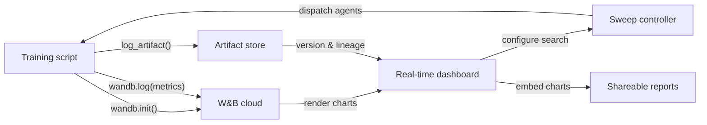

# Weights & Biases (W&B)

## 定义

Weights & Biases（通常缩写为 W&B 或 wandb）是一个云原生 MLOps 平台，在单一集成产品中提供实验追踪、数据集和模型版本化、超参数优化以及交互式报告。W&B 于 2017 年成立，在学术研究和工业界广泛采用，尤其受训练深度学习模型的团队欢迎，因为这些模型会产生丰富的媒体输出——图像、音频、视频、点云——这些在训练过程中需要可视化检查。

W&B 的核心价值主张是几乎不需要任何基础设施即可开始使用：注册一个免费账户，安装 `wandb` Python 包，在脚本中添加 `wandb.init()`，一切都会自动记录到 W&B 的云端。平台组织为**项目**（相关运行的集合）、**运行**（单次训练执行）、**制品**（版本化的数据集和模型文件）、**扫描**（自动超参数搜索）以及**报告**（嵌入实时图表的可共享叙述性文档）。

与 MLflow 等自托管解决方案不同，W&B 管理所有后端基础设施。这消除了运营负担，但意味着数据会离开你的本地环境——这对受监管行业而言是需要考虑的因素。W&B 为需要数据驻留保证的企业客户提供私有云和本地部署选项，但这需要付费计划。

## 工作原理

### 初始化与自动记录

调用 `wandb.init(project="...", config={...})` 启动一个运行，将配置发送到 W&B，并返回一个运行对象。许多流行的框架（PyTorch Lightning、Hugging Face Trainer、Keras、XGBoost、scikit-learn）提供 W&B 回调或集成，无需额外代码即可自动记录梯度、学习率计划和评估指标。在后台，一个后台线程在通过 HTTPS 发送之前对日志数据进行批处理和压缩，从而最大限度地减少训练开销。

### 实时仪表板

W&B UI 在运行进行时实时渲染指标曲线、系统利用率（GPU/CPU/内存）和媒体。多个运行可以在同一图表上叠加显示，并自动着色。运行可以按任意配置维度（例如，按学习率分组以查看其在所有实验中的效果）进行筛选和分组，从而实现快速的可视化诊断。

### 扫描（Sweeps）

扫描由一个 YAML 或 Python 字典定义，指定搜索空间、搜索策略（网格、随机或贝叶斯）以及停止准则（例如提前终止性能不佳的运行）。W&B 扫描控制器协调并行运行的多个代理，每个代理从控制器中选取超参数组合并将结果记录回去。贝叶斯搜索根据观察结果进行自适应调整，比网格搜索收敛得更快。

### 制品（Artifacts）

W&B Artifacts 将数据集、模型检查点和评估输出版本化为内容寻址的对象。制品链接到产生它的运行以及使用它的运行，从而创建数据血缘图。你可以用两行 Python 代码下载特定的制品版本，使数据集和模型的可重现性就像指定版本字符串一样简单。

### 报告（Reports）

报告是交互式文档，嵌入实时 W&B 图表、运行比较和 Markdown 叙述。它们是主要的协作界面：研究人员可以在 Slack 消息或 GitHub PR 中链接报告，以共享可重现的实验证据，无需导出静态图像。



## 何时使用 / 何时不使用

| 适合使用 | 避免使用 |
|----------|------------|
| 训练深度学习模型且需要丰富的媒体记录（图像、音频、嵌入向量） | 数据不能离开本地且负担不起企业本地部署计划 |
| 团队协作、共享结果和叙述性报告很重要 | 需要完全开源的自托管解决方案，无 SaaS 依赖 |
| 需要内置超参数优化，无需额外工具 | 实验简单，创建 SaaS 账户的开销不值得 |
| 团队在研究或学术界工作，可以受益于免费层访问 | 预算紧张，且付费层功能对你的团队规模是必要的 |

## 工具比较

| 标准 | W&B | MLflow |
|-----------|-----|--------|
| 配置简易度 | 免费 SaaS 账户；无基础设施；`wandb login` + 两行代码 | 可本地自托管；无需账户；`mlflow ui` 启动 |
| UI 质量 | 精美、交互性强；专为视觉和媒体密集型工作负载设计 | 简洁且功能齐全；更适合表格指标比较 |
| 协作 | 原生团队工作区、报告、共享链接、Slack 集成 | 需要共享服务器；开源版无内置协作功能 |
| 定价 | 个人免费；大型团队付费；本地部署企业版 | 免费开源；Databricks Managed MLflow 额外收费 |
| 超参数优化 | 内置 Sweeps，支持贝叶斯/网格/随机搜索 + 早停 | 需要外部工具（Optuna、Ray Tune） |

## 代码示例

```python
# wandb_tracking_example.py
# W&B experiment tracking: logs config, metrics, images, and registers a model artifact.
# pip install wandb scikit-learn matplotlib Pillow

import wandb
import numpy as np
import matplotlib.pyplot as plt
from sklearn.ensemble import RandomForestClassifier
from sklearn.datasets import load_digits
from sklearn.model_selection import train_test_split
from sklearn.metrics import (
    accuracy_score, f1_score, confusion_matrix, ConfusionMatrixDisplay
)
import os, tempfile

# ── 1. Initialize the W&B run ─────────────────────────────────────────────────
run = wandb.init(
    project="digits-classification",
    name="random-forest-v1",
    config={                         # All hyperparameters go here
        "n_estimators": 150,
        "max_depth": 12,
        "min_samples_split": 4,
        "random_state": 7,
        "dataset": "sklearn-digits",
    },
)
cfg = wandb.config  # Access config values through this proxy

# ── 2. Data ───────────────────────────────────────────────────────────────────
X, y = load_digits(return_X_y=True)
X_train, X_test, y_train, y_test = train_test_split(
    X, y, test_size=0.2, stratify=y, random_state=cfg.random_state
)

# ── 3. Train ──────────────────────────────────────────────────────────────────
clf = RandomForestClassifier(
    n_estimators=cfg.n_estimators,
    max_depth=cfg.max_depth,
    min_samples_split=cfg.min_samples_split,
    random_state=cfg.random_state,
)
clf.fit(X_train, y_train)

# ── 4. Evaluate and log metrics ───────────────────────────────────────────────
y_pred = clf.predict(X_test)
metrics = {
    "accuracy": accuracy_score(y_test, y_pred),
    "f1_macro": f1_score(y_test, y_pred, average="macro"),
    "n_train": len(X_train),
    "n_test": len(X_test),
}
wandb.log(metrics)

# ── 5. Log a confusion matrix image ──────────────────────────────────────────
cm = confusion_matrix(y_test, y_pred)
fig, ax = plt.subplots(figsize=(8, 8))
ConfusionMatrixDisplay(cm).plot(ax=ax)
ax.set_title("Confusion Matrix – digits RF")
wandb.log({"confusion_matrix": wandb.Image(fig)})
plt.close(fig)

# ── 6. Save model as a versioned W&B Artifact ─────────────────────────────────
import joblib

with tempfile.TemporaryDirectory() as tmp:
    model_path = os.path.join(tmp, "model.joblib")
    joblib.dump(clf, model_path)

    artifact = wandb.Artifact(
        name="digits-rf-model",
        type="model",
        description="Random Forest trained on sklearn digits dataset",
        metadata=dict(metrics),
    )
    artifact.add_file(model_path)
    run.log_artifact(artifact)

# ── 7. Finish the run ─────────────────────────────────────────────────────────
run.finish()
print(f"Accuracy: {metrics['accuracy']:.4f} | F1 macro: {metrics['f1_macro']:.4f}")
print(f"View run at: {run.url}")
```

## 实践资源

- [W&B 官方文档](https://docs.wandb.ai/) — 涵盖 Python SDK、集成、扫描、制品和报告的完整参考。
- [W&B 快速入门](https://docs.wandb.ai/quickstart) — 用最少示例在五分钟内记录你的第一个 W&B 运行。
- [W&B 扫描文档](https://docs.wandb.ai/guides/sweeps) — 配置和运行分布式超参数搜索的综合指南。
- [W&B Fully Connected 博客](https://wandb.ai/fully-connected) — 深度教程、基准报告和 ML 工程文章的从业者博客。
- [Hugging Face + W&B 集成](https://docs.wandb.ai/guides/integrations/huggingface) — 通过单个 `report_to="wandb"` 参数自动记录所有 Hugging Face Trainer 指标的指南。

## 另请参阅

- [实验追踪（Experiment tracking）](/docs/mlops/experiment-tracking)
- [MLflow](/docs/mlops/mlflow)
- [MLOps](/docs/mlops)
