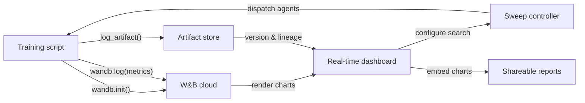

# Weights & Biases (W&B)

## 定义

Weights & Biases（通常缩写为 W&B 或 wandb）是一个云原生 MLOps 平台，在单一集成产品中提供实验追踪、数据集和模型版本控制、超参数优化以及交互式报告。创立于 2017 年，在学术研究和工业界均被广泛采用，W&B 在训练深度学习模型的团队中尤为流行，这些模型产生丰富的媒体输出——图像、音频、视频、点云——在训练过程中受益于可视化检查。

W&B 的核心价值主张是几乎不需要任何基础设施即可开始使用：注册一个免费账户，安装 `wandb` Python 包，在脚本中添加 `wandb.init()`，一切都会自动记录到 W&B 的云端。该平台被组织为**项目**（相关运行的集合）、**runs**（单次训练执行）、**artifacts**（版本化的数据集和模型文件）、**sweeps**（自动化超参数搜索）和**reports**（嵌入实时图表的可分享叙述性文档）。

与 MLflow 等自托管解决方案不同，W&B 管理所有后端基础设施。这消除了运维负担，但意味着数据会离开您的场所——这对受监管行业来说是一个相关考量。W&B 为需要数据驻留保证的企业客户提供私有云和本地部署选项，但这些需要付费计划。

## 工作原理

### 初始化和自动日志记录

调用 `wandb.init(project="...", config={...})` 启动一次运行，将配置发送到 W&B，并返回运行对象。许多流行框架（PyTorch Lightning、Hugging Face Trainer、Keras、XGBoost、scikit-learn）提供 W&B 回调或集成，无需额外代码即可自动记录梯度、学习率调度和评估指标。在底层，后台线程在通过 HTTPS 发送日志数据之前对其进行批处理和压缩，最大程度减少训练开销。

### 实时仪表板

W&B UI 在运行进行时渲染指标曲线、系统利用率（GPU/CPU/内存）和媒体。多次运行可以叠加在同一图表上，并自动进行颜色编码。运行可以按任意配置维度过滤和分组，从而实现快速的可视化诊断。

### Sweeps

Sweep 由 YAML 或 Python 字典定义，指定搜索空间、搜索策略（网格、随机或贝叶斯）和停止标准。W&B sweep 控制器协调多个并行运行的代理，每个代理从控制器中选取超参数组合并将结果记录回去。贝叶斯搜索根据观察到的结果进行自适应，比网格搜索收敛更快。

### Artifacts

W&B Artifacts 将数据集、模型检查点和评估输出版本化为内容寻址对象。一个 artifact 与产生它的运行以及消费它的运行相关联，创建了一个数据谱系图。只需两行 Python 代码即可下载特定 artifact 版本，使数据集和模型的可复现性如同指定版本字符串一样简单。

### Reports

Reports 是交互式文档，嵌入了实时 W&B 图表、运行比较和 Markdown 叙述。它们是主要的协作界面：研究员可以在 Slack 消息或 GitHub PR 中分享 report 链接，无需导出静态图像即可共享可复现的实验证据。



## 何时使用 / 何时不使用

| 使用场景 | 避免场景 |
|----------|------------|
| 训练深度学习模型并需要丰富的媒体日志记录（图像、音频、嵌入） | 数据不能离开场所，且无法承担企业本地部署计划 |
| 团队协作、共享结果和叙述性报告很重要 | 需要完全开源的自托管解决方案，无 SaaS 依赖 |
| 希望内置超参数优化而无需额外工具 | 实验简单，SaaS 账户的开销不值得 |
| 团队在研究或学术界工作，受益于免费层访问 | 预算有限，且付费层的功能对团队规模是必需的 |

## 比较

| 标准 | W&B | MLflow |
|-----------|-----|--------|
| 配置难易度 | 免费 SaaS 账户；无基础设施；`wandb login` + 两行代码 | 可本地自托管；无需账户；`mlflow ui` 启动 |
| UI 质量 | 精致，交互式；为视觉和媒体密集型工作负载构建 | 简洁实用；更适合表格指标比较 |
| 协作 | 原生团队工作区、报告、分享链接、Slack 集成 | 需要共享服务器；OSS 中没有内置协作功能 |
| 定价 | 个人免费；较大团队付费；on-prem 企业版 | 免费开源；Databricks Managed MLflow 额外收费 |
| 超参数优化 | 内置 Sweeps，支持贝叶斯/网格/随机 + 早停 | 需要外部工具（Optuna、Ray Tune） |

## 代码示例

```python
# wandb_tracking_example.py
# W&B experiment tracking: logs config, metrics, images, and registers a model artifact.
# pip install wandb scikit-learn matplotlib Pillow

import wandb
from sklearn.ensemble import RandomForestClassifier
from sklearn.datasets import load_digits
from sklearn.model_selection import train_test_split
from sklearn.metrics import accuracy_score, f1_score

run = wandb.init(
    project="digits-classification",
    name="random-forest-v1",
    config={
        "n_estimators": 150,
        "max_depth": 12,
        "random_state": 7,
    },
)
cfg = wandb.config

X, y = load_digits(return_X_y=True)
X_train, X_test, y_train, y_test = train_test_split(
    X, y, test_size=0.2, stratify=y, random_state=cfg.random_state
)

clf = RandomForestClassifier(
    n_estimators=cfg.n_estimators,
    max_depth=cfg.max_depth,
    random_state=cfg.random_state,
)
clf.fit(X_train, y_train)

y_pred = clf.predict(X_test)
metrics = {
    "accuracy": accuracy_score(y_test, y_pred),
    "f1_macro": f1_score(y_test, y_pred, average="macro"),
}
wandb.log(metrics)
run.finish()
```

## 实用资源

- [W&B Official Documentation](https://docs.wandb.ai/) — 涵盖 Python SDK、集成、sweeps、artifacts 和报告的完整参考。
- [W&B Quickstart](https://docs.wandb.ai/quickstart) — 通过最简示例在五分钟内记录您的第一次 W&B 运行。
- [W&B Sweeps Documentation](https://docs.wandb.ai/guides/sweeps) — 配置和运行分布式超参数搜索的综合指南。
- [W&B Fully Connected Blog](https://wandb.ai/fully-connected) — 包含深度教程、基准报告和 ML 工程文章的从业者博客。
- [Hugging Face + W&B Integration](https://docs.wandb.ai/guides/integrations/huggingface) — 使用单个 `report_to="wandb"` 参数自动记录所有 Hugging Face Trainer 指标的指南。

## 另请参阅

- [Experiment tracking](/docs/mlops/experiment-tracking)
- [MLflow](/docs/mlops/mlflow)
- [MLOps](/docs/mlops)
