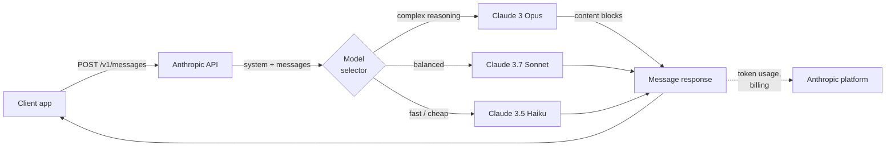
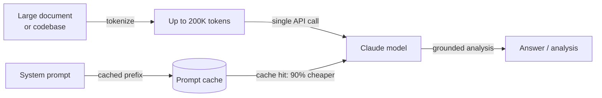

# Anthropic

## 定义

**Anthropic** 是一家 AI 安全公司和模型提供商，由前 OpenAI 研究人员于 2021 年创立。其核心论点是：构建强大的 AI 模型与解决对齐问题是不可分割的目标——公司在追求前沿能力的同时，也开展宪法 AI（Constitutional AI）、可解释性和模型内部机制理解等安全研究。这些研究的商业成果是 **Claude** 系列模型，通过 Anthropic API 和企业产品提供访问。

Claude 模型系列采用三层命名约定，反映能力和成本的权衡：**Opus**（最高质量、复杂推理）、**Sonnet**（质量与速度平衡）和 **Haiku**（最快且最具成本效益）。截至 2025 年，当前一代为 **Claude 3.7 Sonnet**——具有扩展思考能力的旗舰模型——以及 **Claude 3 Opus**、**Claude 3.5 Sonnet** 和 **Claude 3.5 Haiku**。所有 Claude 3+ 模型均支持视觉输入（图像），整个系列围绕 200K token 上下文窗口设计，无需截断即可处理书籍、大型代码库和长对话历史。

从平台角度来看，Anthropic 的 API 以 **Messages API** 为核心——这是一个专为多轮对话设计的简洁接口。该平台包括工具使用（Anthropic 对函数调用的称法）、扩展思考（可见的思维链推理）、提示缓存（降低大型重复上下文的成本和延迟）以及批处理。Python SDK（`anthropic`）和 TypeScript SDK 是主要的客户端库。Claude 模型还可通过 Amazon Bedrock、Google Cloud Vertex AI 以及具有数据驻留选项的企业合同获取。

## 工作原理

### Messages API

Messages API（`POST /v1/messages`）是 Anthropic 的主要接口。与某些使用扁平 `prompt` 字符串的 API 不同，Messages API 以对话为中心：您发送包含交替 `user` 和 `assistant` 轮次的 `messages` 数组，并可通过可选的 `system` 参数设置上下文和角色。模型返回包含 `content` 列表的 `Message` 对象——默认为文本块，当模型决定调用工具时为工具使用块。流式传输受支持，推荐用于交互式场景；SDK 提供流式传输辅助工具和原始 SSE 访问。



### 工具使用

工具使用允许 Claude 通过发出结构化的 `tool_use` 内容块来调用外部函数。您在 `tools` 参数中将工具声明为 JSON schema。当 Claude 决定需要使用某个工具时，响应包含一个带有工具名称和输入的 `tool_use` 块；您的代码执行该函数并在下一个用户轮次中返回 `tool_result`。Claude 随后使用该结果来完成其响应。这种模式支持代理、代码执行环境、数据库查询和 API 集成，而无需模型直接访问任何系统。


### 扩展思考

扩展思考是 Claude 3.7 Sonnet 上可用的一种模式，允许模型在产生最终答案之前进行深度推理。当您设置 `thinking: {type: "enabled", budget_tokens: N}` 时，模型会发出包含其内部草稿的 `thinking` 内容块——类似于思维链，但是原生且结构化的。扩展思考显著提高了数学竞赛、复杂代码、多步骤推理以及需要仔细逐步分析的任务上的性能。思考 token 计入 token 预算，但在响应中可见，让您了解模型如何得出答案。

### 提示缓存

提示缓存大幅降低了重复使用大型系统提示或文档上下文的工作负载的成本和延迟。您用 `cache_control: {type: "ephemeral"}` 标记请求的前缀部分。首次调用时，Anthropic 在其基础设施上缓存提示前缀；后续与前缀匹配的调用从缓存提供，输入 token 成本降低 90%，首 token 时间也显著缩短。这对于 RAG 管道（每次查询都传入大量上下文）、代理循环（每轮重复大型系统提示）和批量文档处理特别有价值。

### 长上下文（200K token）

所有 Claude 3 及更高版本的模型均支持 200K token 上下文窗口——相当于约 15 万字或约 500 页文本。长上下文使整个代码库、法律文件、研究论文或完整对话历史能够在单次调用中处理，无需分块。Anthropic 关于长上下文性能的研究（"大海捞针"评估）表明，Claude 在整个 200K 范围内保持较高的召回准确率，使其在文档问答、合同分析和大型代码库代码审查方面可靠。这是 Anthropic 相对于 GPT-4o 的 128K 窗口最明显的差异化优势之一。



## 何时使用 / 何时不使用

| 使用 Anthropic 的场景 | 避免或考虑替代方案的场景 |
|--------------------|--------------------------------------|
| 需要 200K 上下文窗口处理长文档、代码库或扩展对话而不截断 | 工作负载需要图像生成、音频转录或文字转语音——Claude 仅支持文本/视觉；OpenAI 支持音频 |
| 安全约束和可预测的拒绝行为至关重要（合规、医疗、金融） | 需要开放权重模型用于自托管、微调或数据驻留——Anthropic 不提供开放权重选项 |
| 希望通过扩展思考完成深度推理任务（数学、复杂代码、多步分析） | 主要用例是大量嵌入生成——Anthropic 不提供嵌入 API |
| 提示缓存能显著降低成本（大量重复上下文、代理系统提示） | 严重依赖 OpenAI 专用工具（Assistants API、DALL-E、Whisper），这些没有 Anthropic 等效项 |
| 构建工具使用或计算机使用工作流，需要一个经过良好校准的结构化输出模型 | 需要按 token 的绝对最低成本——Claude Haiku 在价格上有竞争力，但 GPT-4o-mini 和开放模型更便宜 |

## 比较

| 标准 | Anthropic | OpenAI | Google Gemini |
|----------|-----------|--------|---------------|
| 旗舰模型 | Claude 3.7 Sonnet | GPT-4o | Gemini 2.5 Pro |
| 上下文窗口 | 200K（所有 Claude 3+） | 128K（GPT-4o） | 最高 1M（Gemini 1.5 Pro） |
| 推理/思考 | 扩展思考（原生 CoT） | o1、o3 系列 | Gemini 2.5 Pro 思考 |
| 多模态输入 | 文本、图像 | 文本、图像、音频、视频 | 文本、图像、音频、视频 |
| 音频/语音 | 否 | 是（Whisper、TTS） | 是（Gemini） |
| 图像生成 | 否 | 是（DALL-E 3） | 是（Imagen） |
| 嵌入 API | 否 | 是 | 是 |
| 开放权重 | 否 | 否 | Gemma（部分） |
| 提示缓存 | 是（原生，90% 折扣） | 上下文缓存（有限） | 是（Gemini） |
| 工具使用/函数调用 | 成熟，支持计算机使用 | 成熟，广泛采用 | 成熟 |
| 安全理念 | 宪法 AI，拒绝调优 | 审核 API，使用政策 | 负责任 AI 准则 |
| 数据驻留选项 | 企业合同 | 企业合同 | Google Cloud 区域 |

## 优缺点

| 优点 | 缺点 |
|------|------|
| 所有模型均具备 200K 上下文窗口——长文档处理的行业领先水平 | 没有音频、语音或图像生成 API |
| 扩展思考为困难推理任务提供透明的思维链 | 没有嵌入 API——RAG 需要第二个提供商 |
| 提示缓存显著降低重复大型上下文的成本 | 封闭模型，没有开放权重选项 |
| 以安全为先的设计，具有谨慎的拒绝校准和宪法 AI | 生态系统比 OpenAI 小——第三方教程和集成更少 |
| 计算机使用（测试版）支持桌面 GUI 的代理控制 | 对简单任务而言，定价可能高于 GPT-4o-mini 或开放权重替代方案 |

## 代码示例

### Messages API——基本补全和系统提示

```python
import anthropic

client = anthropic.Anthropic(api_key="sk-ant-...")  # or set ANTHROPIC_API_KEY env var

# Basic message
message = client.messages.create(
    model="claude-3-7-sonnet-20250219",
    max_tokens=1024,
    system="You are a concise technical assistant. Answer in plain English.",
    messages=[
        {"role": "user", "content": "What is the Anthropic Messages API?"}
    ],
)
print(message.content[0].text)

# Multi-turn conversation
messages = [
    {"role": "user", "content": "What is prompt caching?"},
    {"role": "assistant", "content": "Prompt caching stores repeated large context..."},
    {"role": "user", "content": "How much does it save?"},
]
response = client.messages.create(
    model="claude-3-5-haiku-20241022",
    max_tokens=512,
    messages=messages,
)
print(response.content[0].text)
```

### 工具使用

```python
import json
import anthropic

client = anthropic.Anthropic()

# Define tools as JSON schemas
tools = [
    {
        "name": "search_docs",
        "description": "Search the documentation for a given query and return relevant passages.",
        "input_schema": {
            "type": "object",
            "properties": {
                "query": {"type": "string", "description": "Search query"},
                "max_results": {"type": "integer", "default": 3},
            },
            "required": ["query"],
        },
    }
]

messages = [{"role": "user", "content": "How do I enable prompt caching?"}]

# First call — Claude may request a tool
response = client.messages.create(
    model="claude-3-7-sonnet-20250219",
    max_tokens=1024,
    tools=tools,
    messages=messages,
)

# Process tool calls
if response.stop_reason == "tool_use":
    messages.append({"role": "assistant", "content": response.content})

    tool_results = []
    for block in response.content:
        if block.type == "tool_use":
            # Simulated tool execution
            result = f"Prompt caching docs for '{block.input['query']}': use cache_control param..."
            tool_results.append({
                "type": "tool_result",
                "tool_use_id": block.id,
                "content": result,
            })

    messages.append({"role": "user", "content": tool_results})

    # Final call with tool result
    final = client.messages.create(
        model="claude-3-7-sonnet-20250219",
        max_tokens=1024,
        tools=tools,
        messages=messages,
    )
    print(final.content[0].text)
```

### 扩展思考

```python
import anthropic

client = anthropic.Anthropic()

response = client.messages.create(
    model="claude-3-7-sonnet-20250219",
    max_tokens=16000,
    thinking={
        "type": "enabled",
        "budget_tokens": 10000,  # tokens allocated for internal reasoning
    },
    messages=[{
        "role": "user",
        "content": (
            "A train leaves city A at 9am traveling at 80 km/h. "
            "Another train leaves city B (320 km away) at 10am traveling at 100 km/h. "
            "At what time do they meet, and how far from city A?"
        ),
    }],
)

for block in response.content:
    if block.type == "thinking":
        print("=== Model's internal reasoning ===")
        print(block.thinking[:500], "...")  # first 500 chars for brevity
    elif block.type == "text":
        print("=== Final answer ===")
        print(block.text)
```

### 大型重复上下文的提示缓存

```python
import anthropic

client = anthropic.Anthropic()

# Large document loaded once — cached after first call
large_document = open("contract.txt").read()  # e.g., 50K tokens

response = client.messages.create(
    model="claude-3-5-sonnet-20241022",
    max_tokens=1024,
    system=[
        {
            "type": "text",
            "text": "You are a legal document analyst. Answer questions based solely on the document provided.",
        },
        {
            "type": "text",
            "text": large_document,
            "cache_control": {"type": "ephemeral"},  # mark for caching
        },
    ],
    messages=[{"role": "user", "content": "What are the termination clauses?"}],
)

print(response.content[0].text)
# usage.cache_creation_input_tokens — tokens cached this call (full price)
# usage.cache_read_input_tokens — tokens served from cache (10% price)
print(response.usage)
```

## 实用资源

- [Anthropic API 参考](https://docs.anthropic.com/en/api/getting-started) — 完整的端点文档，包含请求/响应 schema 和参数参考
- [Anthropic 提示工程指南](https://docs.anthropic.com/en/docs/build-with-claude/prompt-engineering/overview) — 系统提示、思维链和任务特定技术的官方最佳实践
- [Anthropic Cookbook](https://github.com/anthropics/anthropic-cookbook) — 涵盖工具使用、RAG、多模态、提示缓存和代理的可运行笔记本
- [Claude 模型概述](https://docs.anthropic.com/en/docs/about-claude/models) — 当前模型 ID、上下文窗口、能力比较和弃用时间表
- [Anthropic Python SDK（GitHub）](https://github.com/anthropics/anthropic-sdk-python) — 源码、变更日志、类型存根和迁移指南

## 另请参阅

- [模型提供商](/docs/model-providers) — 所有提供商的概述和比较，包括 7 家提供商对比表
- [案例研究：Claude](/docs/case-studies/claude) — 深入了解模型架构和训练方法，请参阅 Claude 案例研究
- [OpenAI](/docs/model-providers/openai) — GPT-4o、o 系列推理、函数调用、DALL-E、Whisper
- [提示工程](/docs/prompt-engineering) — 适用于所有 Claude 模型的技术
- [工具](/docs/tools/claude-code) — Claude Code，基于 Claude API 构建的 Anthropic AI 编码代理
- [代理](/docs/agents) — 使用 Claude 工具使用构建代理工作流
