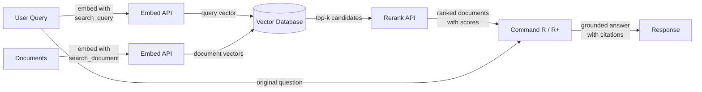

# Cohere

## 定义

**Cohere** 是一家企业级 AI 公司，专门为商业应用构建语言模型和 API，专注于搜索、信息检索和检索增强生成（RAG）。与提供广泛消费者和开发者功能的通用提供商不同，Cohere 面向需要可靠、生产就绪的 NLP 基础设施的企业客户——特别是对于*查找和呈现正确信息*是核心问题的用例。

Cohere 的模型系列反映了这一重点。**Command R** 和 **Command R+** 是专门针对 RAG 工作流优化的对话和指令遵循模型——它们支持长上下文窗口，并经过训练能可靠地遵循基于检索的提示。**Embed** 提供跨 100 多种语言的最先进的多语言密集向量嵌入，是全球企业搜索应用的首选。**Rerank** 是一个交叉编码器模型，它接收一组初始检索的文档，并根据原始查询重新对它们进行评分，以实现单纯稀疏和密集检索无法达到的精确度。

Cohere 与 OpenAI 等通用提供商的区别在于，其整个产品套件都围绕检索管道作为一等工作流而设计。Embed、Rerank 和 Command R 模型被构建为协同工作的整体技术栈，Cohere 还提供满足严格企业数据治理和合规要求的本地部署和私有云部署选项——这对于金融、医疗和政府等受监管行业是关键区别。

## 工作原理

### 聊天和生成 API

Command R 和 Command R+ 模型通过 Cohere 的聊天 API 访问，同时支持对话式多轮交互和单轮生成任务。Command R+ 是更大、功能更强的变体，适用于复杂推理和重文档的 RAG；而 Command R 针对高吞吐量生产管道中的低延迟和低成本进行了优化。两个模型都接受 `documents` 参数，允许您将检索到的上下文直接传入提示，实现原生 RAG 模式，其中模型被指示基于提供的内容回答并引用来源。

### 嵌入 API（多语言嵌入）

嵌入 API 将文本转换为适合语义相似性搜索的密集向量表示。Cohere 的嵌入模型在单一模型中支持 100 多种语言，使得跨语言搜索和多语言文档检索无需单独的语言特定模型即可实现。嵌入可以使用不同的 `input_type` 值生成——`search_document` 用于索引时内容，`search_query` 用于运行时查询编码——这种区分应用了非对称训练信号，通常比对称嵌入方案提高检索准确性。

### 重排 API

重排 API 接受查询和候选文档列表（通常是向量或关键词搜索的 top-k 结果），并通过交叉编码器计算的相关性分数返回每个文档。交叉编码器在单次前向传播中联合评估查询和文档，比分别编码查询和文档的双编码器具有更高的精确度。重排是一个轻量但高效的步骤，能显著提高 precision@k——当初始检索相对廉价（BM25 或 ANN 搜索）但在将上下文传递给 LLM 之前需要最大化精确度时，它最具价值。

### RAG 集成

Cohere 的 RAG 集成将 Embed、Rerank 和 Command R 连接成统一管道。典型流程是：嵌入查询、在向量数据库中运行近似最近邻搜索、对 top 候选进行重排以获取最相关文档，然后将这些文档与原始查询一起传递给 Command R 以进行有依据的生成。模型返回答案以及引用检索文档中特定段落的引用对象，使构建可审计、有来源的 AI 应用变得简单。



## 何时使用 / 何时不使用

| 使用场景 | 避免场景 |
|----------|------------|
| 构建企业搜索或知识库问答，检索精确度至关重要 | 需要没有检索组件的通用聊天助手 |
| 内容跨多种语言，需要单一嵌入模型处理所有语言 | 主要用例是图像、音频或多模态——Cohere 仅支持文本 |
| 希望在初始向量或 BM25 搜索后添加重排步骤以提高精确度 | 独立任务需要高强度推理、数学或编码能力（GPT-4o 或 Claude 可能表现更好） |
| 数据治理要求必须在本地或私有云部署 | 项目是快速原型，需要最广泛的集成生态系统 |
| 需要在模型输出中原生支持来源引用和文档接地 | 预算极为紧张——Cohere 的企业定价高于某些替代方案 |

## 比较

| 标准 | Cohere | OpenAI | Mistral |
|----------|--------|--------|---------|
| 嵌入质量（MTEB） | 多语言顶级，100+ 种语言 | 强大的英语优先（text-embedding-3-large） | 有竞争力；mistral-embed 可用 |
| 重排 | 原生重排 API（交叉编码器） | 无原生重排端点 | 无原生重排端点 |
| RAG 原生模型 | Command R/R+ 专为带引用的 RAG 设计 | GPT-4o 与 RAG 提示配合良好，但非 RAG 原生 | Mixtral/Mistral 与 RAG 提示配合使用 |
| 开放权重 | 否（仅专有 API） | 否（仅专有 API） | 是（Mistral 模型在 Hugging Face 上） |
| 本地/私有云 | 是（企业合同） | Azure OpenAI（有限） | 是（自托管开放权重） |
| 多语言嵌入 | 单一模型，100+ 种语言 | 单独或有限的多语言支持 | 有限的多语言嵌入支持 |
| 定价模式 | 企业/按 token | 按 token，文档完善 | 按 token；自托管选项免费 |

## 优缺点

| 优点 | 缺点 |
|------|------|
| 单一模型中业界一流的多语言嵌入 | 与 OpenAI 相比，通用生态系统较小 |
| 原生重排 API 显著提高检索精确度 | 没有用于自托管的开放权重选项 |
| Command R/R+ 专为有依据、带引用的 RAG 构建 | 在复杂的独立推理方面不如 GPT-4o/Claude |
| 企业级部署选项，包括私有云 | 文档和社区资源比 OpenAI 少 |
| RAG 管道组件（Embed + Rerank + Command R）作为整体技术栈协同工作 | 小规模实验的定价可能较高 |

## 代码示例

### 使用 Command R 聊天

```python
import cohere

co = cohere.Client("YOUR_COHERE_API_KEY")

response = co.chat(
    model="command-r-plus",
    message="Explain retrieval-augmented generation in plain English.",
)
print(response.text)
```

### 用于语义搜索的嵌入

```python
import cohere

co = cohere.Client("YOUR_COHERE_API_KEY")

# Embed documents at indexing time
documents = [
    "Cohere specializes in enterprise NLP and semantic search.",
    "RAG combines retrieval with language model generation.",
    "Multilingual embeddings support over 100 languages.",
]
doc_embeddings = co.embed(
    texts=documents,
    model="embed-multilingual-v3.0",
    input_type="search_document",
).embeddings

# Embed a query at search time
query_embedding = co.embed(
    texts=["What does Cohere specialize in?"],
    model="embed-multilingual-v3.0",
    input_type="search_query",
).embeddings[0]

# Compute cosine similarity (or use a vector DB)
import numpy as np

doc_array = np.array(doc_embeddings)
query_array = np.array(query_embedding)
scores = doc_array @ query_array / (
    np.linalg.norm(doc_array, axis=1) * np.linalg.norm(query_array)
)
top_idx = int(np.argmax(scores))
print(f"Most relevant: '{documents[top_idx]}' (score: {scores[top_idx]:.4f})")
```

### 对检索候选进行重排

```python
import cohere

co = cohere.Client("YOUR_COHERE_API_KEY")

query = "How does multilingual embedding work?"
candidates = [
    "Cohere Embed supports over 100 languages in a single model.",
    "Command R+ is optimized for RAG workflows with long context.",
    "Rerank re-scores retrieved documents with a cross-encoder.",
    "BM25 is a classic keyword-based retrieval algorithm.",
]

results = co.rerank(
    model="rerank-multilingual-v3.0",
    query=query,
    documents=candidates,
    top_n=3,
)

for hit in results.results:
    print(f"[{hit.relevance_score:.4f}] {candidates[hit.index]}")
```

### 带 Command R+ 引用的完整 RAG 管道

```python
import cohere

co = cohere.Client("YOUR_COHERE_API_KEY")

# Documents retrieved from your vector store (simplified)
retrieved_docs = [
    {"id": "doc1", "text": "Cohere Embed supports 100+ languages for multilingual search."},
    {"id": "doc2", "text": "Command R+ is designed for grounded generation with source citations."},
    {"id": "doc3", "text": "Rerank improves precision by re-scoring candidates with a cross-encoder."},
]

response = co.chat(
    model="command-r-plus",
    message="How does Cohere's pipeline improve search quality?",
    documents=retrieved_docs,
)

print(response.text)
print("\n--- Citations ---")
for citation in response.citations:
    print(f"  [{citation.start}:{citation.end}] → {[doc['id'] for doc in citation.documents]}")
```

## 实用资源

- [Cohere API 文档](https://docs.cohere.com/) — 所有 Cohere API 的完整参考，包括 Chat、Embed 和 Rerank
- [Cohere Embed 文档](https://docs.cohere.com/docs/embeddings) — 嵌入模型、输入类型和多语言支持的详细指南
- [Cohere Rerank 文档](https://docs.cohere.com/docs/reranking) — 重排 API 指南，包含示例和模型选择建议
- [Cohere RAG 指南](https://docs.cohere.com/docs/retrieval-augmented-generation-rag) — 使用 Command R 构建 RAG 管道的端到端演示
- [MTEB 排行榜](https://huggingface.co/spaces/mteb/leaderboard) — 包括 Cohere Embed 在内的嵌入模型独立基准测试

## 另请参阅

- [模型提供商](/docs/model-providers)
- [RAG](/docs/rag)
- [嵌入](/docs/rag/embeddings)
- [语义搜索](/docs/semantic-search)
