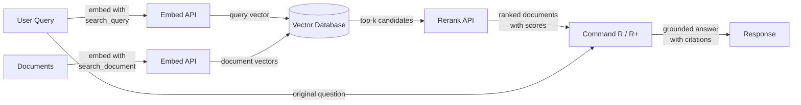

# Cohere

## 定义

**Cohere** 是一家企业 AI 公司，专门为商业应用构建语言模型和 API，具有鲜明的搜索、信息检索和检索增强生成（RAG）焦点。与提供广泛消费者和开发者功能的通用提供商不同，Cohere 针对需要可靠的生产就绪 NLP 基础设施的企业客户——特别是*找到并呈现正确信息*是核心问题的用例。

Cohere 的模型阵容反映了这一重点。**Command R** 和 **Command R+** 是专门针对 RAG 工作流程优化的对话式和指令跟随模型——它们支持长上下文窗口，并经过训练能够可靠地遵循基于检索的提示。**Embed** 在 100 多种语言中提供最先进的多语言密集向量嵌入，使其成为全球企业搜索应用的首选。**Rerank** 是一个交叉编码器模型，对初始检索到的文档集进行重新评分，实现稀疏和密集检索单独无法达到的精度。

Cohere 与 OpenAI 等通用提供商的区别在于，其整个产品套件都是围绕检索管道作为一流工作流程设计的。Embed、Rerank 和 Command R 模型被构建为协同工作的一致堆栈，Cohere 提供满足严格企业数据治理和合规要求的本地部署和私有云部署选项——这是金融、医疗和政府等受监管行业的关键区别。

## 工作原理

### 聊天和生成 API

Command R 和 Command R+ 模型通过 Cohere 的聊天 API 访问，支持多轮对话交互和单轮生成任务。Command R+ 是更大、更有能力的变体，适合复杂推理和文档密集型 RAG，而 Command R 在高吞吐量生产管道中针对更低的延迟和成本进行了优化。两个模型都接受 `documents` 参数，允许您将检索到的上下文直接传递到提示中，启用原生 RAG 模式，指示模型将其答案基于提供的内容并引用来源。

### Embed API（多语言嵌入）

Embed API 将文本转换为适合语义相似性搜索的密集向量表示。Cohere 的嵌入模型在单个模型中支持 100 多种语言，使得跨语言搜索和多语言文档检索无需单独的语言特定模型成为可能。嵌入可以使用不同的 `input_type` 值生成——`search_document` 用于索引静态内容，`search_query` 用于在运行时编码查询——这种区别应用了不对称的训练信号，通常比对称嵌入方案提高检索准确率。

### Rerank API

Rerank API 接受一个查询和一组候选文档（通常是向量或关键字搜索的 top-k 结果），并返回每个文档及由交叉编码器计算的相关性分数。交叉编码器在单次前向传递中联合评估查询和文档，提供比分别编码查询和文档的双编码器高得多的精度。重排序是一个轻量但高效的步骤，可以显著提高精度@k——当初始检索相对便宜（BM25 或 ANN 搜索）但在将上下文传递给 LLM 之前需要最大化精度时，它最有价值。

### RAG 集成

Cohere 的 RAG 集成将 Embed、Rerank 和 Command R 整合到统一的管道中。典型流程是：嵌入查询，在向量数据库中运行近似最近邻搜索，对顶部候选进行重排序以获得最相关的文档，然后将这些文档与原始查询一起传递给 Command R 进行基础生成。模型返回答案以及引用对象，这些对象引用检索到的文档中的特定段落，使构建可审计的、有来源引用的 AI 应用变得简单。



## 何时使用 / 何时不用

| 使用场景 | 避免场景 |
|---------|---------|
| 构建企业搜索或知识库问答，检索精度至关重要 | 需要无检索组件的通用聊天助手 |
| 内容跨多种语言，需要一个模型覆盖所有语言 | 用例主要是图像、音频或多模态——Cohere 仅支持文本 |
| 想在初始向量或 BM25 搜索后添加重排序步骤以提高精度 | 需要高能力推理、数学或编码用于独立任务 |
| 数据治理要求要求本地或私有云部署 | 项目是快速原型，需要最广泛的集成生态系统 |
| 需要模型输出中原生的来源引用和文档基础 | 预算极其紧张——Cohere 的企业定价高于一些替代品 |

## 对比

| 标准 | Cohere | OpenAI | Mistral |
|-----|--------|--------|---------|
| 嵌入质量（MTEB） | 顶级多语言，100+ 种语言 | 英语优先较强（text-embedding-3-large） | 有竞争力；mistral-embed 可用 |
| 重排序 | 原生 Rerank API（交叉编码器） | 无原生重排序端点 | 无原生重排序端点 |
| RAG 原生模型 | Command R/R+ 专为带引用的 RAG 设计 | GPT-4o 与 RAG 提示配合良好但非 RAG 原生 | Mixtral/Mistral 与 RAG 提示配合 |
| 开放权重 | 否（仅专有 API） | 否（仅专有 API） | 是（Hugging Face 上的 Mistral 模型） |
| 本地/私有云 | 是（企业合同） | Azure OpenAI（有限） | 是（自托管开放权重） |
| 多语言嵌入 | 单一模型，100+ 种语言 | 独立或有限的多语言支持 | 有限的多语言嵌入支持 |
| 定价模式 | 企业级/按 token 付费 | 按 token 付费，文档详细 | 按 token 付费；自托管选项免费 |

## 优缺点

| 优点 | 缺点 |
|------|------|
| 单一模型中的顶级多语言嵌入 | 与 OpenAI 相比，通用生态系统较小 |
| 原生 Rerank API 显著提高检索精度 | 无自托管的开放权重选项 |
| Command R/R+ 专为基础性带引用的 RAG 构建 | 对于独立的复杂推理，不如 GPT-4o / Claude 有能力 |
| 企业级部署选项，包括私有云 | 文档和社区资源不如 OpenAI 丰富 |
| RAG 管道组件（Embed + Rerank + Command R）作为一致堆栈协同工作 | 小规模实验的定价可能较高 |

## 代码示例

### 使用 Command R 聊天

```python
import cohere

co = cohere.Client("YOUR_COHERE_API_KEY")

response = co.chat(
    model="command-r-plus",
    message="Explain retrieval-augmented generation in plain English.",
)
print(response.text)
```

### 语义搜索的嵌入

```python
import cohere

co = cohere.Client("YOUR_COHERE_API_KEY")

# Embed documents at indexing time
documents = [
    "Cohere specializes in enterprise NLP and semantic search.",
    "RAG combines retrieval with language model generation.",
    "Multilingual embeddings support over 100 languages.",
]
doc_embeddings = co.embed(
    texts=documents,
    model="embed-multilingual-v3.0",
    input_type="search_document",
).embeddings

# Embed a query at search time
query_embedding = co.embed(
    texts=["What does Cohere specialize in?"],
    model="embed-multilingual-v3.0",
    input_type="search_query",
).embeddings[0]

# Compute cosine similarity (or use a vector DB)
import numpy as np

doc_array = np.array(doc_embeddings)
query_array = np.array(query_embedding)
scores = doc_array @ query_array / (
    np.linalg.norm(doc_array, axis=1) * np.linalg.norm(query_array)
)
top_idx = int(np.argmax(scores))
print(f"Most relevant: '{documents[top_idx]}' (score: {scores[top_idx]:.4f})")
```

### 对检索候选进行重排序

```python
import cohere

co = cohere.Client("YOUR_COHERE_API_KEY")

query = "How does multilingual embedding work?"
candidates = [
    "Cohere Embed supports over 100 languages in a single model.",
    "Command R+ is optimized for RAG workflows with long context.",
    "Rerank re-scores retrieved documents with a cross-encoder.",
    "BM25 is a classic keyword-based retrieval algorithm.",
]

results = co.rerank(
    model="rerank-multilingual-v3.0",
    query=query,
    documents=candidates,
    top_n=3,
)

for hit in results.results:
    print(f"[{hit.relevance_score:.4f}] {candidates[hit.index]}")
```

### 带 Command R+ 引用的完整 RAG 管道

```python
import cohere

co = cohere.Client("YOUR_COHERE_API_KEY")

# Documents retrieved from your vector store (simplified)
retrieved_docs = [
    {"id": "doc1", "text": "Cohere Embed supports 100+ languages for multilingual search."},
    {"id": "doc2", "text": "Command R+ is designed for grounded generation with source citations."},
    {"id": "doc3", "text": "Rerank improves precision by re-scoring candidates with a cross-encoder."},
]

response = co.chat(
    model="command-r-plus",
    message="How does Cohere's pipeline improve search quality?",
    documents=retrieved_docs,
)

print(response.text)
print("\n--- Citations ---")
for citation in response.citations:
    print(f"  [{citation.start}:{citation.end}] → {[doc['id'] for doc in citation.documents]}")
```

## 实用资源

- [Cohere API 文档](https://docs.cohere.com/) — 所有 Cohere API 的完整参考，包括聊天、嵌入和重排序
- [Cohere Embed 文档](https://docs.cohere.com/docs/embeddings) — 嵌入模型、输入类型和多语言支持的详细指南
- [Cohere Rerank 文档](https://docs.cohere.com/docs/reranking) — 带示例和模型选择建议的 Rerank API 指南
- [Cohere RAG 指南](https://docs.cohere.com/docs/retrieval-augmented-generation-rag) — 使用 Command R 构建 RAG 管道的端到端演练
- [MTEB Leaderboard](https://huggingface.co/spaces/mteb/leaderboard) — 比较包括 Cohere Embed 在内的嵌入模型的独立基准测试

## 另请参阅

- [模型提供商](/docs/model-providers)
- [RAG](/docs/rag)
- [Embeddings](/docs/rag/embeddings)
- [语义搜索](/docs/semantic-search)
