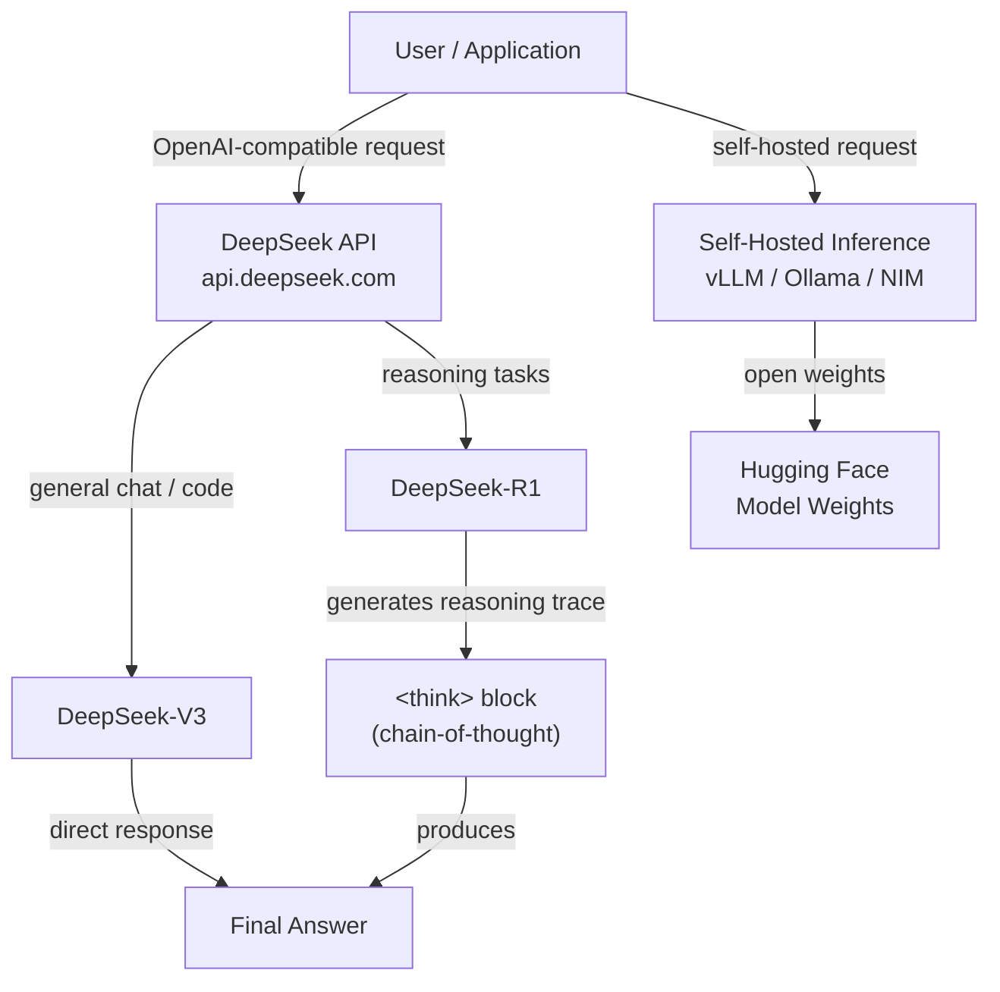

# DeepSeek

## 定义

**DeepSeek** 是一家中国 AI 研究实验室和商业平台，因生产出与最佳专有模型竞争的同时公开发布权重且运营成本仅为其一小部分的模型而引起了国际广泛关注。DeepSeek 于 2023 年作为高飞量化（量化对冲基金）的子公司成立，其方法以严格研究训练效率为特征——包括在混合专家（MoE）架构、人类反馈强化学习方面的创新，以及不依赖大量算力预算的新型推理方法。

模型系列涵盖三个主要能力领域。**DeepSeek-V3** 是一个通用聊天和指令遵循模型，在标准基准上可与 GPT-4o 和 Claude 3.5 Sonnet 媲美，同时 API 访问成本大幅降低。**DeepSeek-R1** 是一个专用推理模型，使用扩展思维链（CoT）——模型在产生最终答案之前生成明确的推理轨迹——使其在数学、逻辑推断和多步骤问题解决方面特别强大。**DeepSeek-Coder**（及其集成到 V3/R1 中的后续变体）专注于跨多种编程语言的代码生成、补全和调试。

DeepSeek 的开放权重方法意味着所有主要模型都在 Hugging Face 上提供，可以在您自己的基础设施上自托管——这对于有数据主权需求或希望在大规模使用时避免按 token API 成本的组织来说是关键能力。DeepSeek 平台还公开了与 OpenAI API 格式线路兼容的 API，这意味着使用 OpenAI Python SDK 构建的任何应用程序都可以通过更改 `base_url` 和 API 密钥而无需其他代码更改即可切换到 DeepSeek 模型。

## 工作原理

### API 平台

DeepSeek 在 `api.deepseek.com` 托管云推理 API，接受 OpenAI 聊天补全格式的请求。这种兼容层意味着集成开销极小——熟悉 OpenAI SDK 的开发者可以在几分钟内迁移或测试 DeepSeek 模型。该平台支持流式响应、函数调用和系统提示。定价基于 token 并公开列出，通常比同等级别的 OpenAI 模型低 90-95%，使大量生产部署显著便宜。

### 推理模型（DeepSeek-R1）

DeepSeek-R1 使用多阶段流程训练，采用强化学习奖励模型产生正确最终答案——关键在于，不在核心训练阶段依赖监督思维链数据。模型在最终答案之前生成包含推理轨迹的 `<think>` 块。这个明确的草稿空间允许模型执行多步骤推断、检查其工作并从错误路径回退——这些行为在数学奥林匹克问题、形式逻辑以及需要跨多步骤规划的复杂编码任务上显著提高了性能。

### 代码模型和 DeepSeek-Coder

DeepSeek 的代码专用模型在大型源代码语料库（GitHub、竞赛编程平台、文档）上进行预训练，并针对编码任务的指令遵循进行微调。它们支持填空（FIM）补全，这是 IDE 自动补全工具（如 Copilot）使用的标准格式。DeepSeek-Coder 在 HumanEval、MBPP 和 SWE-bench 上取得了顶级性能，经常超越其他提供商规模大数倍的模型。编码能力也集成到 DeepSeek-V3 和 R1 中，因此通用模型在代码任务上也表现良好。

### 开放权重部署

所有主要 DeepSeek 模型的权重都在 Hugging Face 上以宽松许可证发布，支持在消费级或企业级 GPU 硬件上自托管推理。DeepSeek-V3 使用混合专家架构，每个 token 仅激活参数的一个子集，与同等能力的密集模型相比显著降低了推理成本。流行的部署选项包括 vLLM、Ollama（用于量化版本）和 NVIDIA NIM 容器。自托管部署对于大规模批量工作负载、在专有数据上微调或所有数据必须保留在本地的场景特别有吸引力。



## 何时使用 / 何时不使用

| 使用场景 | 避免场景 |
|----------|------------|
| 成本是主要约束——DeepSeek API 在相当质量下比 GPT-4o 便宜 90% 以上 | 需要具有成熟企业 SLA、合规认证（SOC 2、HIPAA）或美国本地数据处理的提供商 |
| 任务需要深度多步骤推理：数学、逻辑、形式证明、复杂编码 | 任务主要是多模态——DeepSeek-V3/R1 是纯文本模型 |
| 希望自托管开放权重模型以满足数据主权或自定义微调需求 | 需要最广泛的插件/工具生态系统和第三方集成 |
| 构建大量批处理管道，按 token 成本降低效果显著 | 延迟敏感的消费者应用，R1 的推理轨迹会增加响应时间 |
| 代码生成、代码审查或调试是主要用例 | 所在司法管辖区对 AI 模型来源有监管要求 |

## 比较

| 标准 | DeepSeek（V3/R1） | OpenAI（GPT-4o/o1） | Meta/Llama |
|----------|--------------------|----------------------|--------------|
| 推理性能 | R1 在数学/逻辑基准上与 o1 竞争 | o1 是顶级；GPT-4o 在通用推理上强大 | Llama 3.x 有竞争力，但在困难推理上低于 R1/o1 |
| 通用聊天质量 | V3 与 GPT-4o 竞争 | GPT-4o 业界一流的通用质量 | Llama 3.3 70B 在同等规模下有竞争力 |
| 开放权重 | 是（所有模型在 Hugging Face） | 否（仅专有） | 是（Meta 开源 Llama） |
| API 成本 | 极低（V3 约 $0.27/M 输入 token） | 高（GPT-4o 输入约 $2.50/M） | 免费（自托管）；Fireworks/Together API 实惠 |
| 生态系统和集成 | 不断增长；兼容 OpenAI 的 API 便于采用 | 最大生态系统，最多集成 | 大型开源生态系统 |
| 数据主权 | 可自托管；API 数据在中国处理 | Azure OpenAI 用于美国区域处理 | 完整自托管可能 |
| 多模态 | 仅文本（V3/R1） | 是（GPT-4o、DALL-E） | Llama 3.2 具有视觉能力 |

## 优缺点

| 优点 | 缺点 |
|------|------|
| API 成本比 OpenAI/Anthropic 低得多 | API 数据通过中国服务器路由——某些受监管行业存在担忧 |
| R1 提供前沿级别的推理性能 | R1 推理轨迹增加延迟和 token 使用量 |
| 兼容 OpenAI 的 API——几乎零切换成本 | 在西方企业销售周期中品牌知名度较低 |
| 开放权重允许自托管和微调 | V3/R1 仅支持文本；无原生图像或音频能力 |
| 跨大多数主流语言的强大代码生成 | 社区和文档主要是中文；英文资源仍在追赶 |

## 代码示例

### 使用 DeepSeek-V3 的聊天补全（兼容 OpenAI）

```python
from openai import OpenAI

# DeepSeek uses the OpenAI SDK with a custom base_url
client = OpenAI(
    api_key="YOUR_DEEPSEEK_API_KEY",
    base_url="https://api.deepseek.com",
)

response = client.chat.completions.create(
    model="deepseek-chat",  # maps to DeepSeek-V3
    messages=[
        {"role": "system", "content": "You are a helpful AI assistant."},
        {"role": "user", "content": "Explain the difference between MoE and dense transformer architectures."},
    ],
    temperature=0.7,
    max_tokens=1024,
)

print(response.choices[0].message.content)
```

### 使用 DeepSeek-R1 进行推理（思维链）

```python
from openai import OpenAI

client = OpenAI(
    api_key="YOUR_DEEPSEEK_API_KEY",
    base_url="https://api.deepseek.com",
)

response = client.chat.completions.create(
    model="deepseek-reasoner",  # maps to DeepSeek-R1
    messages=[
        {
            "role": "user",
            "content": (
                "A train leaves City A at 08:00 and travels at 120 km/h. "
                "Another train leaves City B (300 km away) at 09:00 and travels "
                "toward City A at 80 km/h. At what time do they meet?"
            ),
        }
    ],
)

# R1 exposes the reasoning trace in reasoning_content
message = response.choices[0].message
if hasattr(message, "reasoning_content") and message.reasoning_content:
    print("=== Reasoning trace ===")
    print(message.reasoning_content)
    print()

print("=== Final answer ===")
print(message.content)
```

### 使用 DeepSeek-V3 的流式响应

```python
from openai import OpenAI

client = OpenAI(
    api_key="YOUR_DEEPSEEK_API_KEY",
    base_url="https://api.deepseek.com",
)

stream = client.chat.completions.create(
    model="deepseek-chat",
    messages=[
        {"role": "user", "content": "Write a Python function that implements binary search."},
    ],
    stream=True,
)

for chunk in stream:
    delta = chunk.choices[0].delta
    if delta.content:
        print(delta.content, end="", flush=True)
print()
```

### 使用 vLLM 自托管推理

```python
# Start vLLM server (run in terminal):
# vllm serve deepseek-ai/DeepSeek-V3 --tensor-parallel-size 4 --port 8000

from openai import OpenAI

# Point to your local vLLM server instead of DeepSeek cloud
client = OpenAI(
    api_key="not-needed",  # vLLM does not require a real key
    base_url="http://localhost:8000/v1",
)

response = client.chat.completions.create(
    model="deepseek-ai/DeepSeek-V3",
    messages=[
        {"role": "user", "content": "Summarize the key advantages of mixture-of-experts models."},
    ],
)

print(response.choices[0].message.content)
```

## 实用资源

- [DeepSeek API 文档](https://platform.deepseek.com/api-docs/) — DeepSeek 平台 API 的官方参考，包括模型、参数和定价
- [DeepSeek GitHub](https://github.com/deepseek-ai) — DeepSeek 模型、训练代码和研究论文的开源仓库
- [DeepSeek-R1 on Hugging Face](https://huggingface.co/deepseek-ai/DeepSeek-R1) — 包含权重、基准结果和部署说明的模型卡
- [DeepSeek-V3 技术报告](https://arxiv.org/abs/2412.19437) — 详细介绍 V3 架构、训练方法和基准比较的研究论文
- [vLLM DeepSeek 部署指南](https://docs.vllm.ai/en/latest/models/supported_models.html) — 使用 vLLM 进行生产推理的 DeepSeek 模型自托管说明

## 另请参阅

- [模型提供商](/docs/model-providers)
- [DeepSeek 案例研究](/docs/case-studies/deepseek)
- [推理模式](/docs/reasoning-patterns)
