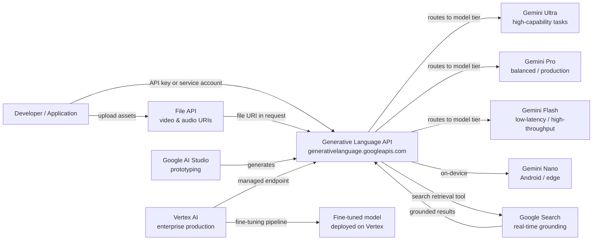

# Google Gemini

## 定义

Google Gemini 是 Google 的旗舰多模态大型语言模型系列及其周边平台。Gemini 于 2023 年底宣布发布，接替 PaLM 2 系列，从设计之初就旨在在单一统一模型架构中对文本、图像、视频、音频和代码进行跨模态推理。与通过独立管道附加视觉功能的系统不同，Gemini 的原生多模态意味着模型在训练和推理期间联合处理所有模态，实现更丰富的跨模态推理。

Gemini 系列跨越四个针对不同用例调优的层级：**Gemini Ultra**（最强大，面向复杂企业和研究任务）、**Gemini Pro**（广泛商业用途的平衡主力）、**Gemini Flash**（针对低延迟、高吞吐量应用以降低成本优化）和 **Gemini Nano**（用于 Android 和边缘硬件的设备端推理）。每个层级都有版本号（例如 Gemini 1.5 Pro、Gemini 2.0 Flash），Google 持续滚动发布新版本。

开发者通过两个互补界面访问 Gemini。**Google AI Studio** 是一个免费的基于浏览器的原型开发环境，提供 API 密钥，让您无需任何基础设施即可试验提示词、系统指令和多模态输入。**Vertex AI** 是 Google Cloud 的托管 ML 平台，是生产工作负载的推荐路径——它增加了企业控制功能，如 VPC Service Controls、IAM、审计日志、微调管道和 SLA 支持的端点。两个界面都通过生成语言 API 使用相同的底层 Gemini 模型。

## 工作原理

### 生成语言 API

生成语言 API（`generativelanguage.googleapis.com`）是所有 Gemini 模型的统一 REST 接口。请求以 `contents` 数组结构化——每个项目有一个 `role`（`user` 或 `model`）和一个或多个 `parts`（文本、内联数据或文件 URI）。API 返回包含 `content`、`finishReason` 和 `safetyRatings` 的 `candidates` 数组。token 计数、接地元数据和函数调用响应在同一信封中返回。AI Studio 的 API 密钥适用于开发；生产工作负载通过 Vertex AI 使用服务账户凭据。

### 多模态输入——图像、视频和音频

Gemini 在单个请求中接受图像（JPEG、PNG、WebP、HEIC）、视频（MP4、MOV、AVI，最长数小时）和音频（MP3、WAV、FLAC）与文本一起处理。图像可以作为内联 base64 数据或通过 Cloud Storage URI 发送。对于长视频，File API 异步上传资产并返回文件 URI，可在后续的 `generateContent` 调用中引用。模型内部对非文本模态进行 token 化，因此相同的上下文窗口计算和注意力机制均匀适用，支持"总结此视频的音轨并识别演讲者何时切换主题"等任务。

### 使用 Google Search 进行接地

Gemini 通过可选的 `tools` 参数支持基于检索的生成，该参数启用 `google_search_retrieval`。当此工具处于活动状态时，模型可以在生成过程中发出搜索查询、检索实时网络结果，并将其综合到响应中——同时返回引用。这对于静态参数模型会产生幻觉或返回过时信息的事实密集型或时效性强的查询特别有价值。接地在 AI Studio 和 Vertex AI 中均可用，并可与其他工具结合使用。

### Vertex AI 集成

在 Vertex AI 上，Gemini 通过 `vertexai` Python SDK（`aiplatform`）访问。Vertex 增加了微调（监督微调和 RLHF 管道）、模型评估数据集、用于比较模型的模型花园、带自动扩展的专用端点部署，以及用于协调端到端 ML 工作流的 Vertex AI Pipelines。企业客户受益于数据驻留保证、通过 VPC Service Controls 的私有网络以及每次 API 调用的 Cloud Audit Logs——这些功能在 AI Studio 中不可用。



## 何时使用 / 何时不使用

| 使用场景 | 避免场景 |
|----------|------------|
| 需要对图像、视频或音频与文本进行原生多模态推理 | 工作负载仅文本，偏好具有更长公共 API 记录的提供商 |
| 已在 Google Cloud 上，希望深度集成 Vertex AI/GCP（IAM、VPC、审计日志） | 在 Vertex AI 尚未提供的地区有严格的数据驻留要求 |
| 需要通过 Google Search 进行实时接地 | 应用程序需要确定性、可重现的输出（接地引入实时搜索的可变性） |
| 大规模成本效率很重要——Gemini Flash 在每 token 价格上极具竞争力 | 需要可以在本地运行的有详细文档的开放权重模型 |
| 希望有免费、无障碍的原型开发环境，无需信用卡（AI Studio 免费层） | 团队已深度投入 OpenAI API 界面，迁移成本较高 |

## 比较

| 标准 | Google Gemini | OpenAI GPT-4o | Anthropic Claude 3.5 |
|-----------|--------------|--------------|----------------------|
| 多模态能力 | 原生——单一模型中支持文本、图像、视频、音频 | 文本+图像（GPT-4V）；通过独立 Whisper/TTS API 处理音频 | 文本+图像（Claude 3）；无原生视频/音频 |
| 企业/云集成 | 通过 Vertex AI 深度 GCP 集成——IAM、VPC、审计日志、微调 | 企业使用 Azure OpenAI Service；有限的非 Azure 云可移植性 | AWS Bedrock 和直接 API；无原生 GCP 集成 |
| 接地/实时检索 | 内置 Google Search 接地工具 | 网络浏览插件（ChatGPT）；API 无原生接地 | 无内置搜索；依赖用户提供的 RAG |
| 上下文窗口 | 最高 1M token（Gemini 1.5 Pro） | 128K token（GPT-4o） | 200K token（Claude 3.5 Sonnet） |
| 开放权重可用性 | 仅封闭 API | 仅封闭 API | 仅封闭 API |
| 定价模式 | 按 token；Flash 层极具竞争力 | 按 token；GPT-4o 中等价位 | 按 token；与 GPT-4o 相当 |
| 微调 | Vertex AI 监督微调 | GPT-3.5/4o-mini 微调 API | 无公开微调 API |

## 代码示例

```python
# google_gemini_examples.py
# Demonstrates text generation, multimodal image input, and embeddings
# using the google-generativeai SDK.
# pip install google-generativeai pillow

import google.generativeai as genai
import pathlib

# ── Configuration ─────────────────────────────────────────────────────────────
# Set your API key from https://aistudio.google.com/app/apikey
genai.configure(api_key="YOUR_API_KEY")


# ── 1. Text generation ────────────────────────────────────────────────────────
def text_generation_example():
    """Simple single-turn text completion with Gemini Flash."""
    model = genai.GenerativeModel(
        model_name="gemini-1.5-flash",
        system_instruction="You are a concise technical writer.",
    )

    response = model.generate_content(
        "Explain the difference between supervised and unsupervised learning "
        "in three sentences.",
        generation_config=genai.GenerationConfig(
            temperature=0.4,
            max_output_tokens=256,
        ),
    )

    print("=== Text Generation ===")
    print(response.text)
    print(f"Finish reason : {response.candidates[0].finish_reason}")
    print(f"Total tokens  : {response.usage_metadata.total_token_count}")


# ── 2. Multimodal — image input ───────────────────────────────────────────────
def multimodal_image_example(image_path: str):
    """
    Send a local image alongside a text prompt to Gemini Pro.
    The model reasons over both modalities jointly.
    """
    model = genai.GenerativeModel("gemini-1.5-pro")

    image_data = pathlib.Path(image_path).read_bytes()
    # Inline image part
    image_part = {
        "mime_type": "image/jpeg",  # adjust to image/png, image/webp as needed
        "data": image_data,
    }

    response = model.generate_content(
        [image_part, "Describe this image and identify any text present in it."]
    )

    print("\n=== Multimodal Image Input ===")
    print(response.text)


# ── 3. Embeddings ─────────────────────────────────────────────────────────────
def embeddings_example(texts: list[str]):
    """
    Generate text embeddings using the text-embedding-004 model.
    Embeddings can be used for semantic search, clustering, and classification.
    """
    result = genai.embed_content(
        model="models/text-embedding-004",
        content=texts,
        task_type="retrieval_document",  # or retrieval_query, semantic_similarity
    )

    print("\n=== Embeddings ===")
    for text, embedding in zip(texts, result["embedding"]):
        print(f"Text    : {text[:60]}...")
        print(f"Dims    : {len(embedding)}")
        print(f"First 5 : {embedding[:5]}\n")


# ── 4. Multi-turn chat ────────────────────────────────────────────────────────
def multi_turn_chat_example():
    """Maintain conversational context using the chat interface."""
    model = genai.GenerativeModel("gemini-1.5-flash")
    chat = model.start_chat(history=[])

    turns = [
        "What is gradient descent?",
        "How does the learning rate affect it?",
        "What is Adam optimizer and how does it improve on basic gradient descent?",
    ]

    print("\n=== Multi-turn Chat ===")
    for user_message in turns:
        response = chat.send_message(user_message)
        print(f"User  : {user_message}")
        print(f"Model : {response.text}\n")


# ── Entry point ───────────────────────────────────────────────────────────────
if __name__ == "__main__":
    text_generation_example()

    # Provide a path to a local JPEG/PNG for multimodal demo
    # multimodal_image_example("path/to/your/image.jpg")

    embeddings_example([
        "Machine learning is a subset of artificial intelligence.",
        "Deep learning uses neural networks with many layers.",
        "Reinforcement learning trains agents through reward signals.",
    ])

    multi_turn_chat_example()
```

## 实用资源

- [Google AI Studio](https://aistudio.google.com/) — 免费的基于浏览器的 Gemini 原型开发环境；生成 API 密钥，无需基础设施即可交互式调整提示词。
- [Gemini API 文档](https://ai.google.dev/gemini-api/docs) — 涵盖所有模型、端点、多模态输入格式、接地、函数调用和 File API 的官方参考。
- [Vertex AI——生成式 AI 文档](https://cloud.google.com/vertex-ai/generative-ai/docs/overview) — 企业路径：微调、模型评估、部署和 GCP 安全控制。
- [google-generativeai Python SDK（PyPI）](https://pypi.org/project/google-generativeai/) — SDK 源码、变更日志和使用示例。

## 另请参阅

- [模型提供商](/docs/model-providers)
- [多模态 AI](/docs/multimodal-ai)
- [案例研究——Gemini](/docs/case-studies/gemini)
