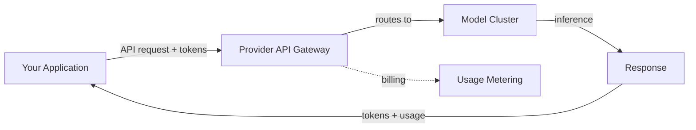
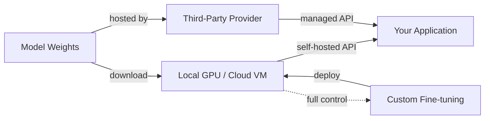

# 模型提供商

## 定义

模型提供商是通过托管 API、可下载的开放权重或两者兼备的方式提供大型语言模型访问权限的组织。提供商的选择决定了应用程序的能力、成本结构、数据隐私立场和部署灵活性。了解提供商格局是构建任何生产 AI 系统的前提条件。

市场分为三类。**基于 API 的提供商**（如 OpenAI、Anthropic 和 Google）仅通过托管 API 提供模型——您发送请求，他们处理推理基础设施。**开放权重提供商**（如 Meta 和 Mistral）发布您可以下载并在自有硬件或第三方托管服务上运行的模型权重。**混合提供商**（如 Mistral 和 DeepSeek）同时提供开放权重模型和商业 API 访问，让开发者可以根据需求灵活选择。

选择提供商涉及多个维度的权衡：模型质量、定价、上下文窗口大小、多模态能力、数据隐私、微调支持和生态系统成熟度。没有任何单一提供商在所有标准上占据主导地位，这就是为什么大多数生产系统会评估多个选项，有时在同一应用程序中针对不同任务使用不同提供商。

## 工作原理

### 基于 API 的提供商

API 提供商将模型托管在其基础设施上，并通过 REST API 公开访问。您使用 API 密钥进行身份验证，发送包含提示和配置参数的请求，并接收响应。提供商负责扩缩容、GPU 分配、模型更新和正常运行时间。这是通往生产环境最简单的路径——无需管理基础设施——但您需要将数据发送给第三方并按 token 付费。



### 开放权重提供商

开放权重提供商发布模型文件（通常在 Hugging Face 上），您可以下载并在本地或云基础设施上运行。您控制完整的技术栈：硬件选择、量化、服务框架（vLLM、TGI、llama.cpp）和扩缩容。这提供了最大的隐私性和可定制性，但需要 ML 基础设施专业知识。第三方推理提供商（Together AI、Groq、Fireworks）提供了折中方案——他们通过 API 接口托管开放模型。



### 选择提供商

决策树取决于您的约束条件。从您的需求出发——数据隐私、预算、延迟、模型质量——然后逐步缩小范围。许多团队从 API 提供商开始进行原型开发，然后评估开放权重替代方案以优化生产成本或满足数据主权要求。

## 何时使用 / 何时不用

| 使用场景 | 避免场景 |
|---------|---------|
| **API 提供商**：快速原型开发、无 ML 基础设施团队、需要立即访问最前沿模型 | 数据不能离开您的基础设施（受监管行业、个人身份信息） |
| **开放权重**：数据隐私要求、需要微调控制、高容量成本优化 | 缺乏 GPU 基础设施和 ML 运维专业知识 |
| **第三方托管开放模型**：需要开放模型的灵活性而无需管理基础设施 | 需要有保障的 SLA 和企业支持（使用第一方 API） |
| **多个提供商**：不同任务有不同的质量/成本要求 | 您的用例足够简单，一个提供商就能满足所有需求 |

## 对比

| 标准 | OpenAI | Anthropic | Google Gemini | Meta Llama | Mistral | Cohere | DeepSeek |
|-----|--------|-----------|---------------|------------|---------|--------|----------|
| 模型访问方式 | 仅 API | 仅 API | API + Vertex AI | 开放权重 | 开放 + API | 仅 API | 开放 + API |
| 顶级模型 | GPT-4o, o3 | Claude Opus/Sonnet | Gemini Ultra/Pro | Llama 3.1 405B | Mistral Large | Command R+ | DeepSeek-V3 |
| 上下文窗口 | 128K | 200K | 1M+ | 128K | 128K | 128K | 128K |
| 多模态 | 视觉、音频、图像生成 | 视觉 | 视觉、音频、视频 | 视觉 (3.2) | 视觉 | 以文本为主 | 以文本为主 |
| 专长 | 通用目的、生态系统 | 安全、长上下文 | 多模态、搜索基础 | 开放权重、定制化 | 效率、多语言 | 嵌入、RAG、重排序 | 推理、成本效率 |
| 微调 | API 微调 | 不可用 | Vertex AI 微调 | 完整权重访问 | API 微调 | 不可用 | 完整权重访问 |
| 定价模式 | 按 token | 按 token | 按 token + 免费套餐 | 免费（自托管）或第三方 | 按 token + 免费模型 | 按 token | 按 token（成本极低） |

## 代码示例

### 并排 API 调用（Python）

```python
# OpenAI
from openai import OpenAI

openai_client = OpenAI()
openai_response = openai_client.chat.completions.create(
    model="gpt-4o",
    messages=[{"role": "user", "content": "Explain RAG in one sentence."}],
)
print("OpenAI:", openai_response.choices[0].message.content)
```

```python
# Anthropic
import anthropic

anthropic_client = anthropic.Anthropic()
anthropic_response = anthropic_client.messages.create(
    model="claude-sonnet-4-20250514",
    max_tokens=256,
    messages=[{"role": "user", "content": "Explain RAG in one sentence."}],
)
print("Anthropic:", anthropic_response.content[0].text)
```

```python
# Google Gemini
import google.generativeai as genai

model = genai.GenerativeModel("gemini-1.5-pro")
gemini_response = model.generate_content("Explain RAG in one sentence.")
print("Gemini:", gemini_response.text)
```

### 使用 LiteLLM 的统一接口（Python）

```python
from litellm import completion

# Same interface, different providers
providers = {
    "OpenAI": "gpt-4o",
    "Anthropic": "claude-sonnet-4-20250514",
    "Gemini": "gemini/gemini-1.5-pro",
}

for name, model in providers.items():
    response = completion(
        model=model,
        messages=[{"role": "user", "content": "Explain RAG in one sentence."}],
    )
    print(f"{name}: {response.choices[0].message.content}")
```

## 实用资源

- [Artificial Analysis](https://artificialanalysis.ai/) — 独立的 LLM 基准测试和价格比较
- [LiteLLM](https://docs.litellm.ai/) — 100+ LLM 提供商的统一 API
- [OpenRouter](https://openrouter.ai/) — 通往多个提供商的单一 API 网关
- [Hugging Face Open LLM Leaderboard](https://huggingface.co/spaces/open-llm-leaderboard/open_llm_leaderboard) — 开放模型基准测试
- [LMSYS Chatbot Arena](https://chat.lmsys.org/) — 通过盲目人工评估的众包 LLM 排名

## 另请参阅

- [OpenAI](/docs/model-providers/openai)
- [Anthropic](/docs/model-providers/anthropic)
- [Google Gemini](/docs/model-providers/google-gemini)
- [Meta Llama](/docs/model-providers/meta-llama)
- [Mistral](/docs/model-providers/mistral)
- [Cohere](/docs/model-providers/cohere)
- [DeepSeek](/docs/model-providers/deepseek)
- [LLMs](/docs/llms)
- [Infrastructure](/docs/infrastructure)
- [Local inference](/docs/local-inference)
