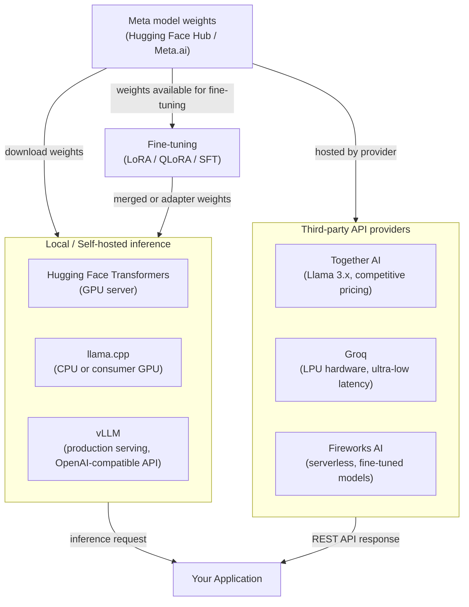

# Meta Llama

## 定义

Meta 的 Llama（大型语言模型 Meta AI）是由 Meta AI Research 发布的开放权重大型语言模型系列。与仅通过付费 API 分发的完全专有模型不同，Llama 模型在 Meta 的自定义社区许可证下发布权重，开发者可以下载、检查、修改和重新分发。这意味着组织可以完全在自己的基础设施内运行推理，而不需要通过第三方云服务路由数据——这对于隐私敏感的工作负载是显著优势。该系列始于 2023 年的 Llama 1 和 Llama 2，并以 **Llama 3** 世代达到了重要里程碑。

**Llama 3 系列**涵盖多种规模和专业化版本。基础 Llama 3 发布包含 8B 和 70B 参数的指令调优和基础变体。后续版本引入了 **Llama 3.1**（具有 4050 亿参数、扩展的 128K 上下文窗口和多语言改进）、**Llama 3.2**（用于设备端的轻量级 1B 和 3B 模型，以及 11B 和 90B 多模态视觉变体）和 **Llama 3.3**（具有显著改进的多语言和推理性能的 70B 模型）。这些版本共同覆盖了从边缘部署到接近前沿性能的广泛范围。

开放权重模型领域处于哲学和实践争论的交汇处：**开放 vs. 封闭**。开放权重的支持者认为，透明度、可审计性、社区创新和成本控制胜过托管 API 的便利性。批评者指出，大型开放权重模型在规模部署上成本高昂，需要工程专业知识来部署和保护，而且"开放权重"并不等同于"开源"——训练数据和完整方法论仍然是专有的。在实践中，大多数组织最终采用混合方式：对敏感或成本敏感的工作负载使用开放权重模型，同时仍然依赖封闭 API 提供商获取前沿能力。

## 工作原理

### 本地部署——transformers、llama.cpp、vLLM

运行 Llama 模型最直接的方式是使用 Hugging Face **Transformers** 在本地运行，它提供了跨数百种模型架构的统一 Python 接口。对于消费者硬件上的较小模型（7B–13B），**llama.cpp** 是黄金标准：它是一个纯 C/C++ 推理引擎，具有 GGUF 量化支持，可以在笔记本电脑 CPU 或普通 GPU 上以可接受的延迟以 4 位量化运行 Llama 3 8B。对于大规模生产服务，**vLLM** 是推荐解决方案——它实现了用于高效 KV 缓存管理的 PagedAttention，支持连续批处理，并暴露兼容 OpenAI 的 REST API，使得只需最小代码更改即可将 Llama 替换到任何 GPT-4 集成中。每个选项在延迟/吞吐量/硬件权衡曲线上占据不同位置。

### 第三方 API 提供商——Together AI、Groq、Fireworks AI

对于想要开放权重模型的灵活性而不需要基础设施负担的团队，多家专业提供商通过托管 API 提供 Llama 模型。**Together AI** 提供具有竞争性按 token 定价的 Llama 3.x 模型，以及镜像 OpenAI 接口的 Python SDK。**Groq** 在自定义 LPU（语言处理单元）硬件上运行 Llama 模型，提供极低延迟（通常每 token 单位数毫秒），适用于交互式应用程序。**Fireworks AI** 专注于微调和无服务器模型部署，非常注重开发者体验。这些提供商对于概念验证工作、突发工作负载或没有 GPU 基础设施的团队特别有价值。

### 微调开放权重

开放权重模型最引人注目的优势之一是完整的微调访问权限。组织可以使用监督微调（SFT）和人类反馈强化学习（RLHF）将 Llama 适配到特定领域任务、风格要求或安全配置。实际上，大多数从业者使用参数高效微调，通过 **LoRA**（低秩自适应）或 **QLoRA**（量化权重上的 LoRA），将 GPU 内存需求降低 4-10 倍。微调后的适配器权重与基础模型相比非常小，可以合并或单独加载。**Hugging Face TRL**、**Axolotl** 和 **LLaMA-Factory** 等工具为 Llama 微调提供了高级训练循环，样板代码最少。



## 何时使用 / 何时不使用

| 使用场景 | 避免场景 |
|----------|------------|
| 数据隐私至关重要——受监管行业、PII、不能离开基础设施的机密 IP | 需要前沿能力（GPT-4o/Claude 3.5 在许多复杂推理基准上仍优于 Llama 3） |
| 大量使用时的成本控制——按 token API 成本积累很快；超过一定 QPS 阈值后，自托管大型模型可显著更便宜 | 缺乏管理 GPU 基础设施、保持模型更新和处理安全补丁的 ML 工程能力 |
| 需要在专有数据上微调模型以深度定制行为或风格 | 需要具有 SLA、自动扩展和零运营开销的生产就绪托管 API |
| 希望完整的可审计性，以及出于合规或红队目的检查模型权重的能力 | 工作负载需要实时网络接地或原生多模态视频/音频（Llama 3.2 增加了视觉，但不及 Gemini 1.5） |
| 希望在没有网络依赖的情况下进行设备端推理（Llama 3.2 1B/3B、llama.cpp） | 团队正在快速评估模型，迭代速度比数据控制更重要 |

## 比较

| 标准 | Meta Llama 3.x | OpenAI GPT-4o | Mistral（开放权重） |
|-----------|---------------|--------------|------------------------|
| 权重可用性 | 开放权重下载（社区许可证） | 仅封闭 API | 7B/Mixtral 开放权重；Mistral Large 封闭 |
| 最大模型规模 | 4050 亿参数（Llama 3.1） | 未披露 | ~1410 亿有效参数（Mixtral 8x22B） |
| 自托管 | 完全支持；llama.cpp、vLLM、Transformers | 不可能 | 完全支持；与 Llama 相同的工具链 |
| 托管 API 选项 | Together AI、Groq、Fireworks、AWS Bedrock、Azure AI | OpenAI 直接、Azure OpenAI | La Plateforme（mistral.ai）、Together AI |
| 微调 | 是——完整权重上的 LoRA、QLoRA、SFT | 仅 GPT-3.5/4o-mini 的微调 API | 是——相同的开放权重工具链 |
| 多模态 | Llama 3.2（11B/90B 视觉） | GPT-4o（文本+图像、音频原生） | 开放模型仅文本；Pixtral 通过 API |
| 欧洲数据主权 | 在欧盟区域自托管可实现 | 有限（仅 Azure 欧盟区域） | 原生欧盟提供商（巴黎总部） |

## 代码示例

```python
# meta_llama_examples.py
# Demonstrates two deployment paths:
#   1. Local inference with Hugging Face Transformers
#   2. Third-party API via Together AI (OpenAI-compatible interface)
#
# pip install transformers accelerate torch together

# ─────────────────────────────────────────────────────────────────────────────
# Path 1: Local inference with Hugging Face Transformers
# Requires a GPU with enough VRAM (e.g. RTX 3090 for 8B in bfloat16,
# or use load_in_4bit=True with bitsandbytes for lower VRAM).
# ─────────────────────────────────────────────────────────────────────────────
from transformers import AutoTokenizer, AutoModelForCausalLM
import torch


def local_llama_inference(prompt: str, model_id: str = "meta-llama/Meta-Llama-3.1-8B-Instruct"):
    """
    Run Llama 3.1 8B Instruct locally.
    Requires a Hugging Face token with access granted at meta-llama/Meta-Llama-3.1-8B-Instruct.
    Set HF_TOKEN environment variable or pass token= to from_pretrained.
    """
    tokenizer = AutoTokenizer.from_pretrained(model_id)
    model = AutoModelForCausalLM.from_pretrained(
        model_id,
        torch_dtype=torch.bfloat16,
        device_map="auto",          # automatically distribute across available GPUs
        # load_in_4bit=True,        # uncomment for QLoRA / low VRAM inference
    )

    # Llama 3 instruct models use a chat template
    messages = [
        {"role": "system", "content": "You are a helpful data science assistant."},
        {"role": "user", "content": prompt},
    ]
    input_ids = tokenizer.apply_chat_template(
        messages,
        add_generation_prompt=True,
        return_tensors="pt",
    ).to(model.device)

    outputs = model.generate(
        input_ids,
        max_new_tokens=512,
        temperature=0.6,
        top_p=0.9,
        do_sample=True,
        eos_token_id=tokenizer.eos_token_id,
    )

    # Decode only the generated tokens (skip the input)
    generated = outputs[0][input_ids.shape[-1]:]
    return tokenizer.decode(generated, skip_special_tokens=True)


# ─────────────────────────────────────────────────────────────────────────────
# Path 2: Together AI — managed Llama API (OpenAI-compatible)
# Requires a Together AI account: https://api.together.ai
# pip install together
# ─────────────────────────────────────────────────────────────────────────────
from together import Together


def together_ai_inference(prompt: str):
    """
    Call Llama 3.1 405B via Together AI's managed inference API.
    Together AI uses an OpenAI-compatible interface, so the openai SDK
    also works — just point base_url at https://api.together.xyz/v1.
    """
    client = Together(api_key="YOUR_TOGETHER_API_KEY")

    response = client.chat.completions.create(
        model="meta-llama/Meta-Llama-3.1-405B-Instruct-Turbo",
        messages=[
            {"role": "system", "content": "You are a helpful data science assistant."},
            {"role": "user", "content": prompt},
        ],
        max_tokens=512,
        temperature=0.6,
        top_p=0.9,
    )

    return response.choices[0].message.content


# ─────────────────────────────────────────────────────────────────────────────
# Path 3: vLLM — production-grade OpenAI-compatible server (run separately)
# Start server: vllm serve meta-llama/Meta-Llama-3.1-8B-Instruct --port 8000
# Then query it as if it were the OpenAI API:
# ─────────────────────────────────────────────────────────────────────────────
from openai import OpenAI


def vllm_server_inference(prompt: str, base_url: str = "http://localhost:8000/v1"):
    """
    Query a locally running vLLM server.
    vLLM exposes an OpenAI-compatible API at /v1/chat/completions.
    """
    client = OpenAI(api_key="not-needed-for-local", base_url=base_url)

    response = client.chat.completions.create(
        model="meta-llama/Meta-Llama-3.1-8B-Instruct",
        messages=[{"role": "user", "content": prompt}],
        max_tokens=256,
        temperature=0.7,
    )
    return response.choices[0].message.content


# ─────────────────────────────────────────────────────────────────────────────
if __name__ == "__main__":
    test_prompt = "Explain the bias-variance tradeoff in machine learning."

    # Uncomment to run local inference (requires GPU + HF access)
    # print("=== Local (Transformers) ===")
    # print(local_llama_inference(test_prompt))

    print("=== Together AI ===")
    print(together_ai_inference(test_prompt))

    # Uncomment if you have a vLLM server running
    # print("=== vLLM Server ===")
    # print(vllm_server_inference(test_prompt))
```

## 实用资源

- [Llama GitHub 仓库（Meta）](https://github.com/meta-llama/llama-models) — Llama 3 完整系列的官方模型卡、下载说明和社区许可证。
- [Llama 3 on Hugging Face](https://huggingface.co/meta-llama) — 模型权重、分词器文件和社区微调版本；需要已获得访问权限的 Hugging Face 账户。
- [llama.cpp](https://github.com/ggerganov/llama.cpp) — 轻量级 C/C++ 推理引擎，具有 GGUF 量化；CPU 和消费者 GPU 部署的首选工具。
- [Together AI 文档](https://docs.together.ai/) — 托管 Llama API 参考、定价以及托管开放权重模型的微调指南。
- [vLLM 文档](https://docs.vllm.ai/) — 具有 PagedAttention、连续批处理和兼容 OpenAI 的服务器的生产服务框架。

## 另请参阅

- [模型提供商](/docs/model-providers)
- [本地推理](/docs/local-inference)
- [基础设施](/docs/infrastructure)
- [LLMs——微调](/docs/llms/fine-tuning)
- [Meta Llama → Mistral 比较](/docs/model-providers/mistral)
