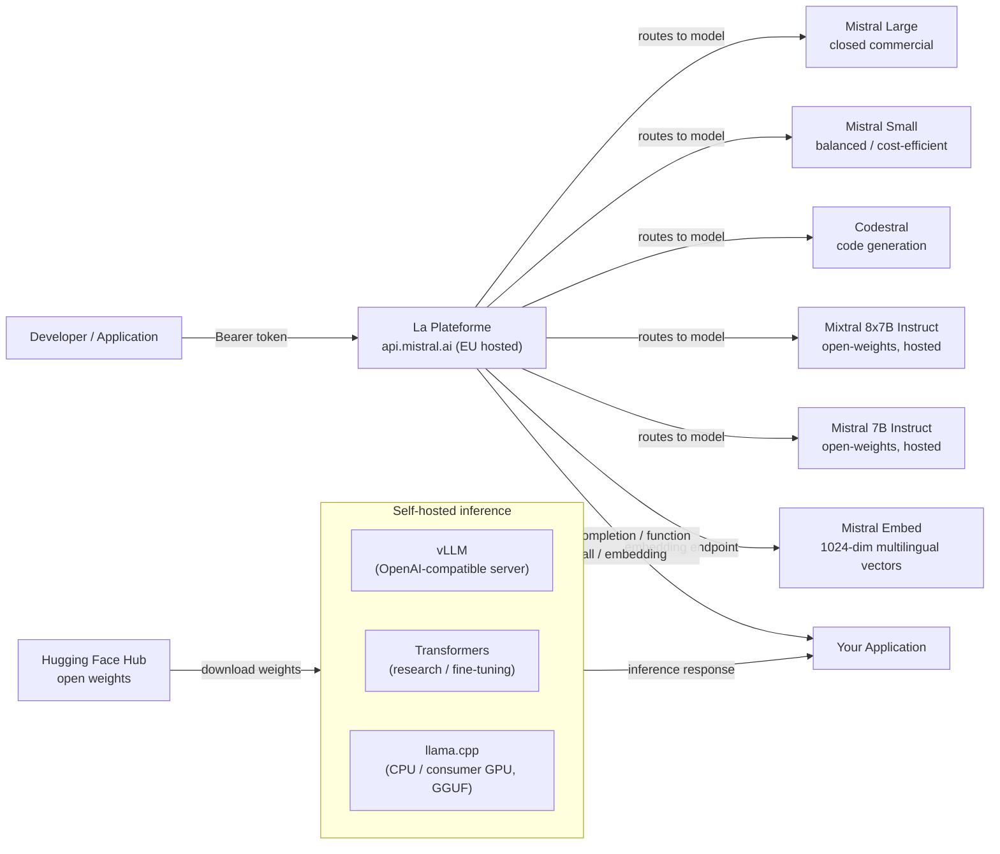

# Mistral AI

## 定义

Mistral AI 是一家于 2023 年创立的法国 AI 初创公司，已迅速确立自己在欧洲 AI 生态系统中最具影响力的参与者之一的地位。该公司的定义性理念是**双重方法**：向研究社区和开发者生态系统发布高效的开放权重模型，同时提供具有优质模型和企业功能的商业 API 平台（**La Plateforme**）。这种组合使 Mistral 在开发者中特别受欢迎——他们希望在承诺付费部署之前自由试验——以及希望在欧盟数据中心托管的符合 GDPR 的基础设施中寻找主权 AI 提供商的欧洲企业。

Mistral 的开放权重发布在其参数数量方面效率显著。**Mistral 7B** 于 2023 年 9 月发布，尽管规模几乎只有一半，但在大多数基准上超越了 Llama 2 13B——主要是通过使用分组查询注意力（GQA）实现快速推理，以及在该规模不常见的 32K 上下文窗口。**Mixtral 8x7B** 引入了每层具有八个专家前馈网络的混合专家（MoE）架构，每个 token 仅激活两个。这使 Mixtral 在推理时的有效参数数量为 130 亿活跃参数，同时拥有 470 亿总参数——以更低的计算成本提供接近 700 亿模型的质量。后续版本通过 **Mistral Small**、**Mistral Medium** 和 **Mistral Large** 扩展了商业产品线，后者在复杂推理和编码任务上与 GPT-4 级别的模型竞争。

Mistral 的优势集中在效率、多语言性能（特别是欧洲语言——法语、西班牙语、德语、意大利语）以及与 OpenAI 接口非常接近的开发者友好型 API 上。该公司在 AI 治理领域也值得注意，积极参与欧盟 AI 法案讨论，将自己定位为负责任的、欧洲替代美国前沿实验室 API 的选择。

## 工作原理

### La Plateforme API

La Plateforme（`api.mistral.ai`）是 Mistral 的托管推理 API，围绕 OpenAI 聊天补全接口构建。请求结构为 `{"model": "...", "messages": [...]}`——任何为 OpenAI API 构建的客户端库都可以通过单个 `base_url` 更改重定向。该 API 提供 Mistral 的专有商业模型（Mistral Large、Mistral Small、Mistral Medium、Codestral）和开放权重模型（Mistral 7B Instruct、Mixtral 8x7B Instruct、Mixtral 8x22B Instruct）。身份验证使用 Bearer token。La Plateforme 托管在欧洲数据中心，是有欧盟数据驻留要求的组织的自然选择。速率限制、计费和 API 密钥管理可通过 `console.mistral.ai` 上的 Mistral 控制台访问。

### 开放权重模型——Mistral 7B、Mixtral 8x7B、Mistral Large

旗舰开放权重模型通过 Hugging Face 分发，可以使用标准的 Transformers、vLLM 或 llama.cpp（GGUF 格式）工具链自托管。**Mistral 7B** 非常适合微调实验、本地部署和资源受限的环境。**Mixtral 8x7B** 以仅稍高的活跃参数成本提供显著更高的质量，是生产自托管的热门选择。**Mixtral 8x22B** 在需要更深推理的任务上进一步扩展。**Mistral Large** 是仅通过 La Plateforme 和部分云合作伙伴（Azure AI、AWS Bedrock、Google Cloud）提供的封闭商业模型。开放权重模型使用具有 32K 上下文窗口的滑动窗口注意力机制，BPE 分词，32K 词汇量，以及与官方 mistralai Python SDK 兼容的基于 sentencepiece 的分词器。

### 函数调用

Mistral 在开放权重指令模型和所有 La Plateforme 模型上都支持结构化函数调用（也称为工具使用）。接口反映了 OpenAI 的 `tools` 参数：您传递 JSON Schema 定义的工具定义列表，模型返回指定要调用哪个函数及其参数的 `tool_calls` 数组，您的应用程序执行该函数，结果作为 `tool` 角色消息返回以继续对话。Mistral 的函数调用对于构建代理工作流、数据提取管道和 API 编排层特别有用，无需额外的提示工程。

### 嵌入

La Plateforme 提供由 Mistral Embed 支持的文本嵌入端点（`/v1/embeddings`），这是一个生成 1024 维密集向量的专用嵌入模型。该嵌入模型在跨多种欧洲语言的语义相似性、检索和分类任务上表现出色。接口与 OpenAI 嵌入 API 完全相同：传入字符串或字符串列表，接收浮点向量。Mistral Embed 是最具成本效益的嵌入端点之一，非常适合多语言 RAG 管道中的大规模文档索引。



## 何时使用 / 何时不使用

| 使用场景 | 避免场景 |
|----------|------------|
| 需要欧盟数据驻留和开箱即用的 GDPR 合规 AI 基础设施 | 需要原生多模态图像/视频/音频输入（Mistral 仅支持文本，Pixtral 仅通过 API 且处于早期阶段） |
| 需要与现有 GPT 集成迁移成本最小的 OpenAI 兼容 API | 需要在复杂的多步骤推理上的绝对最高能力——Mistral Large 在某些困难基准上落后于 GPT-4o 和 Claude 3.5 Sonnet |
| 效率很重要——Mixtral 8x7B 以较低的活跃计算成本提供与性能相当的密集模型相比的高质量 | 需要大量第三方微调和社区支持的生态系统（Meta Llama 社区规模更大） |
| 欧洲多语言（法语、西班牙语、德语、意大利语）是用例的核心 | 工作负载需要超过开放权重模型 32K token 的长上下文（Llama 3.1 提供 128K） |
| 希望自托管开放权重模型并可能在专有数据上微调 | 需要使用亚十亿参数模型进行设备端/边缘推理（Llama 3.2 1B/3B 更好地填补了这个需求） |

## 比较

| 标准 | Mistral AI | Meta Llama 3.x | OpenAI GPT-4o |
|-----------|-----------|---------------|--------------|
| 权重可用性 | 7B、Mixtral 8x7B、8x22B 开放；Mistral Large 封闭 | 所有规模（8B 到 4050 亿）开放 | 仅封闭 API |
| API 提供商位置 | 欧盟（巴黎）；GDPR 原生 | 美国第三方托管（Together、Groq） | 美国（Azure 欧盟区域可用） |
| MoE 架构 | 是（Mixtral 8x7B、8x22B） | 否（密集变换器） | 未披露 |
| 函数调用 | 所有指令/API 模型的完整工具使用 | 是（Llama 3.x） | 是（成熟，文档最齐全） |
| 多语言（欧洲语言） | 强——核心设计目标 | 良好，但训练强调美国为中心 | 跨所有主要语言强大 |
| 微调支持 | 开放权重：LoRA/QLoRA；API 微调测试版 | 开放权重：完整微调可用 | 仅较小模型的微调 API |
| 嵌入 API | Mistral Embed（1024 维，多语言） | Meta 未直接提供 | text-embedding-3-small/large |
| 上下文窗口（开放模型） | 32K token | 128K token（Llama 3.1+） | 128K token |

## 优缺点

| 优点 | 缺点 |
|------|------|
| 强大的效率质量比，特别是 Mixtral 8x7B 与类似质量的密集模型相比 | 开放权重上下文窗口（32K）比 Llama 3.1 的 128K 短 |
| 具有强大 GDPR 定位的欧盟托管 API；吸引欧洲企业客户 | 与 Llama 相比，社区生态系统和社区微调版本较少 |
| 兼容 OpenAI 的接口最大限度降低迁移工作量 | 生产就绪的开放权重模型中没有原生多模态能力 |
| 真正有用的开放权重发布，表现超越其重量级别 | Mistral Large 在最困难的基准上仍落后于 OpenAI 和 Anthropic 的顶级模型 |

## 代码示例

```python
# mistral_examples.py
# Demonstrates chat completion and function calling with the mistralai Python SDK.
# pip install mistralai

from mistralai import Mistral
import json

# ── Configuration ─────────────────────────────────────────────────────────────
# Get your API key at: https://console.mistral.ai/api-keys
client = Mistral(api_key="YOUR_MISTRAL_API_KEY")


# ── 1. Chat completion ─────────────────────────────────────────────────────────
def chat_completion_example():
    """Standard multi-turn chat with Mistral Large."""
    response = client.chat.complete(
        model="mistral-large-latest",
        messages=[
            {
                "role": "system",
                "content": (
                    "You are a senior machine learning engineer. "
                    "Provide concise, technically accurate answers."
                ),
            },
            {
                "role": "user",
                "content": "What are the key differences between MoE and dense transformer architectures?",
            },
        ],
        temperature=0.4,
        max_tokens=512,
    )

    print("=== Chat Completion ===")
    print(response.choices[0].message.content)
    print(f"\nModel : {response.model}")
    print(f"Usage : {response.usage}")


# ── 2. Function calling ────────────────────────────────────────────────────────
def function_calling_example():
    """
    Mistral function calling (tool use).
    The model decides which tool to call and with what arguments.
    Your application executes the function and returns the result.
    """
    # Define available tools with JSON Schema
    tools = [
        {
            "type": "function",
            "function": {
                "name": "get_model_benchmark",
                "description": (
                    "Retrieves benchmark scores for a specified language model "
                    "on a given benchmark suite."
                ),
                "parameters": {
                    "type": "object",
                    "properties": {
                        "model_name": {
                            "type": "string",
                            "description": "The name of the model, e.g. 'mixtral-8x7b'",
                        },
                        "benchmark": {
                            "type": "string",
                            "enum": ["MMLU", "HumanEval", "GSM8K", "HellaSwag"],
                            "description": "The benchmark suite to query.",
                        },
                    },
                    "required": ["model_name", "benchmark"],
                },
            },
        }
    ]

    # First turn — model decides to call a tool
    messages = [
        {
            "role": "user",
            "content": "What is Mixtral 8x7B's score on the MMLU benchmark?",
        }
    ]

    response = client.chat.complete(
        model="mistral-large-latest",
        messages=messages,
        tools=tools,
        tool_choice="auto",
    )

    assistant_message = response.choices[0].message
    print("=== Function Calling — Step 1: model requests tool call ===")
    print(f"Tool calls: {assistant_message.tool_calls}")

    # Simulate executing the tool
    if assistant_message.tool_calls:
        tool_call = assistant_message.tool_calls[0]
        function_args = json.loads(tool_call.function.arguments)
        print(f"\nExecuting: {tool_call.function.name}({function_args})")

        # Simulated function result
        tool_result = {
            "model": function_args["model_name"],
            "benchmark": function_args["benchmark"],
            "score": 70.6,
            "source": "Open LLM Leaderboard (Hugging Face)",
        }

        # Second turn — return the tool result and get the final response
        messages.append({"role": "assistant", "content": None, "tool_calls": assistant_message.tool_calls})
        messages.append({
            "role": "tool",
            "tool_call_id": tool_call.id,
            "content": json.dumps(tool_result),
        })

        final_response = client.chat.complete(
            model="mistral-large-latest",
            messages=messages,
            tools=tools,
        )

        print("\n=== Function Calling — Step 2: final answer ===")
        print(final_response.choices[0].message.content)


# ── 3. Embeddings ──────────────────────────────────────────────────────────────
def embeddings_example(texts: list[str]):
    """
    Generate multilingual embeddings with Mistral Embed.
    Returns 1024-dimensional dense vectors suitable for semantic search and RAG.
    """
    response = client.embeddings.create(
        model="mistral-embed",
        inputs=texts,
    )

    print("\n=== Embeddings ===")
    for i, embedding_obj in enumerate(response.data):
        vec = embedding_obj.embedding
        print(f"Text    : {texts[i][:60]}...")
        print(f"Dims    : {len(vec)}")
        print(f"First 5 : {vec[:5]}\n")


# ── Entry point ────────────────────────────────────────────────────────────────
if __name__ == "__main__":
    chat_completion_example()
    function_calling_example()
    embeddings_example([
        "L'intelligence artificielle transforme l'industrie.",
        "Machine learning models require careful evaluation.",
        "Die Verarbeitung natürlicher Sprache verbessert sich rasant.",
    ])
```

## 实用资源

- [Mistral AI 文档](https://docs.mistral.ai/) — 涵盖聊天、嵌入、函数调用、微调和所有可用模型的完整 API 参考。
- [La Plateforme 控制台](https://console.mistral.ai/) — API 密钥管理、使用量仪表板和用于交互测试的模型游乐场。
- [Hugging Face 上的 Mistral 模型](https://huggingface.co/mistralai) — Mistral 7B、Mixtral 8x7B 和 Mixtral 8x22B 的官方模型权重，包含下载说明和模型卡。
- [mistralai Python SDK（PyPI）](https://pypi.org/project/mistralai/) — SDK 源码、变更日志和所有 API 功能的代码示例。

## 另请参阅

- [模型提供商](/docs/model-providers)
- [Meta Llama](/docs/model-providers/meta-llama)
- [本地推理](/docs/local-inference)
- [RAG——嵌入](/docs/rag/embeddings)
