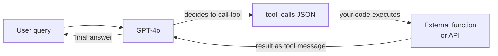

# OpenAI

## 定义

**OpenAI** 是一家总部位于旧金山的 AI 研究公司和开发者平台。成立于 2015 年，因 2022 年底发布 ChatGPT 而广为人知，OpenAI 运营着业界使用最广泛的模型 API 之一。该平台为开发者提供跨语言、视觉、音频和图像生成的模型系列的编程访问——使其成为大多数生成式 AI 用例的一站式平台。

截至 2025 年的 OpenAI 模型系列包括：**GPT-4o**（在单一模型中处理文本、图像和音频的旗舰多模态模型）、**GPT-4o-mini**（针对大批量任务的成本优化变体）、**o 系列**推理模型——**o1**、**o1-mini**、**o3** 和 **o3-mini**——这些模型使用扩展思维链推理来处理数学、编码和复杂分析，**DALL-E 3** 用于文本到图像生成，**Whisper** 用于语音到文本转录，**TTS**（文字转语音）用于音频合成。嵌入模型（text-embedding-3-small 和 text-embedding-3-large）驱动语义搜索和 RAG 管道。

从平台角度来看，OpenAI 提供分层 API 及基于使用量的定价、用于交互测试的 Playground、异步批量推理可降低 50% 成本的 Batch API、GPT-4o-mini 和 GPT-3.5-turbo 的微调、用于有状态代理式交互的 Assistants API，以及用于系统模型评估的 Evals 框架。Python SDK（`openai`）和 TypeScript/Node.js SDK 是主要的客户端库，该 API 格式已成为其他提供商（Mistral、Together、Groq）部分效仿的事实标准。

## 工作原理

### 聊天补全 API

聊天补全端点（`POST /v1/chat/completions`）是 OpenAI 平台的核心。您发送包含角色（`system`、`user`、`assistant`）的消息数组并接收补全。`system` 消息设置助手的角色和约束；`user` 消息携带用户输入；`assistant` 消息表示多轮对话的先前模型轮次。通过服务器发送事件支持流式传输，响应可以逐 token 显示。temperature 和 top-p 控制响应随机性；`max_tokens` 限制输出长度。

```mermaid
flowchart LR
  Client[Client app] -->|POST messages array| ChatAPI[/v1/chat/completions]
  ChatAPI -->|model routing| Selector{Model\nselector}
  Selector -->|standard| GPT4o[GPT-4o]
  Selector -->|reasoning| O3[o3 / o1]
  Selector -->|budget| Mini[GPT-4o-mini]
  GPT4o -->|stream or complete| Resp[JSON response]
  O3 --> Resp
  Mini --> Resp
  Resp --> Client
```

### 函数调用和工具

函数调用（也称为"工具使用"）让模型通过输出结构化 JSON 而不是自由文本来调用外部工具。您在请求中声明工具 schema；模型决定何时调用工具并填充其参数。您的代码执行函数并将结果作为 `tool` 消息返回；模型随后使用该结果产生最终答案。这是大多数代理框架的基础：模型充当推理和路由层，而实际计算在您的代码中进行。



### 嵌入 API

嵌入端点（`POST /v1/embeddings`）将文本转换为密集数值向量。这些向量编码语义含义：相似的文本产生相似的向量。`text-embedding-3-large`（3072 维）提供最佳检索质量；`text-embedding-3-small`（1536 维）更快更便宜。嵌入是 [RAG](/docs/rag) 管道的支柱：在索引时嵌入文档，在搜索时嵌入查询，然后通过余弦相似度检索文档。

### 图像和音频 API

**DALL-E 3**（`POST /v1/images/generations`）从文本提示生成图像。您指定尺寸（1024×1024、1792×1024 或 1024×1792）、质量（标准或高清）和风格（生动或自然）。**Whisper**（`POST /v1/audio/transcriptions`）以高精度转录 57+ 种语言的音频文件。**TTS**（`POST /v1/audio/speech`）将文本转换为具有六种内置声音的自然语音。这些 API 与文本 API 共享相同的身份验证和计费模式，使在单个应用程序中构建多模态管道变得简单。

## 何时使用 / 何时不使用

| 使用 OpenAI 的场景 | 避免或考虑替代方案的场景 |
|-----------------|--------------------------------------|
| 需要最广泛的生态系统：库、教程和社区支持都默认使用 OpenAI | 工作负载涉及高度敏感或受监管的数据，无法发送给美国第三方提供商 |
| 需要来自单一供应商的多模态支持（文本+图像+音频） | 需要深度微调或控制模型的每个方面——开放权重模型提供更多灵活性 |
| 需要在数学、代码或逻辑问题上的高级推理（o1、o3 系列） | 大规模成本过高——在极高 token 量时，开放权重托管通常优于按 token 定价 |
| 构建函数调用或代理工作流——OpenAI 的结构化输出和工具调用已成熟 | 需要非英语优先的体验——Qwen 或 Mistral 在某些语言上可能表现更好 |
| 希望有状态的、支持文件的代理的 Assistants API，无需自己构建状态层 | 需要来自冻结模型版本的可重现确定性输出——OpenAI 持续更新模型 |

## 比较

| 标准 | OpenAI | Anthropic | Google Gemini |
|----------|--------|-----------|---------------|
| 旗舰模型 | GPT-4o | Claude 3.7 Sonnet/Opus | Gemini 2.5 Pro |
| 推理模型 | o3、o1 | 扩展思考（Claude 3.7） | Gemini 2.5 Pro（思考） |
| 上下文窗口 | 128K（GPT-4o）、200K（o1） | 200K | 最高 1M（Gemini 1.5 Pro） |
| 多模态输入 | 文本、图像、音频、视频 | 文本、图像 | 文本、图像、音频、视频、代码 |
| 开放权重选项 | 否 | 否 | Gemma（部分） |
| 函数/工具调用 | 成熟，广泛采用 | 强大，支持计算机使用 | 成熟，Google 生态系统 |
| 定价（旗舰） | ~$2.50/1M 输入 token（GPT-4o） | ~$3/1M 输入 token（Sonnet） | ~$1.25/1M 输入 token（Gemini 1.5 Pro） |
| 安全方法 | 审核 API，使用政策 | 宪法 AI，拒绝调优 | 负责任 AI 准则 |
| 数据驻留 | 美国（默认），企业选项 | 美国（默认），企业选项 | 多区域，Google Cloud |
| 最适合 | 最广泛的生态系统、代理工具、推理 | 长文档、安全性、细致指令 | 长上下文、多模态、Google Cloud 用户 |

## 优缺点

| 优点 | 缺点 |
|------|------|
| 大多数框架和库采用的行业标准 API | 封闭模型——对权重或训练数据没有可见性 |
| 最广泛的模型系列：单一平台上的语言、视觉、音频、图像 | 默认托管在美国；数据驻留有限 |
| o 系列推理模型在数学、代码和逻辑上表现出色 | 大规模定价可能高于自托管开放模型 |
| 强大的生态系统：cookbook、evals、微调、批量 API | 模型版本持续更新——行为可能在不通知的情况下改变 |
| 可靠的速率限制和企业 SLA | 没有真正的开放权重产品 |

## 代码示例

### 带流式传输的聊天补全

```python
from openai import OpenAI

client = OpenAI(api_key="sk-...")  # or set OPENAI_API_KEY env var

# Basic completion
response = client.chat.completions.create(
    model="gpt-4o",
    messages=[
        {"role": "system", "content": "You are a concise technical assistant."},
        {"role": "user", "content": "Explain embeddings in two sentences."},
    ],
    temperature=0.2,
    max_tokens=256,
)
print(response.choices[0].message.content)

# Streaming response
with client.chat.completions.stream(
    model="gpt-4o",
    messages=[{"role": "user", "content": "Write a haiku about APIs."}],
) as stream:
    for text in stream.text_stream:
        print(text, end="", flush=True)
```

### 函数调用

```python
import json
from openai import OpenAI

client = OpenAI()

# Define a tool schema
tools = [
    {
        "type": "function",
        "function": {
            "name": "get_weather",
            "description": "Get the current weather for a city",
            "parameters": {
                "type": "object",
                "properties": {
                    "city": {"type": "string", "description": "City name"},
                    "unit": {"type": "string", "enum": ["celsius", "fahrenheit"]},
                },
                "required": ["city"],
            },
        },
    }
]

messages = [{"role": "user", "content": "What's the weather in Tokyo?"}]

# First call — model may decide to call a tool
response = client.chat.completions.create(
    model="gpt-4o",
    messages=messages,
    tools=tools,
    tool_choice="auto",
)

msg = response.choices[0].message
messages.append(msg)

# If the model called a tool, execute it and return the result
if msg.tool_calls:
    for tc in msg.tool_calls:
        args = json.loads(tc.function.arguments)
        # Simulated function execution
        result = {"city": args["city"], "temp": "18°C", "condition": "Partly cloudy"}
        messages.append({
            "role": "tool",
            "tool_call_id": tc.id,
            "content": json.dumps(result),
        })

# Second call — model uses the tool result to answer
final = client.chat.completions.create(model="gpt-4o", messages=messages)
print(final.choices[0].message.content)
```

### 用于语义搜索的嵌入

```python
from openai import OpenAI
import numpy as np

client = OpenAI()

def embed(texts: list[str], model: str = "text-embedding-3-small") -> list[list[float]]:
    response = client.embeddings.create(input=texts, model=model)
    return [item.embedding for item in response.data]

# Index documents
docs = [
    "Python is a high-level programming language.",
    "OpenAI provides a REST API for language models.",
    "RAG combines retrieval with generation.",
]
doc_vectors = embed(docs)

# Query
query = "How do I call OpenAI from Python?"
query_vector = embed([query])[0]

# Cosine similarity
def cosine_sim(a, b):
    a, b = np.array(a), np.array(b)
    return float(np.dot(a, b) / (np.linalg.norm(a) * np.linalg.norm(b)))

scores = [(cosine_sim(query_vector, dv), doc) for dv, doc in zip(doc_vectors, docs)]
scores.sort(reverse=True)
for score, doc in scores:
    print(f"{score:.3f}  {doc}")
```

## 实用资源

- [OpenAI API 参考](https://platform.openai.com/docs/api-reference) — 包含请求/响应 schema 的完整端点文档
- [OpenAI 定价](https://openai.com/api/pricing/) — 所有模型的按 token 定价，包括批量折扣
- [OpenAI Cookbook](https://cookbook.openai.com/) — 涵盖函数调用、RAG、微调、evals 等的实用示例
- [OpenAI 模型概述](https://platform.openai.com/docs/models) — 模型 ID、上下文窗口、能力和弃用时间表
- [OpenAI Python SDK（GitHub）](https://github.com/openai/openai-python) — 源码、变更日志和迁移指南

## 另请参阅

- [模型提供商](/docs/model-providers) — 所有提供商的概述和比较
- [案例研究：ChatGPT](/docs/case-studies/chatgpt) — 深入了解模型架构，请参阅 ChatGPT 案例研究
- [Anthropic](/docs/model-providers/anthropic) — Claude 模型系列、工具使用、长上下文
- [提示工程](/docs/prompt-engineering) — 适用于所有 OpenAI 模型的技术
- [代理](/docs/agents) — 使用函数调用构建代理工作流
- [RAG](/docs/rag) — 在检索增强生成中使用 OpenAI 嵌入
