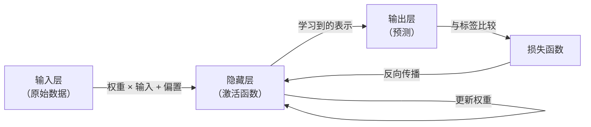

# 神经网络

## 定义

人工神经网络是受生物大脑启发的计算模型。它们由组织在**层**中的**神经元**（节点）组成，通过数学函数将输入转换为输出。

典型的神经网络有三种类型的层：接收原始数据的**输入层**、学习中间表示的一个或多个**隐藏层**，以及产生最终预测的**输出层**。神经元之间的每个连接都有一个**权重**——一个缩放信号的可学习参数。每个神经元还有一个**偏置**——一个在应用**激活函数**（如 ReLU、sigmoid、tanh）之前添加的可学习偏移量，它引入非线性。

学习通过**反向传播**结合**梯度下降**进行：计算损失（预测输出与目标之间的差异），梯度通过链式法则向后流经网络，更新权重以减少损失。在许多样本上迭代这个过程，使网络趋向于能很好地泛化到新数据的参数。更深的架构（更多隐藏层）可以学习更抽象的特征层次——这是[深度学习](/docs/fundamentals/deep-learning)的核心思想。

## 工作原理



### 单个神经元

一个**神经元**计算：`输出 = 激活(Σ(权重_i × 输入_i) + 偏置)`。激活函数决定神经元何时"激发"——没有它，整个网络将退化为线性函数。

### 常见激活函数

**ReLU**（`max(0, x)`）——隐藏层的默认选择，计算高效。**Sigmoid**（`1/(1+e^{-x})`）——映射到 (0, 1)，用于二分类输出。**Tanh**——输出在 (-1, 1) 之间，常用于 RNN。**Softmax**——将输出归一化为多分类的概率分布。

### 反向传播

反向传播应用链式法则，在一次向后传播中计算网络中每个参数的 ∂损失/∂权重。这使具有数百万参数的网络能够在 GPU 上高效训练。

## 何时使用 / 何时不使用

| 场景 | 使用神经网络 | 考虑替代方案 |
|------|------------|------------|
| 中等规模的结构化特征表格数据 | 谨慎 | 梯度提升（XGBoost、LightGBM）通常表现更好 |
| 高维数据（图像、文本、音频） | 是——CNN、Transformer、RNN 在此领域优秀 | |
| 很少的标注训练样本（\<1000）| 谨慎 | 传统模型在数据稀少时泛化更好 |
| 可解释性至关重要 | 谨慎 | 更简单的模型（决策树、回归）更可解释 |
| 扩展到数十亿参数 | 是——深度学习为此而设计 | |

## 对比

| 方面 | 浅层神经网络 | 深层网络（深度学习） |
|------|------------|------------------|
| 层数 | 1–2 个隐藏层 | 10 到数百层 |
| 表示 | 低级特征 | 抽象特征层次 |
| 所需数据 | 中等 | 大量 |
| 计算能力 | 低到中等 | 高（需要 GPU/TPU） |
| 最适合 | 简单问题、有限数据 | 图像、文本、语音、游戏 |

## 优缺点

| 优点 | 缺点 |
|------|------|
| 可以近似任何连续函数 | 需要大量标注数据 |
| 自动从原始数据中学习特征 | 训练计算密集 |
| 可扩展到非常复杂的问题 | 可解释性有限（"黑盒"） |
| 跨领域统一架构 | 对数据规模和超参数敏感 |

## 代码示例

```python
import torch
import torch.nn as nn

# A simple 2-hidden-layer neural network
class MLP(nn.Module):
    def __init__(self, input_dim: int, hidden_dim: int, output_dim: int):
        super().__init__()
        self.net = nn.Sequential(
            nn.Linear(input_dim, hidden_dim),
            nn.ReLU(),
            nn.Linear(hidden_dim, hidden_dim),
            nn.ReLU(),
            nn.Linear(hidden_dim, output_dim),
        )

    def forward(self, x):
        return self.net(x)

model = MLP(input_dim=20, hidden_dim=64, output_dim=3)
x     = torch.randn(8, 20)   # batch of 8 examples
print(model(x).shape)        # (8, 3)
```

## 实用资源

- [神经网络与深度学习（Nielsen）](http://neuralnetworksanddeeplearning.com/) — 免费在线互动书，包含数学直觉
- [cs231n: 用于视觉识别的卷积神经网络（斯坦福）](https://cs231n.github.io/) — 带详细可视化的课程笔记
- [3Blue1Brown – 神经网络（YouTube）](https://www.youtube.com/playlist?list=PLZHQObOWTQDNU6R1_67000Dx_ZCJB-3pi) — 动画视频系列，解释反向传播和梯度下降

## 另请参阅

- [CNN](/docs/neural-networks/cnn)
- [RNN](/docs/neural-networks/rnn)
- [深度学习](/docs/fundamentals/deep-learning)
- [Transformers](/docs/transformers)
