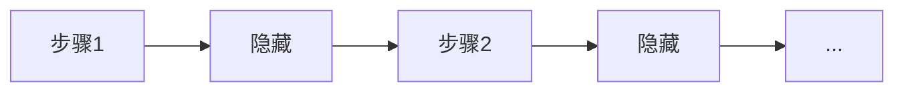

# 循环神经网络（RNN）

## 定义

RNN 通过维护在每一步更新的隐藏状态来处理序列。它们（以及 LSTM 等变体）在 Transformer 之前是序列建模的标准。

它们天然适用于 [NLP](/docs/nlp)、时间序列以及任何过去上下文重要的有序数据。[Transformer](/docs/transformers) 由于并行化和长距离依赖处理能力，已在语言建模中大量取代了它们，但 RNN 仍出现在流式或低延迟场景中。

## 工作原理

在每一**步**中，模型接收当前输入（如 token 或帧）和前一个**隐藏**状态。它计算一个输出（如预测或下一个隐藏表示）并更新下一步的隐藏状态。递归在时间上展开用于训练（时间反向传播）；推理时，隐藏状态逐步向前传递。**LSTM** 和 **GRU** 变体添加门控来缓解梯度消失。输入和输出可以是一对一、一对多或多对一，取决于任务（如序列标注 vs 序列到序列）。

## 应用场景

RNN 适合具有序列输入或输出的问题，其中顺序和时间上下文很重要。

- 序列标注（如命名实体识别、词性标注）
- 时间序列预测和异常检测
- 语音和文本序列建模（在 Transformer 主导之前）

## 外部文档

- [理解 LSTM 网络 (Olah)](https://colah.github.io/posts/2015-08-Understanding-LSTMs/)
- [PyTorch – 序列模型和 RNN](https://pytorch.org/tutorials/beginner/sequence_models_tutorial.html)

## 另请参阅

- [Transformer](/docs/transformers)
- [NLP](/docs/nlp)
