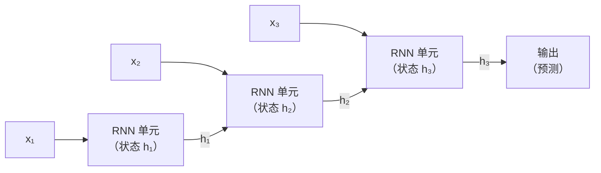

# 循环神经网络（RNN）

## 定义

循环神经网络是专为**序列数据**设计的神经架构——时间序列、文本、语音以及任何顺序重要的输入。RNN 维护一个**隐藏状态**作为记忆，在每个时间步根据当前输入和前一个状态进行更新。

核心思想：RNN 逐步处理序列，通过隐藏状态将过去上下文的信息传递下去。原则上，这允许捕获整个序列的依赖关系。实际上，基本 RNN 受到**梯度消失**问题的困扰——梯度在向后传播经过许多时间步时呈指数衰减，使学习长距离依赖变得困难。

**LSTM**（长短期记忆）和 **GRU**（门控循环单元）通过控制信息流的门控机制解决了这个问题：遗忘门决定从单元状态中清除什么，输入门决定写入什么，输出门决定读取什么。这使 LSTM 能够保留数百个时间步的相关信息。尽管 [Transformer](/docs/transformers) 在 NLP 领域已广泛取代 RNN，但 RNN 和 LSTM 在时间序列预测、嵌入式系统模型和有状态低延迟场景中仍然有用。

## 工作原理



### 循环步骤

在每个时间步 t：`h_t = tanh(W_h · h_{t-1} + W_x · x_t + b)`。同一组权重（W_h、W_x、b）在所有时间步重复使用——这称为**时间上的权重共享**。

### LSTM 门控

LSTM 单元维护两个状态：**隐藏状态** h_t 和**单元状态** c_t。三个门控制流量：**遗忘门** f_t（从 c_t 中清除什么）、**输入门** i_t（写入 c_t 什么）和**输出门** o_t（从 c_t 读取到 h_t 什么）。单元状态中的加法连接创建了一条**梯度高速公路**，减少梯度消失。

### 双向和堆叠 RNN

**双向 RNN** 在两个方向处理序列并连接隐藏状态——当未来上下文重要时很有用（如词性标注）。**堆叠 RNN** 将一个 RNN 层的输出作为下一层的输入，构建更高层次的抽象表示。

## 何时使用 / 何时不使用

| 场景 | 使用 RNN/LSTM | 不使用 RNN/LSTM |
|------|------------|--------------|
| 时间序列预测（低延迟、嵌入式） | 是——对短到中等序列高效 | |
| 资源受限设备上的语言建模 | 是——比 Transformer 占用更小 | |
| 带状态的逐步序列生成 | 是——循环自然地建模逐步依赖 | |
| 现代 NLP 文本理解和生成 | | 带注意力的 Transformer 大幅超越 |
| 非常长的序列（\>500 时间步）| | 带稀疏注意力的 Transformer 处理更好 |

## 对比

| 方面 | RNN / LSTM | Transformer |
|------|-----------|-------------|
| 序列处理方式 | 顺序（逐步） | 并行（所有 token 一次） |
| 训练成本 | 低 | 高（二次注意力） |
| 长距离依赖 | 中等（LSTM/GRU） | 优秀（直接注意力） |
| 有状态推理 | 自然（携带隐藏状态） | 需要 KV 缓存 |
| 现代 NLP 中的流行度 | 下降 | 主导地位 |

## 优缺点

| 优点 | 缺点 |
|------|------|
| 自然处理可变长度序列 | 训练慢——难以并行化 |
| 短序列的高效有状态推理 | 难以捕获非常长的依赖 |
| 比 Transformer 内存占用更小 | LSTM/GRU 比简单 RNN 增加复杂性 |
| 适合实时时间序列预测 | 在 NLP 中已被 Transformer 广泛取代 |

## 代码示例

```python
import torch
import torch.nn as nn

class LSTMClassifier(nn.Module):
    """使用 LSTM 后跟平均池化对序列进行分类。"""
    def __init__(self, vocab_size: int, embed_dim: int, hidden_dim: int, num_classes: int):
        super().__init__()
        self.embedding = nn.Embedding(vocab_size, embed_dim, padding_idx=0)
        self.lstm      = nn.LSTM(embed_dim, hidden_dim, batch_first=True, bidirectional=True)
        self.fc        = nn.Linear(hidden_dim * 2, num_classes)  # ×2 for bidirectional

    def forward(self, x: torch.Tensor) -> torch.Tensor:
        emb, _  = self.lstm(self.embedding(x))  # (B, T, 2*H)
        pooled  = emb.mean(dim=1)                # mean pool over time
        return self.fc(pooled)

model = LSTMClassifier(vocab_size=10_000, embed_dim=64, hidden_dim=128, num_classes=5)
x     = torch.randint(0, 10_000, (16, 50))   # batch of 16 sequences of length 50
print(model(x).shape)                         # (16, 5)
```

## 实用资源

- [cs224n: 深度学习 NLP（斯坦福）](https://web.stanford.edu/class/cs224n/) — 涵盖 LSTM、注意力和 Transformer 的课程笔记
- [PyTorch – 文本分类教程](https://pytorch.org/tutorials/beginner/text_sentiment_ngrams_tutorial.html) — 使用 PyTorch 文本管道的示例
- [理解 LSTM（Olah）](https://colah.github.io/posts/2015-08-Understanding-LSTMs/) — LSTM 的权威可视化解释

## 另请参阅

- [神经网络](/docs/neural-networks)
- [CNN](/docs/neural-networks/cnn)
- [Transformers](/docs/transformers)
- [NLP](/docs/nlp)
