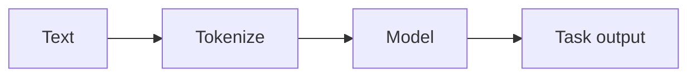

# 自然语言处理 (NLP)

## 定义

NLP 涵盖文本上的任务：分类、NER、QA、摘要、翻译和生成。 Modern NLP is dominated by pretrained [transformers](/docs/transformers) (BERT, GPT, etc.) and [LLMs](/docs/llms).

Inputs are discrete (tokens); models learn from large corpora and are then adapted via [fine-tuning](/docs/llms/fine-tuning) or [prompting](/docs/llms/prompt-engineering). [RAG](/docs/rag) and [agents](/docs/agents) add 检索 and tools on top of NLP models for grounded QA and task completion.

## 工作原理

**Text** is **tokenized** (拆分为子词或词) and optionally normalized. The **model** (例如 BERT, GPT) processes token IDs through embeddings and [transformer](/docs/transformers) layers to produce contextual representations. A **task output** head (例如 classifier, span predictor, or next-token decoder) maps those to the final prediction. Models 在...上预训练 large corpora (masked LM or 下一个 token 预测), then fine-tuned or prompted for downstream tasks. Pipelines often combine tokenization, embedding, and task-specific heads; [LLMs](/docs/llms) can do many tasks with a single model and the right prompt.

## 应用场景

NLP applies to any product or pipeline that needs to understand or generate text at scale.

- Machine translation, summarization, and question answering
- Named entity recognition, sentiment analysis, and text classification
- Chatbots, code generation, and document understanding

## 外部文档

- [Hugging Face – NLP course](https://huggingface.co/learn/nlp-course/)
- [Stanford CS224N – NLP with Deep Learning](http://web.stanford.edu/class/cs224n/)

## 另请参阅

- [Transformers](/docs/transformers)
- [LLMs](/docs/llms)
- [RAG](/docs/rag)
