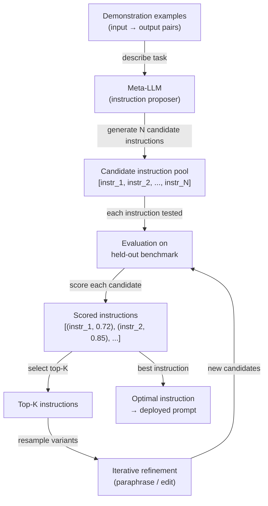

# 自动提示词工程（APE）

## 定义

自动提示词工程（APE，Automatic Prompt Engineering）是使用语言模型生成和优化提示词指令的实践，而非手动编写。由 Zhou 等人（2022）在论文 *Large Language Models Are Human-Level Prompt Engineers* 中提出，APE 将提示词设计定义为程序合成问题：给定一组输入-输出示例对，找到一条自然语言指令，当该指令被前置于提示词时，能在留出评估集上最大化任务性能。候选指令的搜索、评分和优化均以编程方式进行——人类的角色从提示词作者转变为任务定义者和指标设计者。

自动化提示词设计的动机是务实的。手动提示词工程耗时、脆弱，并受人类工程师对语言模型处理文本方式的主观判断影响。措辞上的微小变化——"Think step by step" 与 "Let's think carefully step by step"——会产生可测量的准确率差异，不经验证无法预测。APE 以系统化搜索取代这种猜测：生成大量候选指令池，在基准上评估每一条，保留最佳结果。这与经典机器学习中的超参数搜索设计理念相同——人类定义目标，机器执行搜索。

APE 不同于软提示调优（通过梯度下降优化连续令牌嵌入）和微调（更新模型权重）。APE 完全在自然语言空间中使用冻结模型运行。这使其模型无关、可解释——你可以阅读并理解最优指令——且无需任何训练基础设施即可部署。代价是自然语言的离散搜索空间广阔且不可微，因此 APE 依赖采样、评分启发式方法和迭代优化，而非基于梯度的优化。

## 工作原理



### 候选指令生成

APE 循环从一组示例开始——展示目标任务的输入-输出对。这些示例与元提示词（meta-prompt）一起传递给元大型语言模型（meta-LLM，可以是相同或不同的模型），要求其推断出能从给定输入生成给定输出的指令。典型的元提示词如下：*"Here are input-output pairs. What is the instruction that produces these outputs? Generate 10 diverse candidate instructions."* 通过在温度 > 0 时采样，元大型语言模型生成措辞、框架和具体程度各异的候选指令池。该初始池的质量和多样性直接决定了优化的上限。

### 评分

每条候选指令被实例化为提示词前缀（或系统消息），并在留出基准上进行评估。评分函数因任务而异：分类任务用准确率，代码生成用执行正确率，摘要用 ROUGE 或 BERTScore，开放性任务用辅助大型语言模型评判。关键设计决策是分数由元大型语言模型本身计算（使用正确输出的对数概率估计）还是由单独的任务专用评估器计算。对数概率评分更快，但可能过拟合元大型语言模型的校准。单独评估器评分更可靠，但需要标注数据。

### 迭代优化

初始评分后，选择排名前 K 的候选指令进行优化。提示元大型语言模型对最佳候选进行改写、扩展或组合——产生一批语义相关但文本不同的变体。此优化循环运行固定轮数，或直到达到目标分数阈值为止。每一轮迭代都围绕指令空间的有希望区域缩小搜索范围，类似于在离散景观上进行进化搜索或爬山算法。实践中，在大型初始池（N ≥ 50）之后进行一到两轮优化，通常能获得大部分可实现的收益。

## 对比

| 标准 | APE | 手动提示词工程 | 微调（Fine-tuning） |
|------|-----|--------------|---------------------|
| 人工投入 | 低——定义任务和指标 | 高——迭代编写和测试 | 高——数据收集和训练运行 |
| 需要标注数据 | 是——用于评分 | 否——可凭经验进行 | 是——通常需要数千示例 |
| 模型权重更新 | 否 | 否 | 是 |
| 输出可解释 | 是——自然语言指令 | 是 | 否——权重变化不透明 |
| 跨模型通用 | 是——每个模型重新搜索 | 部分 | 否——与基础模型绑定 |
| 推理延迟 | 无——无运行时开销 | 无 | 无 |
| 成本 | 中等——N × M 次评估调用 | 低 | 高——GPU 时间 |
| 最适合 | 有明确指标且有 ≥ 50 个示例的任务 | 无指标的新任务 | 精度提升能证明训练成本合理的大批量任务 |

## 何时使用 / 何时不适用

| 适合使用 | 不适合使用 |
|---------|-----------|
| 你有标注评估集且能定义明确的评分指标 | 任务没有可靠的自动化指标——APE 无信号则无法搜索 |
| 手动提示词迭代耗时超过一天且准确率仍停滞不前 | 需要立即出结果——APE 需要多次大型语言模型 API 调用进行评估 |
| 你将相同提示词部署给大量用户，即便 1-2% 的准确率提升也有意义 | 你的示例池太小（< 10 个示例）——评分会有噪声 |
| 你希望在部署前审计最佳指令的安全性 | 任务需要创造性或主观判断，单一指标会产生误导 |
| 你在使用 DSPy 或类似框架，其中提示词优化是内置功能 | 已计划进行微调——APE 优化提示词，而非权重 |

## 代码示例

### 使用 OpenAI 的基础 APE 循环

```python
# Minimal APE implementation: generate instructions, score, return best
# pip install openai

import os
import re
from openai import OpenAI

client = OpenAI(api_key=os.environ["OPENAI_API_KEY"])

# ----- Task definition --------------------------------------------------------
# Demonstrations: pairs of (input, expected_output)
DEMOS = [
    ("The movie was absolutely fantastic, I loved every minute.", "positive"),
    ("Terrible film, waste of time and money.", "negative"),
    ("It was okay, nothing special but not bad either.", "neutral"),
    ("A masterpiece of modern cinema.", "positive"),
    ("I walked out after 20 minutes.", "negative"),
]

# Held-out evaluation set for scoring
EVAL_SET = [
    ("A stunning visual experience with weak writing.", "positive"),  # debatable but positive
    ("Boring, predictable, and too long.", "negative"),
    ("I enjoyed it more than I expected.", "positive"),
    ("Neither good nor bad — forgettable.", "neutral"),
    ("One of the best films of the decade.", "positive"),
]


# ----- Step 1: Generate candidate instructions --------------------------------
def generate_instructions(demos: list[tuple[str, str]], n: int = 10) -> list[str]:
    """Ask a meta-LLM to infer N candidate instructions from demo pairs."""
    demo_text = "\n".join(f'Input: "{inp}"\nOutput: "{out}"' for inp, out in demos)
    meta_prompt = (
        f"Here are input-output example pairs for a text classification task:\n\n"
        f"{demo_text}\n\n"
        f"Generate {n} diverse natural-language instructions that, when prepended to "
        f"an input text, would cause a language model to produce the correct output. "
        f"Return one instruction per line, numbered."
    )
    resp = client.chat.completions.create(
        model="gpt-4o-mini",
        messages=[{"role": "user", "content": meta_prompt}],
        temperature=0.9,
        max_tokens=800,
    )
    raw = resp.choices[0].message.content
    lines = [re.sub(r"^\d+[\.\)]\s*", "", l).strip() for l in raw.splitlines()]
    return [l for l in lines if len(l) > 20]  # filter out empty / too-short lines


# ----- Step 2: Score an instruction on the eval set --------------------------
def score_instruction(instruction: str, eval_set: list[tuple[str, str]]) -> float:
    """Return accuracy of the instruction on the eval set."""
    correct = 0
    for text, expected in eval_set:
        prompt = f"{instruction}\n\nText: {text}\nLabel:"
        resp = client.chat.completions.create(
            model="gpt-4o-mini",
            messages=[{"role": "user", "content": prompt}],
            temperature=0,
            max_tokens=5,
        )
        prediction = resp.choices[0].message.content.strip().lower()
        if expected.lower() in prediction:
            correct += 1
    return correct / len(eval_set)


# ----- Step 3: Iterative refinement of top-K instructions --------------------
def refine_instructions(top_instructions: list[str], n_variants: int = 5) -> list[str]:
    """Ask the meta-LLM to paraphrase the top instructions to get variants."""
    instr_text = "\n".join(f"- {i}" for i in top_instructions)
    refine_prompt = (
        f"Here are high-performing instructions for a sentiment classification task:\n"
        f"{instr_text}\n\n"
        f"Generate {n_variants} new instructions that paraphrase or combine the above "
        f"to potentially improve performance. Return one per line."
    )
    resp = client.chat.completions.create(
        model="gpt-4o-mini",
        messages=[{"role": "user", "content": refine_prompt}],
        temperature=0.7,
        max_tokens=500,
    )
    raw = resp.choices[0].message.content
    lines = [l.strip().lstrip("- ") for l in raw.splitlines()]
    return [l for l in lines if len(l) > 20]


# ----- APE main loop ---------------------------------------------------------
def run_ape(
    demos: list[tuple[str, str]],
    eval_set: list[tuple[str, str]],
    n_candidates: int = 10,
    top_k: int = 3,
    n_refinement_rounds: int = 1,
) -> dict:
    print("=== APE: Generating initial candidates ===")
    candidates = generate_instructions(demos, n=n_candidates)
    print(f"Generated {len(candidates)} candidates.\n")

    all_scored: list[tuple[str, float]] = []

    for round_num in range(n_refinement_rounds + 1):
        print(f"--- Round {round_num + 1}: Scoring {len(candidates)} instructions ---")
        round_scores = []
        for instr in candidates:
            score = score_instruction(instr, eval_set)
            round_scores.append((instr, score))
            print(f"  [{score:.0%}] {instr[:80]}{'...' if len(instr) > 80 else ''}")
        all_scored.extend(round_scores)

        if round_num < n_refinement_rounds:
            top = [i for i, _ in sorted(round_scores, key=lambda x: -x[1])[:top_k]]
            candidates = refine_instructions(top, n_variants=n_candidates // 2)
            print()

    best_instr, best_score = max(all_scored, key=lambda x: x[1])
    return {"instruction": best_instr, "score": best_score, "all_scored": all_scored}


if __name__ == "__main__":
    result = run_ape(DEMOS, EVAL_SET, n_candidates=8, top_k=3, n_refinement_rounds=1)
    print(f"\n=== Best instruction (accuracy {result['score']:.0%}) ===")
    print(result["instruction"])
```

### 使用 DSPy 进行结构化 APE

```python
# DSPy provides a higher-level abstraction for automatic prompt optimization.
# pip install dspy-ai

import dspy

# Configure DSPy with your LLM backend
lm = dspy.LM("openai/gpt-4o-mini", api_key=os.environ["OPENAI_API_KEY"])
dspy.configure(lm=lm)


# Define the task as a DSPy signature
class SentimentClassifier(dspy.Signature):
    """Classify the sentiment of a movie review as positive, negative, or neutral."""
    review: str = dspy.InputField(desc="A movie review text")
    sentiment: str = dspy.OutputField(desc="One of: positive, negative, neutral")


# Wrap in a module
class SentimentModule(dspy.Module):
    def __init__(self):
        self.classify = dspy.Predict(SentimentClassifier)

    def forward(self, review: str) -> dspy.Prediction:
        return self.classify(review=review)


# Training examples
trainset = [
    dspy.Example(review=inp, sentiment=out).with_inputs("review")
    for inp, out in [
        ("Absolutely loved it!", "positive"),
        ("Worst movie ever.", "negative"),
        ("It was fine, nothing memorable.", "neutral"),
    ]
]


# Use MIPROv2 optimizer to automatically engineer the prompt
def optimize_with_dspy():
    module = SentimentModule()
    optimizer = dspy.MIPROv2(metric=dspy.evaluate.answer_exact_match, auto="light")
    optimized = optimizer.compile(module, trainset=trainset)
    print(optimized.classify.extended_signature)  # shows the optimized instruction
    return optimized


if __name__ == "__main__":
    optimized_module = optimize_with_dspy()
    result = optimized_module(review="A surprisingly moving and well-acted drama.")
    print(result.sentiment)
```

## 实用资源

- [Large Language Models Are Human-Level Prompt Engineers（Zhou 等人，2022）](https://arxiv.org/abs/2211.01910) — APE 原始论文；引入了指令归纳公式、迭代蒙特卡洛搜索，以及在 24 个 NLP 任务上的基准结果。
- [DSPy: Compiling Declarative Language Model Calls into Self-Improving Pipelines（Khattab 等人，2023）](https://arxiv.org/abs/2310.03714) — 将 APE 式优化作为一等抽象的框架；另见 [dspy.ai](https://dspy.ai)。
- [Automatic Prompt Optimization with "Gradient Descent" and Beam Search（Pryzant 等人，2023）](https://arxiv.org/abs/2305.03495) — 用"文本梯度"方法扩展 APE，使用大型语言模型生成的反馈作为代理梯度信号。
- [PromptBreeder: Self-Referential Self-Improvement Via Prompt Evolution（Fernando 等人，2023）](https://arxiv.org/abs/2309.16797) — 一种进化式 APE 方法，同时对用于指令生成的元提示词进行进化。

## 另请参阅

- [提示词工程](/docs/prompt-engineering)
- [自我评估与校准](/docs/prompt-engineering/self-evaluation-calibration)
- [微调（Fine-tuning）](/docs/llms/fine-tuning)
