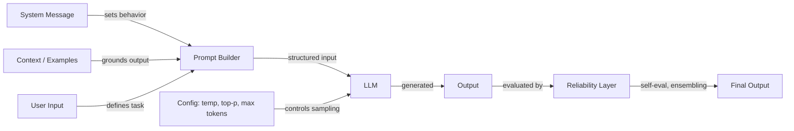

# 提示词工程

## 定义

提示词工程（Prompt Engineering）是通过精心设计输入文本——包括指令、示例、约束和上下文——来控制大型语言模型（LLM）行为的实践，无需修改模型权重。它是人类意图与模型输出之间的主要接口，涵盖从简单的指令措辞到复杂的多步推理策略等各种内容。

该领域涵盖三个相互关联的方面。**配置（Configuration）**涉及采样参数（温度、Top-K、Top-P）和生成控制（最大令牌数、停止序列），这些参数决定了模型如何生成令牌。**技术（Techniques）**包括结构化的方法，如思维链（chain-of-thought）、自一致性（self-consistency）、后退式提示（step-back prompting）以及系统/角色提示，用于引导模型的推理过程。**可靠性（Reliability）**涉及使输出更值得信赖的方法——去偏技术（debiasing）、提示词集成（prompt ensembling）和自我评估（self-evaluation）。

随着大型语言模型进入生产系统，提示词工程已从临时性实验演变为系统化实践。[DSPy](https://dspy-docs.vercel.app/) 和[自动提示词工程](/docs/prompt-engineering/automatic-prompt-engineering)等工具甚至可以自动化部分流程。无论你是在构建聊天机器人、代码助手还是数据提取管道，提示词工程都是提升输出质量最直接、最易用的手段。

## 工作原理

### 提示词处理流程

与大型语言模型的每次交互都始于一个提示词——一个结构化的输入，可能包含系统消息、用户指令、示例和检索的上下文。模型处理此输入并逐令牌生成输出，生成过程同时受提示词内容和采样配置的影响。

### 配置与技术的区别

配置参数（温度、Top-K、Top-P、最大令牌数）在令牌采样层面起作用——它们影响模型*如何*选择每个令牌。技术（思维链、自一致性、后退式提示）在提示词设计层面起作用——它们影响模型*推理的内容*。两个层次相互作用：自一致性需要较高的温度来生成多样化的推理路径，而结构化输出提取则在低温下效果最佳，以确保确定性。

### 可靠性层

高级提示词工程在基础提示词之上添加了一个可靠性层。这包括并行运行多个提示词（集成）、让模型批评自身输出（自我评估），以及应用去偏策略以减少系统性错误。这些方法以算力成本换取输出质量，在高风险应用场景中尤为重要。

## 实用资源

- [OpenAI — 提示词工程指南](https://platform.openai.com/docs/guides/prompt-engineering) — 涵盖最佳实践和策略的综合指南
- [Anthropic — 提示词设计](https://docs.anthropic.com/en/docs/build-with-claude/prompt-engineering/overview) — Anthropic 官方提示词文档
- [Learn Prompting](https://learnprompting.org/) — 涵盖提示词工程技术的开源课程
- [提示词工程指南（DAIR.AI）](https://www.promptingguide.ai/) — 社区维护的指南，包含论文和技术
- [DSPy 文档](https://dspy-docs.vercel.app/) — 程序化提示词优化框架

## 另请参阅

- [温度、Top-K、Top-P](/docs/prompt-engineering/temperature-top-k-top-p)
- [最大令牌数与停止序列](/docs/prompt-engineering/max-tokens-stop-sequences)
- [结构化输出](/docs/prompt-engineering/structured-outputs)
- [系统提示、角色提示与上下文提示](/docs/prompt-engineering/system-role-contextual-prompting)
- [自一致性](/docs/prompt-engineering/self-consistency)
- [后退式提示](/docs/prompt-engineering/step-back-prompting)
- [自动提示词工程（APE）](/docs/prompt-engineering/automatic-prompt-engineering)
- [去偏技术](/docs/prompt-engineering/debiasing-techniques)
- [提示词集成](/docs/prompt-engineering/prompt-ensembling)
- [自我评估与校准](/docs/prompt-engineering/self-evaluation-calibration)
- [大型语言模型（LLMs）](/docs/llms)
- [思维链（Chain-of-thought）](/docs/reasoning-patterns/cot)
- [RAG](/docs/rag)
- [AI 智能体](/docs/agents)
