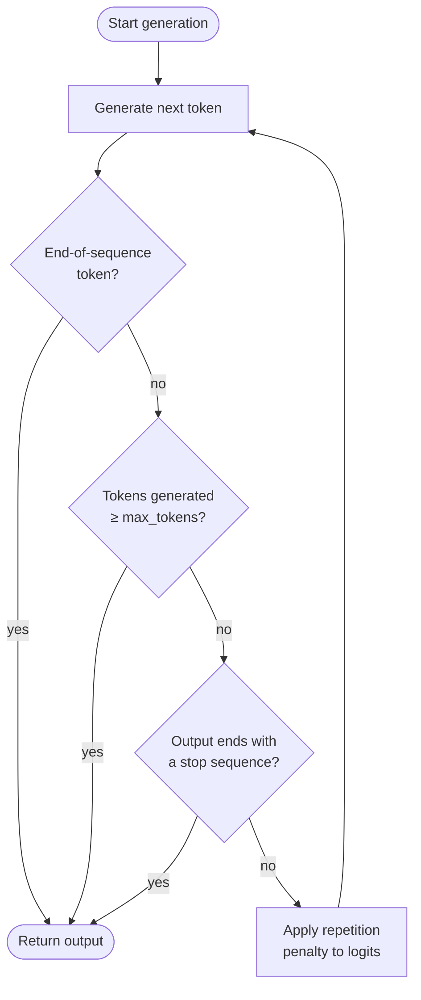

# 最大令牌数与停止序列

## 定义

最大令牌数（max tokens）、停止序列（stop sequences）和重复惩罚（repetition penalties）是生成控制参数，决定模型何时停止生成以及如何处理重复内容。温度等采样参数决定模型*说什么*，而生成控制参数则决定模型*说多少*、*在哪里停止*以及*在长回应过程中保持多大的多样性*。每个大型语言模型 API 都公开了这些控制参数的某种形式，理解它们对于构建可靠、高成本效益的管道至关重要。

**最大令牌数**为模型在单次回应中可以生成的令牌数量设置了一个硬性上限。它作为安全上限：一旦模型要生成超过此预算的令牌就立即停止。它不是目标长度——如果模型自然生成了序列结束令牌，可能会更早停止。选择合适的最大令牌数既关乎成本（通常按输出令牌计费），也关乎正确性（截断的回应可能留下未关闭的 JSON 对象，中断推理链，或向下游系统传递不完整的结果）。

**停止序列**提供语义停止条件：一个或多个字符串，当生成时立即导致模型停止（停止字符串本身不包含在输出中）。它们对于结构化生成不可或缺——将大型语言模型输出包裹在已知分隔符中，并使用闭合分隔符作为停止序列，使提取变得简单且健壮。**重复惩罚**（OpenAI 中的频率惩罚和存在惩罚；Anthropic Messages API 中未原生公开）降低重新生成已经出现过的令牌的概率，防止长生成中可能出现的循环和填充文本。

## 工作原理



每个生成的令牌依次通过三个检查点：序列结束检测、最大令牌预算强制执行，以及停止序列匹配。如果没有停止条件触发，则在恢复采样前对下一个令牌的 logit 应用重复惩罚。

### 最大令牌数

`max_tokens` 参数（在较旧的 Anthropic SDK 中称为 `max_tokens_to_sample`，现为 `max_tokens`）在大多数大型语言模型 API 中是必需或强烈建议的字段。设置过低会导致输出截断；设置不必要地高则会浪费算力并增加流式端点的延迟。实用启发：估计预期输出长度，然后将 `max_tokens` 设置为该估计值的 1.5-2 倍作为安全上限。对于 JSON 等结构化输出，分析模式的最差情况令牌数并添加 20% 的缓冲。

### 停止序列

停止序列定义为字符串列表。模型在每个令牌后扫描其输出，一旦生成的文本以列表中的任何条目结尾，就立即停止。常见模式包括结构化提示词模板的 `["###", "\n\n", "</answer>", "```"]`，不应生成下一个用户回合的聊天模拟器的 `["\nHuman:", "\nUser:"]`，以及用于标签提取的闭合分隔符如 `["</json>"]`。停止序列与原始生成文本（而非令牌边界）进行匹配，因此多令牌字符串可以正确工作。一个关键注意点：停止序列*不*包含在返回的文本中，因此你的解析逻辑必须考虑到其缺失。

### 重复惩罚

OpenAI 的 API 公开了两个不同的惩罚参数。**频率惩罚**（`frequency_penalty`，范围 -2.0 到 2.0）按比例降低令牌的 logit，该比例与其在生成文本中出现的次数成正比——不鼓励频繁使用的词的重复。**存在惩罚**（`presence_penalty`，范围 -2.0 到 2.0）对已出现至少一次的任何令牌施加固定的 logit 降低，无论频率如何——不鼓励重复使用任何已出现的令牌。正值减少重复；负值鼓励重复。0.1-0.5 范围内的值通常足以抑制循环，而不会显著降低输出质量。超过 1.0 的值可能导致模型回避有用的连接词，降低连贯性。

## 何时使用 / 何时不适用

| 场景 | 推荐设置 | 避免 |
|------|---------|------|
| 简短的事实回答或分类 | `max_tokens=50-150`；无需停止序列 | 非常高的 `max_tokens`；浪费预算且可能引入填充 |
| 结构化 JSON 或标签提取 | 在闭合分隔符上停止（如 `["</json>"]`）；`max_tokens` 根据最差情况模式大小设置 | 省略停止序列；模型可能在闭合大括号后追加散文 |
| 多轮对话模拟 | 停止序列 `["\nHuman:", "\nUser:"]` 以防止模型生成下一个用户回合 | 无停止序列；模型会幻想出下一个对话回合 |
| 长文生成（文章、报告） | 高 `max_tokens`（2048-4096+）；轻度 `frequency_penalty=0.2` 以防止重复措辞 | `frequency_penalty > 1.0`；破坏文体连贯性，回避合理的重复术语 |
| 代码生成 | 在语言适当的分隔符上停止（如三重反引号）；`max_tokens` 根据函数长度设置 | `presence_penalty > 0.5`；变量名和关键词需要重复——惩罚会损害正确性 |
| 对成本敏感的批量推理 | 将 `max_tokens` 紧密设置为预期输出长度的第 95 百分位 | 当典型输出为 100 个令牌时将 `max_tokens` 留在 API 最大值（如 4096） |

## 代码示例

### OpenAI — max_tokens、stop 和 frequency_penalty

```python
# OpenAI SDK: max_tokens, stop sequences, and repetition penalties
# pip install openai

import os
from openai import OpenAI

client = OpenAI(api_key=os.environ["OPENAI_API_KEY"])


def extract_with_controls(
    text: str,
    max_tokens: int = 512,
    stop: list[str] | None = None,
    frequency_penalty: float = 0.0,
    presence_penalty: float = 0.0,
) -> str:
    """Call the chat API with full generation-control parameters."""
    response = client.chat.completions.create(
        model="gpt-4o",
        messages=[
            {
                "role": "system",
                "content": (
                    "You are a structured data extractor. "
                    "Output only valid JSON between <json> and </json> tags."
                ),
            },
            {"role": "user", "content": f"Extract key facts from:\n\n{text}"},
        ],
        max_tokens=max_tokens,
        stop=stop or ["</json>"],
        frequency_penalty=frequency_penalty,
        presence_penalty=presence_penalty,
        temperature=0,
    )
    raw = response.choices[0].message.content
    # Strip the opening tag; closing tag was consumed by stop sequence
    return raw.replace("<json>", "").strip()


if __name__ == "__main__":
    article = (
        "SpaceX launched its Starship rocket on March 14, 2024. "
        "The vehicle reached an altitude of 210 km before completing a controlled reentry. "
        "It was the third integrated flight test of the system."
    )

    # Tight budget extraction
    result = extract_with_controls(
        article,
        max_tokens=256,
        stop=["</json>"],
        frequency_penalty=0.1,
    )
    print(result)

    # Long-form summary with anti-repetition penalty
    summary_resp = client.chat.completions.create(
        model="gpt-4o",
        messages=[{"role": "user", "content": f"Write a 3-paragraph summary of: {article}"}],
        max_tokens=600,
        frequency_penalty=0.4,
        presence_penalty=0.1,
        temperature=0.6,
    )
    print(summary_resp.choices[0].message.content)
```

### Anthropic — max_tokens 和 stop_sequences

```python
# Anthropic SDK: max_tokens and stop_sequences
# pip install anthropic

import os
import anthropic

client = anthropic.Anthropic(api_key=os.environ["ANTHROPIC_API_KEY"])


def generate_with_controls(
    prompt: str,
    max_tokens: int = 512,
    stop_sequences: list[str] | None = None,
) -> tuple[str, str]:
    """
    Returns (text_content, stop_reason).
    stop_reason is 'end_turn', 'max_tokens', or 'stop_sequence'.
    """
    message = client.messages.create(
        model="claude-opus-4-5",
        max_tokens=max_tokens,
        stop_sequences=stop_sequences or [],
        messages=[{"role": "user", "content": prompt}],
        temperature=0,
    )
    text = "".join(block.text for block in message.content if hasattr(block, "text"))
    return text, message.stop_reason


if __name__ == "__main__":
    # JSON extraction with stop sequence on closing delimiter
    json_prompt = (
        "Extract the event name, date, and location from the following text as JSON "
        "between <json> and </json> tags:\n\n"
        "The annual PyCon US conference will be held in Pittsburgh, PA on May 14-22, 2025."
    )
    output, reason = generate_with_controls(
        json_prompt,
        max_tokens=256,
        stop_sequences=["</json>"],
    )
    print(f"Stop reason: {reason}")
    print(output)

    # Constrained generation — stop before model generates a second answer
    answer_prompt = "Answer in one sentence: What is gradient descent?"
    answer, reason = generate_with_controls(
        answer_prompt,
        max_tokens=100,
        stop_sequences=["\n\n"],
    )
    print(f"Stop reason: {reason}")
    print(answer)
```

## 实用资源

- [OpenAI — API 参考：聊天补全](https://platform.openai.com/docs/api-reference/chat/create) — `max_tokens`、`stop`、`frequency_penalty` 和 `presence_penalty` 的完整参数参考
- [Anthropic — API 参考：Messages](https://docs.anthropic.com/en/api/messages) — Messages API 中 `max_tokens` 和 `stop_sequences` 的参考
- [OpenAI — 令牌管理](https://platform.openai.com/docs/guides/text-generation/managing-tokens) — 关于计数令牌、理解上下文窗口以及适当调整 `max_tokens` 的指南
- [Hugging Face — 控制文本生成](https://huggingface.co/docs/transformers/main_classes/text_generation) — Transformers 库中 `max_new_tokens`、`eos_token_id`、`repetition_penalty` 及相关参数的底层文档
- [tiktoken（OpenAI 分词器）](https://github.com/openai/tiktoken) — 用于在进行 API 调用前估计输出令牌预算的令牌计数库

## 另请参阅

- [提示词工程](/docs/prompt-engineering)
- [温度、Top-K、Top-P](/docs/prompt-engineering/temperature-top-k-top-p)
- [结构化输出](/docs/prompt-engineering/structured-outputs)
- [自一致性](/docs/prompt-engineering/self-consistency)
- [大型语言模型（LLMs）](/docs/llms)
- [思维链（Chain-of-thought）](/docs/reasoning-patterns/cot)
