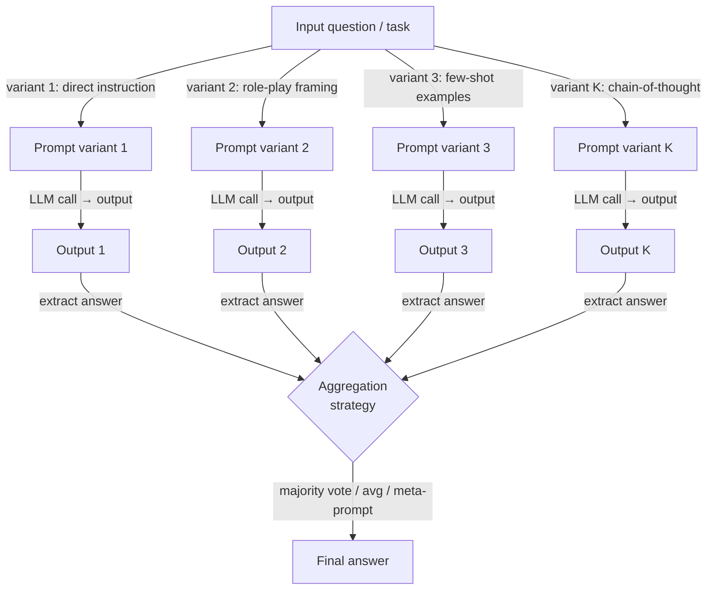

# 提示词集成

## 定义

提示词集成（Prompt Ensembling）是一种提示词技术，它对同一问题或任务生成多个结构不同的表述，将所有这些提交给语言模型，然后将产生的输出合并为一个最终答案。核心直觉借鉴自经典机器学习集成（bagging、boosting、stacking）：没有单一预测器是完美的，但由不完美预测器组成的多样化委员会往往比任何单个成员更可靠，因为它们的错误部分不相关，因此在聚合中相互抵消。

提示词集成与自一致性（self-consistency）之间的关键区别在于多样性来源。在自一致性中，你以温度 > 0 运行*相同*提示词 N 次，依靠随机采样产生多样化的推理路径。在提示词集成中，你刻意制作*不同*的提示词——改变框架、角色分配、指令措辞、少样本示例或输出格式——并以（通常温度为 0 或低温度）运行每一个，以产生多样但确定性的输出。自一致性利用采样引入的方差；提示词集成利用提示词设计引入的方差。实践中，两种方法是互补的，可以结合使用。

提示词集成在两种场景下特别有价值。第一，当你不确定哪种提示词表述对任务最优，且无法大规模评估替代方案时——对多个候选运行并对其输出进行投票，让你无需事先识别最佳提示词就能获益。第二，当任务高风险且单一提示词的失败模式不可接受时——集成提供了一个软审计轨迹，因为不同答案的投票分布是模型不确定性的直接信号。主要成本是延迟和令牌数：K 个提示词变体需要 K 次推理调用，可以并行化但不能消除。

## 工作原理



### 提示词变体策略

集成的质量很大程度上取决于提示词变体的*多样性*。如果所有变体表面上不同但结构上相同，集成就退化为重复采样。有效的变体策略包括：

**角色和人物变体。** 分配不同的专家人物（如"你是一位谨慎的医生"、"你是一位数据科学家"、"你是一位务实的工程师"）会改变模型对合理答案的先验概率，并激活不同的知识寄存器。角色变体对具有多种有效框架的任务特别有效。

**指令措辞变体。** 同一任务可以表述为问题（"...的风险级别是什么？"）、命令（"评估...的风险级别"）或补全（"...的风险级别是"），这些表面差异可测量地改变模型的输出分布。改写核心指令是最省力的变体形式。

**少样本示例变体。** 使用不同的上下文示例组会改变少样本上下文激活模型哪部分知识。轮换来自训练分布不同子域的示例集，显著增加集成多样性，对于分类任务尤其如此。

**思维链与直接回答变体。** 将一个或多个思维链（CoT）变体与直接回答变体结合，融合了 CoT 的推理质量优势和直接提示的速度优势。CoT 变体在聚合中通常权重更高，因为它们更可靠，但在 CoT 导致模型对简单问题过度思考的情况下，直接变体可以覆盖。

**输出格式变体。** 以 JSON 对象、编号列表或自由文本句子的形式请求答案，可以引出不同级别的精确度。结构化输出变体更易于以编程方式解析和聚合。

### 聚合方法

一旦你有 K 个输出，就需要将其减少为单一答案。聚合方法的选择应与输出类型匹配：

**多数投票**最适合离散输出（分类标签、简短事实回答、多选题选择）。它对对抗性或混乱的变体具有鲁棒性，无需额外的模型调用，并直接模仿自一致性的运作方式。平局可以通过对数概率或指定"可信"变体来打破。

**分数平均**适用于每个变体返回数值分数或概率而非标签的情况。平均对异常值敏感；当单个变体可能产生极端值时，中位数聚合更鲁棒。

**元提示词（大型语言模型作为评判者）聚合**将所有 K 个输出发送到第二个大型语言模型调用，该调用被指示综合或选择最佳答案。这是最强大但最昂贵的方法，并引入了第二个大型语言模型失败点。当任务需要开放式生成（摘要、代码、文章）而多数投票不适用时，它最有用。

**加权投票**根据不同变体在留出验证集上的历史准确率为它们分配不同权重。如果你有标注数据且能测量哪些变体表现最佳，加权显著优于均匀投票——但需要前期校准工作。

## 何时使用 / 何时不适用

| 适合使用 | 不适合使用 |
|---------|-----------|
| 你不确定哪种提示词措辞最佳，且无法大规模单独评估它们 | 延迟是硬性约束——K 次并行调用仍然有最慢调用的延迟 |
| 任务高风险，单一提示词的失败模式不可接受 | 令牌预算严重受限，无法负担 K 次补全 |
| 来自不同提示词框架的输出提供了互补视角（如从多个专科角度进行医学诊断） | 模型已经用单个调优良好的提示词达到上限准确率——收益递减 |
| 你想要内置的不确定性信号（投票分布 = 模型分歧） | 输出空间是连续的或开放式的，使投票或平均没有意义 |
| 你正在构建需要抑制提示词敏感性的生产管道 | 你缺乏运行和聚合并行大型语言模型调用的工程基础设施 |

## 对比

| 标准 | 提示词集成 | 自一致性 | 单一提示词 |
|------|-----------|---------|----------|
| 多样性来源 | 不同的提示词设计 | 一个提示词的随机采样 | 无 |
| 大型语言模型调用次数 | K（变体数量，通常 3-10） | N（通常 10-40） | 1 |
| 温度 | 每个变体低（0-0.3） | 高（0.5-0.8） | 依任务而定 |
| 准确率提升 | 对提示词措辞敏感的任务效果显著 | 对多步推理效果显著 | 基准线 |
| 需要提示词工程工作 | 是——设计多样化变体 | 否——只需一个提示词 | 适中 |
| 处理开放式输出 | 是，通过元提示词聚合 | 否——多数投票需要离散答案 | 是 |
| 最佳使用场景 | 对提示词敏感或有多种有效框架的任务 | 数学、符号推理、事实问答 | 有已知良好提示词的简单、明确任务 |

## 代码示例

### 使用 OpenAI 的多模板提示词集成

```python
# Prompt ensembling: run K prompt variants and aggregate by majority vote
# pip install openai

import os
from collections import Counter
from openai import OpenAI

client = OpenAI(api_key=os.environ["OPENAI_API_KEY"])

# Five structurally different prompt variants for the same classification task
PROMPT_VARIANTS = [
    # 1. Direct instruction
    "Is the following customer review positive, negative, or neutral? "
    "Reply with exactly one word.\n\nReview: {review}",

    # 2. Role-play framing
    "You are a sentiment analysis expert. Classify the sentiment of the "
    "review below as positive, negative, or neutral. Output only the label.\n\nReview: {review}",

    # 3. Few-shot examples
    "Review: 'The product broke in two days.' → negative\n"
    "Review: 'Decent quality for the price.' → neutral\n"
    "Review: 'Absolutely love it, will buy again!' → positive\n"
    "Review: '{review}' →",

    # 4. Chain-of-thought variant
    "Analyze the sentiment of this review step by step, then state the "
    "final label (positive / negative / neutral) on the last line.\n\nReview: {review}",

    # 5. Completion framing
    "The overall sentiment expressed in the review '{review}' is",
]


def call_variant(prompt: str, model: str = "gpt-4o-mini") -> str:
    """Call the LLM with a single prompt variant and return the raw response."""
    resp = client.chat.completions.create(
        model=model,
        messages=[{"role": "user", "content": prompt}],
        temperature=0.0,
        max_tokens=80,
    )
    return resp.choices[0].message.content.strip()


def extract_label(text: str) -> str | None:
    """Extract a sentiment label from raw model output."""
    text_lower = text.lower()
    for label in ("positive", "negative", "neutral"):
        if label in text_lower:
            return label
    return None


def ensemble_sentiment(review: str) -> dict:
    """Run all prompt variants and aggregate by majority vote."""
    raw_outputs, labels = [], []

    for i, template in enumerate(PROMPT_VARIANTS):
        prompt = template.format(review=review)
        raw = call_variant(prompt)
        label = extract_label(raw)
        raw_outputs.append(raw)
        if label:
            labels.append(label)
        print(f"  Variant {i + 1}: {label!r}  (raw: {raw[:60]!r})")

    if not labels:
        return {"answer": None, "votes": {}}

    counts = Counter(labels)
    winner, top_votes = counts.most_common(1)[0]
    return {
        "answer": winner,
        "confidence": top_votes / len(labels),
        "votes": dict(counts),
        "raw_outputs": raw_outputs,
    }


if __name__ == "__main__":
    review = (
        "The delivery was fast but the item looks nothing like the photos. "
        "I'm disappointed and won't order again."
    )
    result = ensemble_sentiment(review)
    print(f"\nFinal answer : {result['answer']}")
    print(f"Confidence   : {result['confidence']:.0%}")
    print(f"Vote counts  : {result['votes']}")
```

### 使用留出验证集的加权集成

```python
# Weighted prompt ensembling: calibrate variant weights from a validation set
# pip install openai scikit-learn

import os
from collections import defaultdict
from openai import OpenAI
from sklearn.metrics import accuracy_score

client = OpenAI(api_key=os.environ["OPENAI_API_KEY"])


def evaluate_variant(template: str, examples: list[dict]) -> float:
    """Return accuracy of a single prompt variant on a labeled dataset."""
    preds = []
    for ex in examples:
        prompt = template.format(review=ex["text"])
        raw = call_variant(prompt)   # reuse function from above
        preds.append(extract_label(raw) or "neutral")
    return accuracy_score([ex["label"] for ex in examples], preds)


def weighted_ensemble(review: str, templates: list[str], weights: list[float]) -> str:
    """Aggregate variant outputs with per-variant weights."""
    scores: dict[str, float] = defaultdict(float)
    for template, weight in zip(templates, weights):
        raw = call_variant(template.format(review=review))
        label = extract_label(raw)
        if label:
            scores[label] += weight
    return max(scores, key=scores.__getitem__) if scores else "neutral"


if __name__ == "__main__":
    # Dummy validation set — replace with real labeled examples
    val_set = [
        {"text": "Great product!", "label": "positive"},
        {"text": "Terrible quality.", "label": "negative"},
        {"text": "It's okay I guess.", "label": "neutral"},
    ]
    # Calibrate weights (accuracy on val set)
    weights = [evaluate_variant(t, val_set) for t in PROMPT_VARIANTS]
    print("Variant weights:", [f"{w:.2f}" for w in weights])

    review = "Arrived on time but packaging was damaged."
    answer = weighted_ensemble(review, PROMPT_VARIANTS, weights)
    print("Weighted ensemble answer:", answer)
```

## 实用资源

- [Diverse Demonstrations Improve In-context Compositional Generalization（Levy 等人，2022）](https://arxiv.org/abs/2212.06800) — 展示了多样化的少样本示例（提示词变体的骨干）比随机采样示例显著提升泛化能力。
- [Self-Consistency Improves Chain of Thought Reasoning in Language Models（Wang 等人，2022）](https://arxiv.org/abs/2203.11171) — 提示词集成最近的亲属；理解多个大型语言模型输出聚合的重要背景。
- [Prompt Sensitivity and Prompt Ensembling for LLMs（Mizrahi 等人，2024）](https://arxiv.org/abs/2401.00595) — 直接研究大型语言模型准确率在改写提示词间的变化程度，并证明改写集成能弥合大部分差距。
- [Universal Self-Consistency for Large Language Model Generation（Chen 等人，2023）](https://arxiv.org/abs/2311.17311) — 通过元提示词聚合将自一致性扩展到开放式生成，弥合了多数投票集成与自由形式输出之间的差距。

## 另请参阅

- [提示词工程](/docs/prompt-engineering)
- [自一致性](/docs/prompt-engineering/self-consistency)
- [自动提示词工程](/docs/prompt-engineering/automatic-prompt-engineering)
