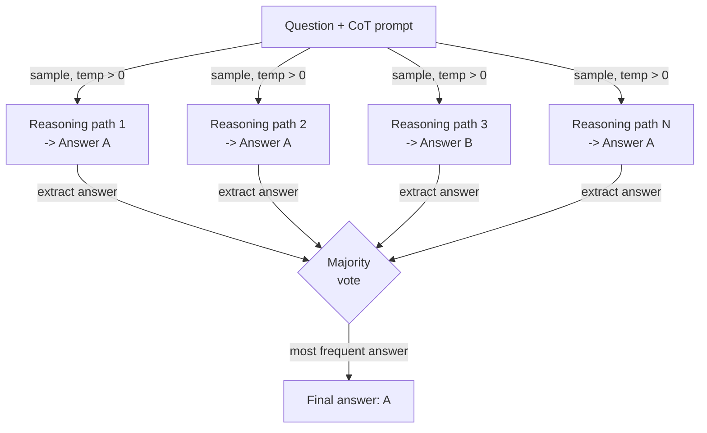

# 自一致性

## 定义

自一致性（Self-consistency）是由 Wang 等人（2022）提出的一种提示词技术，旨在解决思维链（CoT）提示的一个根本弱点：单条推理路径可能导致自信但错误的答案。其洞察是：正确答案往往是鲁棒的——从不同角度接近问题的多条独立推理路径应该收敛到相同的答案——而错误答案往往是脆弱的，在不同路径间不一致。通过在温度 > 0 时采样多条推理链并对其最终答案进行多数投票，自一致性充当一种弱但实用的集成方法，在无需任何模型微调的情况下显著减少推理错误。

与思维链的关系是直接的：自一致性是带重复采样的思维链。标准 CoT 提示产生一条推理链和一个答案；自一致性产生 N 条链（通常 10-40 条）和 N 个答案，然后进行聚合。温度设置至关重要：你需要推理路径的多样性，所以贪婪解码（temperature=0）会违背目的。0.5-0.8 范围内的温度通常提供足够的多样性以进行有效投票，同时保持每条链的连贯性。在 GSM8K（数学应用题）、AQuA（代数推理）和 SVAMP 等基准上，自一致性以 N 倍更多推理调用的代价，将 CoT 准确率提升了 10-20 个百分点。

自一致性实际有用——且有别于简单添加自我评估步骤——的原因在于它不需要额外的模型调用来"检查"或"批评"。投票机制纯粹是统计性的：在 N 个样本中出现最频繁的答案获胜。这使其易于实现，与模型无关，且易于调优（只需改变 N）。主要限制是成本：N 次补全的成本是 N 倍。因此，自一致性最好应用于准确率值得推理预算的任务——数学、多步推理和高风险分类——而非对延迟敏感或对令牌成本敏感的应用。

## 工作原理



### 生成多样化推理路径

第一步是用标准的少样本 CoT 提示词提示模型——一组（问题、逐步推理、答案）三元组示例，后跟新问题。与标准 CoT 的关键区别在于，你以温度 > 0 调用 API N 次，而非以温度 0 调用一次。每次调用在统计上是独立的；模型探索不同的问题分解方式，可能使用不同的中间变量或计算顺序，甚至可能出现不同的中间错误——但如果底层答案是正确的，大多数路径仍然会到达它。样本数 N 是一个超参数：更多样本减少方差但增加成本。在原始论文中，N=40 用于最大准确率；实践中，N=10-20 通常以较低成本获得大部分收益。

### 提取和规范化答案

收集 N 个补全后，你必须从每条推理链中提取最终答案。对于结构良好的 CoT 提示词，答案通常在最后一句中，位于"The answer is..."或"Therefore, X."等短语之后。对于数值答案，规范化很重要："3/4"、"0.75"和"75%"是相同的答案，在投票前必须映射到相同的规范形式。对于分类或简短回答任务，提取通常是子字符串匹配或简单解析。提取鲁棒性是管道中最脆弱的部分——如果模型产生的链没有以可解析答案结束，该路径必须被丢弃或分配到"未知"桶中。

### 多数投票

聚合步骤是对提取答案的频率计数。出现最频繁的答案获胜。平局可以通过选择对数概率最高路径的答案来打破，或简单地将平局答案及其投票数返回供人工审查。统计直觉是：错误是多样的（不同的错误原因导致不同的错误答案），而正确答案是集中的（大多数路径到达相同的正确答案）。这个特性在具有唯一正确答案的任务中最为显著，如算术、符号推理和基于事实的问答。对于开放式生成任务——摘要、创意写作、代码——自一致性适用性较差，因为对文章进行多数投票没有明确定义。

## 何时使用 / 何时不适用

| 适合使用 | 不适合使用 |
|---------|-----------|
| 任务有唯一正确答案且 CoT 准确率不足 | 延迟是硬性约束（N 倍推理调用不可接受） |
| 已知错误率的多步算术或代数推理 | 令牌成本是主要关注点，无法负担 N 次补全 |
| 高风险分类，准确率的几个百分点很重要 | 任务是开放式生成，多数投票没有意义 |
| 你想在不微调或添加额外模型的情况下提升准确率 | 模型已经在 N=1 时达到接近上限的准确率——收益递减 |
| 推理路径需要可审计（你可以检查所有 N 条链） | 由于输出格式不一致，答案提取不可靠 |

## 对比

| 标准 | 自一致性 | 思维链（CoT） | 自我评估 |
|------|---------|-------------|---------|
| 大型语言模型调用次数 | N（通常 10-40） | 1 | 2（生成 + 批评） |
| 准确率提升 | 高——在推理基准上提升 10-20 个百分点 | 中等——相比直接提示显著提升 | 中等——取决于模型自我批评质量 |
| 成本 | 高——与 N 线性相关 | 低 | 低-中等 |
| 实现复杂度 | 低——采样 N 次并投票 | 极低 | 中等——需要设计批评提示词 |
| 无需外部反馈 | 是 | 是 | 是 |
| 最佳任务类型 | 数学、符号推理、事实问答 | 大多数推理任务 | 模型能检测到自身错误的任务 |
| 注意 | 比 CoT 更可靠，但成本成比例增加 | 更简单的基准——先于自一致性尝试 | 互补——可结合以进一步提升 |

## 代码示例

### 使用 OpenAI API 的自一致性

```python
# Self-consistency: sample N CoT paths and take majority vote
# pip install openai

import os, re
from collections import Counter
from openai import OpenAI

client = OpenAI(api_key=os.environ["OPENAI_API_KEY"])

FEW_SHOT = """Q: Roger has 5 tennis balls. He buys 2 cans with 3 each. How many now?
A: 5 + (2 x 3) = 5 + 6 = 11. The answer is 11.

Q: Cafeteria had 23 apples, used 20, bought 6 more. How many now?
A: 23 - 20 = 3. 3 + 6 = 9. The answer is 9.

Q: {question}
A:"""


def extract_answer(text: str) -> str | None:
    m = re.search(r"[Tt]he answer is\s+([^.\n]+)", text)
    return m.group(1).strip().rstrip(".,;") if m else None


def self_consistency(question: str, n: int = 10, temp: float = 0.7) -> dict:
    """Sample n CoT paths and return majority vote answer with confidence."""
    answers, completions = [], []
    for i in range(n):
        resp = client.chat.completions.create(
            model="gpt-4o-mini",
            messages=[{"role": "user", "content": FEW_SHOT.format(question=question)}],
            temperature=temp,
            max_tokens=300,
        )
        text = resp.choices[0].message.content.strip()
        completions.append(text)
        ans = extract_answer(text)
        if ans:
            answers.append(ans)
        print(f"  Path {i+1:>2}: {ans!r}")

    if not answers:
        return {"answer": None, "votes": {}}
    counts = Counter(answers)
    winner, votes = counts.most_common(1)[0]
    return {"answer": winner, "confidence": votes / len(answers), "votes": dict(counts)}


if __name__ == "__main__":
    q = ("Janet's ducks lay 16 eggs per day. She eats 3 and bakes with 4. "
         "She sells the rest at $2/egg. How much does she make daily?")
    r = self_consistency(q, n=10)
    print(f"\nAnswer    : {r['answer']}")
    print(f"Confidence: {r['confidence']:.0%}")
    print(f"Votes     : {r['votes']}")
```

### 用于鲁棒投票的数值答案规范化

```python
# Normalize numeric answers before majority voting
# Handles fractions, decimals, currency, and percentage strings

import re
from collections import Counter
from fractions import Fraction


def normalize_numeric(raw: str) -> str:
    """Canonicalize a raw answer string to a float string for voting."""
    raw = raw.strip().lower()
    raw = re.sub(r"[$%,]", "", raw)
    m = re.match(r"^(\d+)/(\d+)$", raw)
    if m:
        return str(float(Fraction(int(m.group(1)), int(m.group(2)))))
    try:
        return str(float(raw))
    except ValueError:
        return raw


def majority_vote(answers: list[str]) -> str | None:
    normalized = [normalize_numeric(a) for a in answers]
    return Counter(normalized).most_common(1)[0][0] if normalized else None


if __name__ == "__main__":
    raw = ["18", "18.0", "$18", "18", "17", "18", "18", "17", "18", "18"]
    print("Majority:", majority_vote(raw))  # -> "18.0"
```

## 实用资源

- [Self-Consistency Improves Chain of Thought Reasoning in Language Models（Wang 等人，2022）](https://arxiv.org/abs/2203.11171) — 原始论文，包含 GSM8K、AQuA、SVAMP、StrategyQA 和 ARC 上的基准。
- [Chain-of-Thought Prompting Elicits Reasoning in Large Language Models（Wei 等人，2022）](https://arxiv.org/abs/2201.11903) — 自一致性所基于的 CoT 论文；重要背景。
- [OpenAI — 聊天补全 API 参考](https://platform.openai.com/docs/api-reference/chat/create) — 自一致性实现中使用的 `temperature`、`n` 和 `logprobs` 参数的参考。
- [Anthropic — 提示词工程概述](https://docs.anthropic.com/en/docs/build-with-claude/prompt-engineering/overview) — 包含 Claude 模型的采样和思维链指导。

## 另请参阅

- [提示词工程](/docs/prompt-engineering)
- [思维链（CoT）](/docs/reasoning-patterns/cot)
- [提示词集成](/docs/prompt-engineering/prompt-ensembling)
