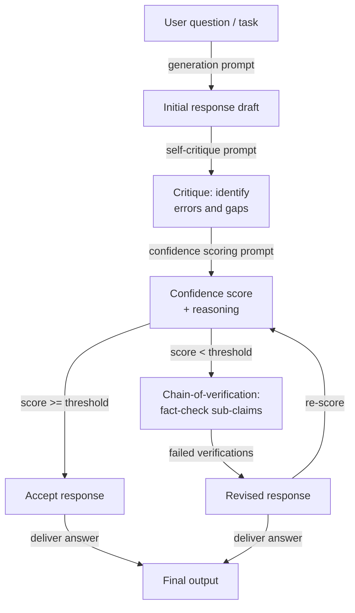

# 自我评估与校准

## 定义

自我评估是指提示语言模型批评、验证或评分其之前生成的输出。与将模型的第一次回应视为最终结果不同，自我评估步骤要求模型充当自己的审阅者——检查事实错误、逻辑不一致、推理不完整或未遵循指令——然后标记问题或生成改进后的回应。模型在两个角色中使用相同的权重和上下文窗口，这既是优势（不需要额外模型），也是根本限制（模型可能有无法自我检测的系统性盲点）。

校准是自我评估更窄、更定量的维度。一个*校准良好*的模型，其表达的置信度与经验准确率相匹配：当它说 80% 有把握时，大约 80% 的时间它是正确的。大多数大型语言模型在默认情况下校准较差——它们在错误回答的问题上也表达出高度置信，这种现象称为*过度自信*或*认识论过度延伸*。校准技术提示模型在每个答案旁边生成一个明确的数值置信度评分，然后系统可以使用该评分将不确定答案路由到人工审核、触发额外验证步骤，或完全拒绝回答。

自我评估和校准共同解决两种不同但相关的失败模式。自我评估解决*正确性*：模型产生了答案，但它正确吗？校准解决*不确定性意识*：模型知道它不知道的时候吗？两者都是在高风险场景中部署大型语言模型所必需的。能发现自身错误的模型更可靠；知道自己不知道什么的模型更值得信赖。这里介绍的技术——自我批评、置信度评分和验证链——已成为生产大型语言模型管道中越来越标准的组成部分。

## 工作原理



### 自我批评

自我批评是最简单的自我评估方法。在生成初始回应后，你追加第二个提示词，要求模型根据明确标准审查自己的输出。好的自我批评提示词对检查内容*具体*：事实准确性、逻辑一致性、完整性、指令遵循、语气或安全性。模糊的提示词如"这个回应好吗？"会产生肤浅、表面的批评。具体的提示词如"列出回应中你不超过 90% 确定的任何事实主张，并解释原因"会产生可操作的反馈。

当你指示模型采取对抗性立场——积极寻找问题而非确认回应没问题——时，自我批评的质量会显著提升。"挑战每个关键主张"、"至少找到一个缺陷"和"怀疑者会反对什么？"等短语使模型偏向有用的批评而非验证。宪法 AI（Anthropic，2022）通过定义一组模型在修改前必须对照检查回应的"原则"来系统化这一过程——有效地创建了一个可审计的结构化批评标准。

自我批评的关键失败模式是*奉承性验证*：模型称赞自己的回应并发现没有问题，特别是当原始回应听起来已经合理但实际上是错误的。这在较小的模型中最为明显，在经过批评数据微调的模型中最不明显。缓解措施包括：使用单独的模型实例进行批评、向草稿中注入故意错误以测试批评步骤是否能发现它们，以及要求批评以结构化列表而非自由散文的形式呈现（使"没有问题"成为更难以维护的主张）。

### 校准与置信度评分

置信度评分提示要求模型在每个答案旁边生成明确的概率或顺序评级。最简单的版本是附加在答案提示词之后的简单请求："在你的答案之后，将你的置信度声明为 0 到 100 的百分比，其中 100 表示你确定，0 表示你在猜测。"更复杂的版本要求按主张分类："对于回应中的每个事实陈述，评定你的置信度（高/中/低）并识别不确定性的来源。"

来自大型语言模型的数值置信度评分必须谨慎对待。原始的语言化概率在统计意义上校准不良——说"70% 有把握"的模型并不系统性地在那些问题上 70% 的时间是正确的。然而，它们是*单调有用的*：模型报告低置信度的问题往往比报告高置信度的问题更难且更容易出错。这意味着语言化置信度评分对于*排序*和*路由*有用（将低置信度答案发送到审核），即使对于精确概率估计没有用。

校准可以通过温度缩放或对模型对数概率应用普拉特缩放（Platt scaling）进行事后改进，但这些需要标注数据集。在提示词层面，你可以通过要求模型将其置信度与已知难度的参考问题进行比较来改善相对校准（"我的置信度与我对法国首都的把握相当，而非对某个晦涩历史日期的把握"）。

### 验证链

验证链（CoVe，Dhuliawala 等人，2023）将自我评估结构化为多步骤验证管道：生成基准回应，然后明确规划一组能确认或驳斥该回应关键主张的验证问题，独立回答这些验证问题（不看原始回应以减少确认偏见），最后基于验证结果生成修改后的回应。这种分解很重要，因为它迫使模型将*主张生成*与*主张验证*分离，减少了相同推理错误在两个步骤中传播的机会。

验证问题应是原子性的——每个问题应测试单一、具体的子主张。例如，如果基准回应声明"Python 3.10 引入了结构模式匹配和海象运算符"，验证问题应为："在哪个 Python 版本中引入了结构模式匹配？"和"在哪个 Python 版本中引入了海象运算符？"独立回答这些问题往往会发现原始回应自信断言的事实错误。

## 何时使用 / 何时不适用

| 适合使用 | 不适合使用 |
|---------|-----------|
| 任务高风险且事实正确性至关重要（医疗、法律、金融） | 延迟是硬性约束——自我评估至少增加一个完整的推理往返 |
| 你想要内置的不确定性信号而无需单独的评估器模型 | 模型的领域是自我评估系统性不可靠的（如超出训练截止日期的极新近事件） |
| 输出质量在不同运行间高度可变，你需要过滤机制 | 任务简单且约束明确——自我评估开销超过准确率收益 |
| 你需要自动将不确定答案路由到人工审核 | 模型太小，无法产生可靠的自我批评（< 70 亿参数通常产生较差的自我评估） |
| 回应包含多个可以原子性验证的独立事实主张 | 你需要精确的概率校准——语言化置信度评分在统计上未经校准 |
| 构建模型必须检测自身幻觉的管道 | 原始生成已经达到上限准确率——自我批评增加成本但无准确率收益 |

## 对比

| 标准 | 自我评估 | 自一致性 | 外部评估 |
|------|---------|---------|---------|
| 额外模型调用 | 1-3（批评、评分、验证） | N（通常 10-40） | 1（单独评估器） |
| 需要单独模型 | 否——同一模型审查自身 | 否 | 是——通常是更强或专门的模型 |
| 能发现事实错误 | 是，如果自我批评提示词设计良好 | 部分——不一致的事实可能在多数投票中存活 | 是，更可靠 |
| 提供不确定性评分 | 是——明确的置信度评级 | 隐含——投票分布是置信度的代理 | 是——评估器可以输出评分 |
| 减少幻觉 | 是，特别是使用 CoVe | 部分——投票减少但不消除幻觉 | 更可靠，但增加成本和延迟 |
| 实现工作量 | 中等——需要仔细的批评提示词设计 | 低——采样 N 次并投票 | 高——需要评估器提示词、单独 API 调用，可能需要单独模型 |
| 最佳使用场景 | 单轮高风险问答、事实生成 | 多步数学和推理 | 有强正确性要求的企业管道 |

## 代码示例

### 使用 Anthropic SDK 的带批评步骤自我评估

```python
# Self-evaluation pipeline: generate → critique → score → revise
# pip install anthropic

import os
from anthropic import Anthropic

client = Anthropic(api_key=os.environ["ANTHROPIC_API_KEY"])
MODEL = "claude-opus-4-5"


def generate_initial(question: str) -> str:
    """Step 1: Generate an initial response."""
    response = client.messages.create(
        model=MODEL,
        max_tokens=512,
        messages=[{"role": "user", "content": question}],
    )
    return response.content[0].text.strip()


def critique_response(question: str, response: str) -> str:
    """Step 2: Critique the initial response for errors and gaps."""
    prompt = f"""You are a rigorous fact-checker and critic. Review the response below and identify:
1. Any factual claims you are less than fully confident about
2. Logical inconsistencies or gaps in reasoning
3. Missing context that would be important for the user

Question: {question}

Response to critique:
{response}

Provide a structured critique. If you find no issues, you must still explain why you believe the response is correct. Do not simply validate the response."""

    critique = client.messages.create(
        model=MODEL,
        max_tokens=512,
        messages=[{"role": "user", "content": prompt}],
    )
    return critique.content[0].text.strip()


def score_confidence(question: str, response: str, critique: str) -> dict:
    """Step 3: Produce an explicit confidence score based on the critique."""
    prompt = f"""Given the question, the response, and the critique below, assign a confidence score.

Question: {question}

Response:
{response}

Critique:
{critique}

Output in this exact format:
CONFIDENCE: [integer 0-100]
REASONING: [one sentence explaining the score]
SHOULD_REVISE: [yes/no]"""

    result = client.messages.create(
        model=MODEL,
        max_tokens=128,
        messages=[{"role": "user", "content": prompt}],
    )
    text = result.content[0].text.strip()

    # Parse structured output
    confidence, reasoning, should_revise = None, "", False
    for line in text.splitlines():
        if line.startswith("CONFIDENCE:"):
            try:
                confidence = int(line.split(":", 1)[1].strip())
            except ValueError:
                pass
        elif line.startswith("REASONING:"):
            reasoning = line.split(":", 1)[1].strip()
        elif line.startswith("SHOULD_REVISE:"):
            should_revise = "yes" in line.lower()

    return {"confidence": confidence, "reasoning": reasoning, "should_revise": should_revise}


def revise_response(question: str, initial: str, critique: str) -> str:
    """Step 4: Produce a revised response informed by the critique."""
    prompt = f"""Revise the response below to address the issues identified in the critique.
Preserve correct information. Be explicit about any remaining uncertainty.

Question: {question}

Original response:
{initial}

Critique to address:
{critique}

Revised response:"""

    revised = client.messages.create(
        model=MODEL,
        max_tokens=512,
        messages=[{"role": "user", "content": prompt}],
    )
    return revised.content[0].text.strip()


def self_evaluate(question: str, confidence_threshold: int = 75) -> dict:
    """Full self-evaluation pipeline: generate, critique, score, conditionally revise."""
    print("=== Step 1: Generating initial response ===")
    initial = generate_initial(question)
    print(initial[:200], "...\n" if len(initial) > 200 else "\n")

    print("=== Step 2: Critiquing response ===")
    critique = critique_response(question, initial)
    print(critique[:200], "...\n" if len(critique) > 200 else "\n")

    print("=== Step 3: Scoring confidence ===")
    score = score_confidence(question, initial, critique)
    print(f"Confidence : {score['confidence']}")
    print(f"Reasoning  : {score['reasoning']}")
    print(f"Revise?    : {score['should_revise']}\n")

    final = initial
    if score["should_revise"] or (score["confidence"] is not None and score["confidence"] < confidence_threshold):
        print("=== Step 4: Revising response ===")
        final = revise_response(question, initial, critique)
        print(final[:200], "...\n" if len(final) > 200 else "\n")
    else:
        print("=== Step 4: Skipped — confidence above threshold ===\n")

    return {
        "question": question,
        "initial_response": initial,
        "critique": critique,
        "confidence_score": score,
        "final_response": final,
        "was_revised": final != initial,
    }


if __name__ == "__main__":
    q = ("What were the main causes of the 2008 financial crisis, "
         "and which regulatory changes were enacted in response?")
    result = self_evaluate(q, confidence_threshold=80)
    print("=== Final answer ===")
    print(result["final_response"])
    print(f"\nRevised: {result['was_revised']}")
    print(f"Confidence: {result['confidence_score']['confidence']}")
```

### 用于事实主张的验证链

```python
# Chain-of-Verification (CoVe): decompose claims, verify independently, revise
# pip install anthropic

import os
from anthropic import Anthropic

client = Anthropic(api_key=os.environ["ANTHROPIC_API_KEY"])
MODEL = "claude-opus-4-5"


def extract_verification_questions(response: str) -> list[str]:
    """Generate atomic verification questions for each factual claim."""
    prompt = f"""Read the response below and generate a list of atomic verification questions
— one per distinct factual claim. Each question should be answerable independently
without referring to the original response.

Response:
{response}

Output as a numbered list of questions only. No preamble."""

    result = client.messages.create(
        model=MODEL,
        max_tokens=400,
        messages=[{"role": "user", "content": prompt}],
    )
    text = result.content[0].text.strip()
    questions = []
    for line in text.splitlines():
        line = line.strip()
        if line and line[0].isdigit():
            # Strip leading number and punctuation
            q = line.lstrip("0123456789.)- ").strip()
            if q:
                questions.append(q)
    return questions


def verify_claim(question: str) -> dict:
    """Answer a single verification question independently."""
    prompt = f"""Answer the following question as accurately as possible.
If you are uncertain, say so explicitly and explain why.

Question: {question}

Answer:"""

    result = client.messages.create(
        model=MODEL,
        max_tokens=150,
        messages=[{"role": "user", "content": prompt}],
    )
    answer = result.content[0].text.strip()
    uncertain = any(w in answer.lower() for w in ("uncertain", "unsure", "not sure", "don't know", "unclear"))
    return {"question": question, "answer": answer, "uncertain": uncertain}


def revise_with_verifications(original_response: str, verifications: list[dict]) -> str:
    """Produce a revised response informed by independent verification results."""
    verification_block = "\n".join(
        f"Q: {v['question']}\nA: {v['answer']}\n" for v in verifications
    )
    prompt = f"""Revise the response below using the independent verification answers provided.
Correct any inaccuracies. Where verifications indicate uncertainty, acknowledge that uncertainty explicitly.

Original response:
{original_response}

Independent verifications:
{verification_block}

Revised response:"""

    result = client.messages.create(
        model=MODEL,
        max_tokens=600,
        messages=[{"role": "user", "content": prompt}],
    )
    return result.content[0].text.strip()


def chain_of_verification(question: str) -> dict:
    """Full CoVe pipeline for a factual question."""
    # Step 1: Baseline response
    baseline = client.messages.create(
        model=MODEL,
        max_tokens=400,
        messages=[{"role": "user", "content": question}],
    ).content[0].text.strip()

    # Step 2: Plan verification questions
    vqs = extract_verification_questions(baseline)
    print(f"Generated {len(vqs)} verification questions.")

    # Step 3: Answer each verification question independently
    verifications = [verify_claim(q) for q in vqs]
    uncertain_count = sum(1 for v in verifications if v["uncertain"])
    print(f"Uncertain claims: {uncertain_count}/{len(verifications)}")

    # Step 4: Revise using verification results
    revised = revise_with_verifications(baseline, verifications)

    return {
        "question": question,
        "baseline": baseline,
        "verification_questions": vqs,
        "verifications": verifications,
        "revised": revised,
        "uncertain_claims": uncertain_count,
    }


if __name__ == "__main__":
    q = "Summarize the key milestones in the development of transformer models from 2017 to 2023."
    result = chain_of_verification(q)
    print("\n=== Baseline ===")
    print(result["baseline"])
    print("\n=== Revised (after CoVe) ===")
    print(result["revised"])
    print(f"\nUncertain claims flagged: {result['uncertain_claims']}/{len(result['verifications'])}")
```

## 实用资源

- [Self-Refine: Iterative Refinement with Self-Feedback（Madaan 等人，2023）](https://arxiv.org/abs/2303.17651) — 在七种多样化文本生成任务中引入并评估迭代自我批评和修改；自我评估管道的基础参考。
- [Chain-of-Verification Reduces Hallucination in Large Language Models（Dhuliawala 等人，2023）](https://arxiv.org/abs/2309.11495) — 提出本文描述的结构化验证规划方法 CoVe，包含基于列表的问答和长文生成实验。
- [Constitutional AI: Harmlessness from AI Feedback（Bai 等人，2022）](https://arxiv.org/abs/2212.08073) — 展示了大规模对照定义原则进行系统性自我批评；结构化自我评估标准的生产先例。
- [Language Models (Mostly) Know What They Know（Kadavath 等人，2022）](https://arxiv.org/abs/2207.05221) — 研究大型语言模型是否能准确报告自身不确定性；显示校准是可能但不完美的，为置信度评分技术提供了实证基础。
- [Calibration of Large Language Models Using Their Generations（Kapoor 等人，2024）](https://arxiv.org/abs/2403.07221) — 调查包括语言化置信度在内的事后校准方法，并在 GPT-4 和 Claude 系列上与对数概率基准进行比较。

## 另请参阅

- [提示词工程](/docs/prompt-engineering)
- [自一致性](/docs/prompt-engineering/self-consistency)
- [去偏技术](/docs/prompt-engineering/debiasing-techniques)
- [评估指标](/docs/evaluation-metrics)
