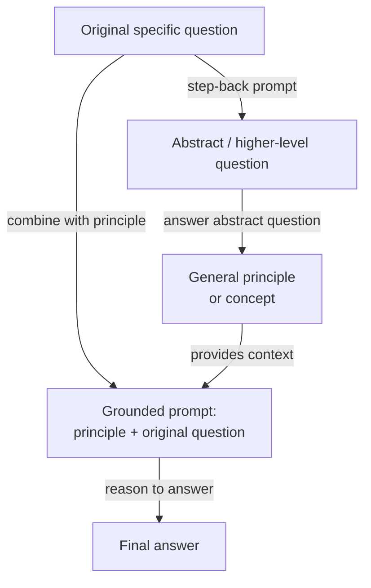

# 后退式提示

## 定义

后退式提示（Step-back Prompting）是由 Zheng 等人（2023）在谷歌 DeepMind 提出的两步提示词技术。其核心思想看似简单：在要求模型回答一个具体的、可能很难的问题之前，先问它同一问题的更抽象、更高层次的版本——然后将模型对该抽象问题的回答作为背景，来回答原始问题。该技术基于一个观察：大型语言模型在具体事实或推理问题上的失败，往往不是因为缺乏相关知识，而是因为问题的具体性在模型内部表征中激活了错误的"检索上下文"。后退到更高的抽象层次激活了更广泛、更可靠的知识，从而支撑最终答案。

后退式提示的洞察源于专家处理难题的方式。一位物理学家被问到"在恒定体积下，气体温度升高时压力会发生什么变化？"时，可能会先回想理想气体定律（PV = nRT）作为一般背景，然后将其应用于具体情况——而非直接跳到答案，冒着混淆变量的风险。后退式提示指示模型做同样的事情：生成支撑具体问题的一般原理或概念，然后从该原理出发推导出答案。这有效地增加了一个概念性脚手架步骤，减少了表面模式匹配导致错误答案的可能性。

在原始论文中，后退式提示通过少样本示例来演示，这些示例教会模型如何针对给定领域适当地"后退"。对于物理问题，抽象问题通常要求相关的物理定律或原理。对于历史问题，它要求更广泛的历史背景。对于医学问题，它要求相关的生理学知识。该技术与模型无关，不需要微调——它纯粹是提示词层面的干预。在 MMLU 和 TimeQA 基准上，后退式提示在困难的、知识密集型问题上优于标准思维链和检索增强基准。

## 工作原理



### 步骤 1 — 生成抽象问题

第一步是提示模型识别一个包含原始问题的更高层次问题。这通常通过包含领域特定（具体问题、抽象问题）对示例的少样本提示词来完成。例如，如果原始问题是"砷化镓的熔点是多少？"，抽象问题可能是"III-V 族半导体的热力学和晶体学特性是什么？"抽象问题应足够宽泛以激活广泛的相关知识，但又不能过于宽泛而缺乏信息量。找到正确的抽象层次是主要的提示词工程挑战，少样本示例对于引导模型到特定领域适当抽象层次至关重要。

### 步骤 2 — 回答抽象问题

生成抽象问题后，模型回答它。该答案通常采用一般原理、定义、物理定律或相关背景上下文摘要的形式。这一步的关键特性是，抽象问题通常比原始具体问题更容易让模型可靠地回答——它激活了经过充分学习的、基于事实的表征，而非更容易产生幻觉的边缘案例或具体数值事实。抽象问题的答案成为约束和指导最终推理步骤的上下文块。

### 步骤 3 — 使用抽象作为上下文回答原始问题

最后一步将抽象原理与原始具体问题合并在一个提示词中："给定此背景：[抽象答案]，回答具体问题：[原始问题]。"模型现在从坚实的概念基础出发进行推理，而不是试图直接检索具体事实。这降低了知识密集型问题中幻觉的风险，并提高了多步推理的逻辑一致性。在原始论文中，这最后一步也使用了思维链，使后退式提示可以与 CoT 组合：抽象步骤奠定推理基础，CoT 使其明确。

## 何时使用 / 何时不适用

| 适合使用 | 不适合使用 |
|---------|-----------|
| 问题需要模型容易产生幻觉的具体事实知识 | 直接提示已经可靠工作的简单问题 |
| 领域有从一般原理到具体实例的清晰层次（物理、化学、历史） | 难以定义抽象问题——没有自然的一般/具体区分的任务 |
| 模型在具体问题上回答不一致，但在一般原理上可靠 | 延迟至关重要——两次大型语言模型调用使响应时间加倍 |
| 你想在不使用 RAG 的情况下减少知识密集型基准上的幻觉 | 问题纯粹是数学或符号性的——仅 CoT 通常就足够了 |
| 领域的少样本示例可用于教模型如何后退 | 令牌预算紧张——抽象答案会向最终提示词添加令牌 |

## 对比

| 标准 | 后退式提示 | 思维链（CoT） | 自一致性 |
|------|-----------|-------------|---------|
| 大型语言模型调用次数 | 2（抽象 + 最终） | 1 | N（通常 10-40） |
| 核心机制 | 抽象到接地到推理 | 明确的逐步推理 | 多条独立路径 + 多数投票 |
| 主要优势 | 减少知识密集型问题中的幻觉 | 提升多步逻辑推理 | 减少推理结果中的方差 |
| 成本 | 基准的 2 倍 | 基准的 1 倍 | 基准的 N 倍 |
| 需要少样本示例 | 是——教授后退行为 | 是——效果最佳时 | 是——作为基础提示词的少样本 CoT |
| 最佳任务类型 | 知识密集型问答、科学、历史 | 数学、逻辑、代码 | 数学、符号推理、事实问答 |
| 可与 CoT 组合 | 是——推荐同时使用 | N/A | 是——基础提示词使用 CoT |
| 注意 | 与自一致性互补；两者可叠加以获得进一步收益 | 更简单的基准——先于后退式提示尝试 | 更昂贵；当高准确率证明 N 倍成本合理时使用 |

## 代码示例

### 使用 OpenAI 的后退式提示——双调用实现

```python
# Step-back prompting: abstraction-then-answer, two API calls
# pip install openai

import os
from openai import OpenAI

client = OpenAI(api_key=os.environ["OPENAI_API_KEY"])

STEP_BACK_FEW_SHOT = """Help identify a broader abstract question underpinning a specific one.

Original: At what temperature does gallium arsenide melt?
Step-back: What are the thermodynamic properties of III-V semiconductors?

Original: What was the immediate cause of the US entering World War I?
Step-back: What geopolitical tensions shaped US foreign policy before WWI?

Original: Patient has peripheral edema, elevated JVP, orthopnea. Diagnosis?
Step-back: What are the hallmark signs of right-sided and left-sided heart failure?

Original: {question}
Step-back:"""

GROUNDED = """Using the background context below, answer the specific question step by step.

Background (general principles):
{background}

Specific question:
{question}

Let's think step by step:"""


def generate_step_back(question: str) -> str:
    resp = client.chat.completions.create(
        model="gpt-4o",
        messages=[{"role": "user", "content": STEP_BACK_FEW_SHOT.format(question=question)}],
        temperature=0, max_tokens=150,
    )
    return resp.choices[0].message.content.strip()


def answer_abstract(abstract_q: str) -> str:
    resp = client.chat.completions.create(
        model="gpt-4o",
        messages=[
            {"role": "system", "content": "Answer with accurate background principles (3-5 sentences)."},
            {"role": "user", "content": abstract_q},
        ],
        temperature=0, max_tokens=300,
    )
    return resp.choices[0].message.content.strip()


def answer_with_step_back(question: str) -> str:
    abstract_q = generate_step_back(question)
    background  = answer_abstract(abstract_q)
    resp = client.chat.completions.create(
        model="gpt-4o",
        messages=[{"role": "user", "content": GROUNDED.format(
            background=background, question=question)}],
        temperature=0, max_tokens=500,
    )
    return resp.choices[0].message.content.strip()


if __name__ == "__main__":
    q = "Why did Soviet collectivization in the early 1930s lead to famine in Ukraine?"
    print(answer_with_step_back(q))
```

### 使用 Anthropic 的后退式提示——带结构化输出的单次调用

```python
# Step-back prompting in one Anthropic call: structured three-part format
# pip install anthropic

import os
import anthropic

client = anthropic.Anthropic(api_key=os.environ["ANTHROPIC_API_KEY"])

SYSTEM = """You are an expert reasoning assistant. For each question, respond in three parts:

## Abstract question:
A broader, general question capturing the underlying principle.

## Background context:
Answer the abstract question with relevant principles and definitions (3-5 sentences).

## Final answer:
Use the background to reason step-by-step to the specific answer."""

EXAMPLE = [
    {"role": "user", "content": "Ideal gas: 2 mol, 300 K, 0.05 m^3. What is the pressure?"},
    {"role": "assistant", "content": """## Abstract question:
What is the ideal gas law and how does it relate P, V, n, and T?

## Background context:
PV = nRT, where P is pressure (Pa), V is volume (m^3), n is moles, R = 8.314 J/mol/K, T is Kelvin. Rearranged: P = nRT / V.

## Final answer:
P = (2 x 8.314 x 300) / 0.05 = 99,768 Pa (about 0.985 atm)."""},
]


def step_back(question: str) -> str:
    response = client.messages.create(
        model="claude-opus-4-5",
        max_tokens=800,
        system=SYSTEM,
        messages=EXAMPLE + [{"role": "user", "content": question}],
    )
    return response.content[0].text


if __name__ == "__main__":
    q = "A patient is given furosemide. How does it cause hypokalemia?"
    print(step_back(q))
```

## 实用资源

- [Take a Step Back: Evoking Reasoning via Abstraction in Large Language Models（Zheng 等人，2023）](https://arxiv.org/abs/2310.06117) — 谷歌 DeepMind 原始论文，包含 MMLU、TimeQA 和 MedQA 上的基准。
- [Chain-of-Thought Prompting Elicits Reasoning in Large Language Models（Wei 等人，2022）](https://arxiv.org/abs/2201.11903) — 后退式提示基于并与之评估的 CoT 论文。
- [Anthropic — 提示词工程概述](https://docs.anthropic.com/en/docs/build-with-claude/prompt-engineering/overview) — 涵盖系统提示词结构化和少样本示例设计。
- [OpenAI — 提示词工程指南](https://platform.openai.com/docs/guides/prompt-engineering) — 关于少样本提示、推理策略和输出结构的实用指南。

## 另请参阅

- [提示词工程](/docs/prompt-engineering)
- [思维链（CoT）](/docs/reasoning-patterns/cot)
- [自一致性](/docs/prompt-engineering/self-consistency)
