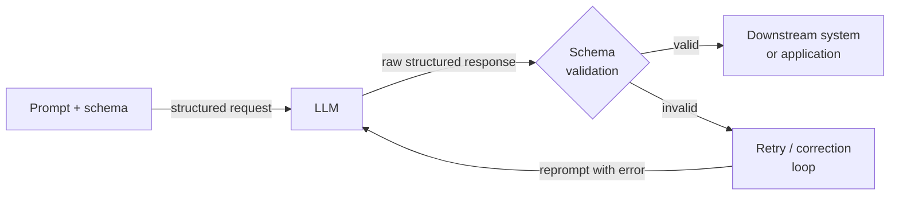

# 结构化输出

## 定义

结构化输出是指约束或引导大型语言模型生成机器可读数据（最常见的是 JSON），而非自由形式散文的实践。在生产管道中，一个返回正确答案的大型语言模型和一个返回*可解析格式*正确答案的大型语言模型之间的差距，就是玩具演示与可部署系统之间的差距。需要提取产品名称、情感标签或行动项列表的下游服务，无法可靠地处理非结构化文本；它需要一个保证的形状来反序列化、验证和路由。

结构化输出技术的演进追踪了大型语言模型 API 的成熟过程。早期系统依赖脆弱的提示词指令（"仅用有效 JSON 回应"），结合正则表达式解析和重试循环。每当模型添加解释性序言、将 JSON 包裹在 Markdown 代码块中，或在边缘案例下微妙地违反模式时，这种方法就会失效。下一代引入了函数调用（OpenAI，2023 年中）和工具使用（Anthropic），将模式定义从提示词移出，放入一流 API 参数，允许模型在输出契约上明确进行训练和约束。最近，提供商引入了严格的语法约束解码，使模式合规性在令牌层面成为硬性保证，而非软性提示词指令。

理解应用哪种技术——以及为什么——对于任何构建依赖大型语言模型输出的管道的人都很重要。JSON 模式是最简单的入口点，但不提供模式验证。函数调用/工具使用在 API 响应中提供了类型化模式和结构化解析，但需要预先定义工具模式。基于 Pydantic 的提取库（Instructor、LangChain 输出解析器）位于 API 层之上，添加了 Python 级别的验证、模式违规时的自动重试，以及人性化的模型定义。正确的选择取决于目标模式的复杂性、验证的重要性，以及你希望库为你处理多少重试/修正逻辑。

## 工作原理



### JSON 模式

JSON 模式是最基础的结构化输出机制。启用后，模型被约束为仅将有效 JSON 作为其顶层输出。在 OpenAI 的 API 中，通过在请求上设置 `response_format={"type": "json_object"}` 来激活；在 Anthropic 的 API 中，可以通过用 `{` 预填助手回合来实现类似效果。JSON 模式保证语法有效性（输出总是可以通过 `json.loads` 解析），但不根据任何模式进行验证——模型可能返回 `{"result": "yes"}`，而你期望 `{"score": 0.87, "label": "positive", "confidence": 0.92}`。你必须添加模式验证（如使用 Pydantic 或 `jsonschema`）作为单独步骤，并对模式不匹配实现重试逻辑。JSON 模式最适合简单、扁平的结构，其中模式漂移的风险较低。

### 函数调用和工具使用

函数调用（OpenAI）和工具使用（Anthropic）代表了质的进步。不是在系统提示词中嵌入输出模式，而是将其声明为带有 JSON Schema 对象的工具或函数定义。API 将模型的输出作为具有解析 `input` 字典的结构化 `tool_use` 块返回，与任何文本内容分离。这种解耦是显著的：文本和结构化数据存在于响应的不同部分，API 本身处理 JSON 解析。你获得了每个字段的类型注释、必需与可选字段语义、枚举约束和嵌套对象支持——所有这些都由 API 层的模式强制执行。OpenAI 的严格模式（2024 年）更进一步，通过启用约束解码使模式遵从性成为硬性保证。工具使用是从文档中提取结构化数据、填充数据库记录或用类型化参数驱动下游 API 调用的正确选择。

### 基于 Pydantic 的模式提取

[Instructor](https://github.com/jxnl/instructor) 和 LangChain 输出解析器等库以 Pydantic 优先接口包装了函数调用/工具使用 API。你将输出模式定义为 `pydantic.BaseModel` 子类，并将模型类传递给库；它自动生成工具定义的 JSON Schema，调用 API，根据你的模型验证响应，如果模式被违反则用验证错误反馈重试。这种方法对 Python 从业者最人性化，因为输出是完全类型化的 Python 对象——而非原始字典——具有字段验证、默认值和嵌套模型支持。带有错误上下文的自动重试显著降低了静默模式违反的比率。代价是额外的库依赖，以及验证错误触发重试消息时略多的令牌使用量。

## 何时使用 / 何时不适用

| 适合使用 | 不适合使用 |
|---------|-----------|
| 大型语言模型输出必须以编程方式消费（API 响应、数据库插入、工作流触发） | 输出仅由人类阅读，不需要下游解析 |
| 你需要类型化、验证后的 Python 对象而非原始字符串 | 模式过于简单（单个字符串或数字），纯文本更易解析 |
| 构建模式违规会导致静默数据损坏的管道 | 延迟极其紧张，无法承受重试循环的开销 |
| 提取涉及嵌套结构、数组或枚举约束字段 | 你处于早期原型阶段，输出模式尚未稳定 |
| 你需要跨模型版本的可重现、可测试的提取行为 | 你使用的模型对工具使用/函数调用的支持较差 |

## 代码示例

### OpenAI — JSON 模式与 Pydantic 验证

```python
# Structured extraction with OpenAI JSON mode + Pydantic validation
# pip install openai pydantic

import json, os
from pydantic import BaseModel, ValidationError
from openai import OpenAI

client = OpenAI(api_key=os.environ["OPENAI_API_KEY"])


class SentimentResult(BaseModel):
    label: str       # "positive" | "negative" | "neutral"
    score: float     # 0.0 - 1.0
    key_phrases: list[str]


def extract_sentiment(text: str, max_retries: int = 3) -> SentimentResult:
    system = (
        "You are a sentiment analysis engine. Respond ONLY with valid JSON: "
        '{"label": "positive"|"negative"|"neutral", "score": <float>, "key_phrases": [...]}'
    )
    for attempt in range(max_retries):
        resp = client.chat.completions.create(
            model="gpt-4o-mini",
            response_format={"type": "json_object"},
            messages=[{"role": "system", "content": system},
                      {"role": "user", "content": f"Analyze: {text}"}],
            temperature=0,
        )
        try:
            return SentimentResult(**json.loads(resp.choices[0].message.content))
        except (json.JSONDecodeError, ValidationError) as e:
            if attempt == max_retries - 1:
                raise RuntimeError(f"Validation failed: {e}") from e
    raise RuntimeError("Unreachable")


if __name__ == "__main__":
    r = extract_sentiment("The model is fast, but docs leave much to be desired.")
    print(r.label, r.score, r.key_phrases)
```

### OpenAI — 严格模式函数调用

```python
# Structured extraction with OpenAI function calling (strict mode)
# pip install openai

import os, json
from openai import OpenAI

client = OpenAI(api_key=os.environ["OPENAI_API_KEY"])

TOOL = {
    "type": "function",
    "function": {
        "name": "extract_product_info",
        "description": "Extract structured product info from a description.",
        "strict": True,
        "parameters": {
            "type": "object",
            "properties": {
                "product_name": {"type": "string"},
                "price_usd":    {"type": "number"},
                "features":     {"type": "array", "items": {"type": "string"}},
                "in_stock":     {"type": "boolean"},
            },
            "required": ["product_name", "price_usd", "features", "in_stock"],
            "additionalProperties": False,
        },
    },
}


def extract_product(description: str) -> dict:
    resp = client.chat.completions.create(
        model="gpt-4o",
        tools=[TOOL],
        tool_choice={"type": "function", "function": {"name": "extract_product_info"}},
        messages=[{"role": "system", "content": "Extract product information."},
                  {"role": "user", "content": description}],
        temperature=0,
    )
    return json.loads(resp.choices[0].message.tool_calls[0].function.arguments)


if __name__ == "__main__":
    desc = ("AcmePro X200 headphones — ships now at $149.99. "
            "Features: 40-hour battery, ANC, USB-C charging.")
    print(json.dumps(extract_product(desc), indent=2))
```

### Anthropic — 工具使用的结构化提取

```python
# Structured extraction with Anthropic tool use
# pip install anthropic pydantic

import os
from pydantic import BaseModel
import anthropic

client = anthropic.Anthropic(api_key=os.environ["ANTHROPIC_API_KEY"])

TOOL = {
    "name": "extract_meeting_notes",
    "description": "Extract structured meeting notes. Always call this tool.",
    "input_schema": {
        "type": "object",
        "properties": {
            "summary": {"type": "string"},
            "action_items": {
                "type": "array",
                "items": {
                    "type": "object",
                    "properties": {
                        "owner":    {"type": "string"},
                        "task":     {"type": "string"},
                        "due_date": {"type": "string"},
                    },
                    "required": ["owner", "task", "due_date"],
                },
            },
            "decisions": {"type": "array", "items": {"type": "string"}},
        },
        "required": ["summary", "action_items", "decisions"],
    },
}


class ActionItem(BaseModel):
    owner: str
    task: str
    due_date: str | None


class MeetingNotes(BaseModel):
    summary: str
    action_items: list[ActionItem]
    decisions: list[str]


def extract_meeting_notes(transcript: str) -> MeetingNotes:
    resp = client.messages.create(
        model="claude-opus-4-5",
        max_tokens=1024,
        tools=[TOOL],
        tool_choice={"type": "tool", "name": "extract_meeting_notes"},
        messages=[{"role": "user", "content": f"Extract notes:\n\n{transcript}"}],
    )
    for block in resp.content:
        if block.type == "tool_use":
            return MeetingNotes(**block.input)
    raise RuntimeError("No tool_use block")


if __name__ == "__main__":
    notes = extract_meeting_notes("""
        Alice: New pricing model starts Q3. Bob: I'll update the pricing page by June 15.
        Carol: I'll brief legal by end of week. Alice: We dropped the free tier.
    """)
    print("Summary:", notes.summary)
    print("Decisions:", notes.decisions)
    for item in notes.action_items:
        print(f"  [{item.owner}] {item.task} — due {item.due_date}")
```

## 对比

| 标准 | JSON 模式 | 函数调用/工具使用 | 基于 Pydantic（Instructor） |
|------|---------|-----------------|--------------------------|
| 模式强制执行 | 仅语法（有效 JSON，无模式） | 结构性（字段、类型、必需项） | 结构性 + 语义（验证器、字段约束） |
| API 接口 | `response_format` 参数 | `tools` + `tool_choice` 参数 | 工具之上的库封装 |
| 输出类型 | 需要 `json.loads` 的原始字符串 | 工具调用参数中的解析字典 | 类型化 Pydantic 模型实例 |
| 失败时重试 | 手动——必须自己实现 | 手动 | 自动——库用错误上下文处理重试 |
| 嵌套模式 | 可能但容易出错 | 通过 JSON Schema 良好支持 | 通过嵌套 BaseModel 原生支持 |
| 最适合 | 简单、扁平结构；快速原型 | 生产提取和类型化 API 分发 | 有 Python 级别验证需求的复杂模式 |

## 实用资源

- [OpenAI — 结构化输出指南](https://platform.openai.com/docs/guides/structured-outputs) — 官方指南，涵盖 JSON 模式、函数调用和带约束解码的严格模式。
- [Anthropic — 工具使用文档](https://docs.anthropic.com/en/docs/build-with-claude/tool-use) — 定义工具模式和处理 Claude 响应中 tool_use 块的完整参考。
- [Instructor 库（jxnl/instructor）](https://github.com/jxnl/instructor) — 最广泛使用的 Pydantic 优先结构化提取库；支持 OpenAI、Anthropic 和其他后端。
- [Pydantic 文档](https://docs.pydantic.dev/) — 用于定义提取管道中使用的模式、验证器和嵌套模型的重要参考。

## 另请参阅

- [提示词工程](/docs/prompt-engineering)
- [大型语言模型（LLMs）](/docs/llms)
- [AI 智能体](/docs/agents)
