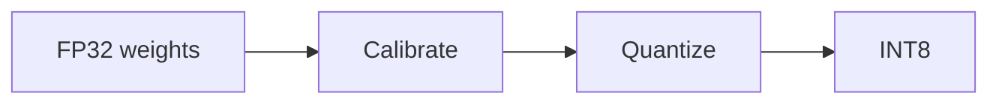

# 量化

## 定义

量化以较低精度表示权重和可选的激活 (例如 8-bit instead of 32-bit float) to reduce memory and speed up inference with minimal accuracy loss.

它是 one of the main [model compression](/docs/model-compression) levers for [LLMs](/docs/llms) and vision models. INT8 is common; INT4 and lower are used for aggressive compression. Deploy on [infrastructure](/docs/infrastructure) that supports quantized ops (例如 GPU tensor cores, dedicated inference chips).

## 工作原理

**FP32 weights** (and optionally activations) are mapped to a discrete range (例如 INT8). **Calibrate**: run a representative dataset to collect activation statistics and choose **scales and zero-points** so the quantized values approximate the original range. **Quantize**: convert weights (and optionally activations at runtime) to INT8. **Post-training quantization (PTQ)** does this 无需重新训练; **quantization-aware training (QAT)** fine-tunes with simulated quantization so the model adapts. The **INT8** model is then run on hardware that supports low-precision ops for faster inference and lower memory.

## 应用场景

Quantization 是在有限精度损失下减少内存和加速推理的主要手段 (edge, cloud, cost).

- Running LLMs and vision models on consumer GPUs or edge devices
- Reducing memory and speeding inference with minimal accuracy loss
- INT8 or lower precision for production serving

## 外部文档

- [PyTorch – Quantization](https://pytorch.org/docs/stable/quantization.html)
- [TensorFlow Lite – Quantization](https://www.tensorflow.org/lite/performance/quantization)

## 另请参阅

- [Model compression](/docs/model-compression)
- [Infrastructure](/docs/infrastructure)
