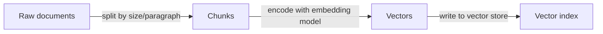
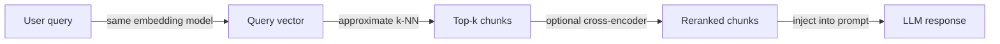

# RAG 架构

## 定义

RAG（检索增强生成）架构定义了原始文档如何转换为可检索的知识，以及该知识如何在推理时注入 LLM。该管道有两个主要阶段：处理和存储文档的离线**索引**阶段，以及为每个用户查询获取相关上下文的在线**检索**阶段。

该架构中的设计选择直接影响最终系统的质量、延迟和成本。块大小控制每个检索段携带多少上下文——较小的块更精确但可能缺乏上下文，而较大的块会降低检索召回率。[嵌入](/docs/rag/embeddings)模型的选择决定了向量空间的语义意义，以及使用稠密、稀疏还是混合检索会影响语义和基于关键字查询的覆盖范围。

高级设置通过查询重写（在嵌入前重新措辞查询）、多跳检索（链式多次检索）、重排序（对 top-k 候选进行重新评分的交叉编码器）和引文提取（将答案归因于源块）来扩展基础管道。每个扩展都增加了延迟和复杂性，但可以显著提高要求较高的用例的答案质量。有关索引选项，请参阅[向量数据库](/docs/rag/vector-databases)。

## 工作原理

### 索引阶段

文档被摄入、分割成块并存储在向量索引中。



### 检索阶段

在查询时，查询被嵌入，相似的块被检索并可选地重新排序。



**块：**文档被分割成段（按段落、句子或固定 token 数量）；可以向每个块添加重叠和元数据。**嵌入和索引：**块通过[嵌入](/docs/rag/embeddings)模型编码为向量并存储在[向量数据库](/docs/rag/vector-databases)中。**查询：**用户的查询使用相同的编码器嵌入；**检索**使用稠密或混合搜索获取 top-k 个相似块。**排序：**可选的重排序器（如交叉编码器）在将最佳候选格式化为 LLM 提示词之前对其重新评分。

## 何时使用 / 何时不应使用

| 场景 | 使用 | 不使用 |
|---|---|---|
| 知识库大且频繁更新 | 是——分块 + 索引处理规模 | 否——微调重新训练成本高 |
| 答案需要来源归属 | 是——块携带来源元数据 | 否——普通 LLM 生成会丢失归属 |
| 查询高度特定于关键字 | 是——混合检索结合稠密 + 稀疏 | 否——纯稠密检索可能错过精确匹配 |
| 知识适合放入上下文窗口 | 也许——直接填充提示词更简单 | 是——不需要检索层 |
| 实时延迟至关重要 | 通过优化——缓存、较小的模型 | 在非常低的延迟预算下避免重排序 + 多跳 |

## 比较

| 方法 | 块大小 | 检索类型 | 重排序器 | 典型用途 |
|---|---|---|---|---|
| 朴素 RAG | 固定 512 tokens | 仅稠密 | 无 | 原型设计 |
| 高级 RAG | 语义 / 重叠 | 混合（稠密 + BM25） | 交叉编码器 | 生产问答 |
| 模块化 RAG | 可变，带元数据 | 混合 + 过滤器 | 学习重排序器 | 企业搜索 |
| 多跳 RAG | 小以获得精确度 | 每跳稠密 | 可选 | 复杂推理 |

## 优缺点

| 优点 | 缺点 |
|---|---|
| 无需重新训练即可保持知识最新 | 增加索引和检索延迟 |
| 为答案提供来源归属 | 分块策略显著影响质量 |
| 可扩展到数百万文档 | 需要维护向量索引 |
| 可与重排序和过滤组合 | 查询-文档不匹配会损害召回率 |

## 代码示例

```python
from langchain_openai import OpenAIEmbeddings, ChatOpenAI
from langchain_community.vectorstores import Chroma
from langchain.text_splitter import RecursiveCharacterTextSplitter
from langchain.chains import RetrievalQA

# --- Indexing ---
splitter = RecursiveCharacterTextSplitter(chunk_size=512, chunk_overlap=64)
docs = splitter.create_documents([open("document.txt").read()])

embeddings = OpenAIEmbeddings()
vectorstore = Chroma.from_documents(docs, embeddings)

# --- Retrieval + Generation ---
retriever = vectorstore.as_retriever(search_kwargs={"k": 4})
qa_chain = RetrievalQA.from_chain_type(
    llm=ChatOpenAI(model="gpt-4o-mini"),
    retriever=retriever,
    return_source_documents=True,
)

result = qa_chain.invoke({"query": "What does the document say about X?"})
print(result["result"])
```

## 实用资源

- [LangChain – RAG architecture](https://python.langchain.com/docs/use_cases/question_answering/) — 使用 LangChain 组件的端到端 RAG 演练
- [LlamaIndex – Document processing and indexing](https://docs.llamaindex.ai/en/stable/module_guides/loading/) — 摄入、分块和索引管道
- [Anthropic – RAG best practices](https://docs.anthropic.com/en/docs/build-with-claude/retrieval-augmented-generation) — Claude 特定的 RAG 指南和技巧

## 另请参阅

- [RAG](/docs/rag)
- [向量数据库](/docs/rag/vector-databases)
- [嵌入](/docs/rag/embeddings)
