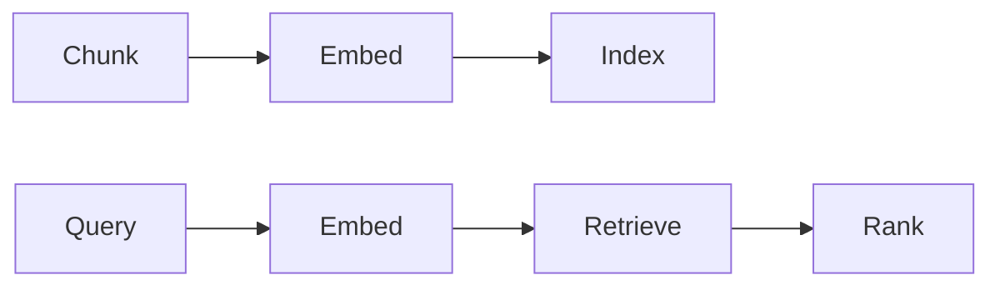

# RAG 架构

## 定义

RAG architecture covers how you chunk documents, choose embeddings and vector stores, run 检索 (dense, sparse, or hybrid), and combine context with the LLM (prompt 设计, reranking).

Design choices here directly affect [RAG](/docs/rag) quality and latency. Trade-offs include chunk size (larger = more context per chunk, less precision), [embedding](/docs/rag/embeddings) model (quality vs cost), and whether to add a reranker or hybrid search. See [vector databases](/docs/rag/vector-databases) for indexing options.

## 工作原理

**分块：**文档被分割成段（按段落、句子或固定大小）；可以添加重叠和元数据。 **Embed** and **index:** Chunks are turned into vectors via an [embedding](/docs/rag/embeddings) model and stored in a [vector database](/docs/rag/vector-databases). **Query:** At query time the query is embedded; **retrieve** fetches the top-k similar chunks (dense search), optionally combined with keyword (sparse) for hybrid. **Rank:** An optional reranker (例如 cross-encoder) rescores the top candidates. The chosen chunks are then formatted into the LLM prompt. Advanced setups add query rewriting, multi-hop 检索, and citation extraction.

## 应用场景

Architecture choices (chunking, 检索, reranking) directly affect answer quality and latency in production RAG.

- Designing chunking and indexing for long documents or codebases
- Choosing dense vs. sparse or hybrid 检索 for domain data
- Adding reranking and citation for production RAG systems

## 外部文档

- [LangChain – RAG architecture](https://python.langchain.com/docs/use_cases/question_answering/)
- [LlamaIndex – Document processing and indexing](https://docs.llamaindex.ai/en/stable/module_guides/loading/)

## 另请参阅

- [RAG](/docs/rag)
- [Vector databases](/docs/rag/vector-databases)
- [Embeddings](/docs/rag/embeddings)
