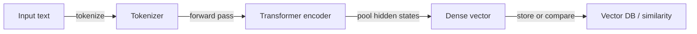
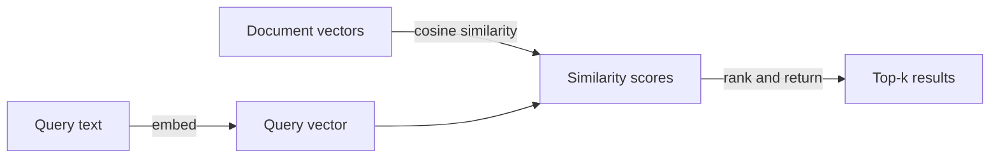

# 嵌入

## 定义

嵌入是固定大小的稠密数值向量，用于编码文本（或其他数据模态，如图像和音频）的语义含义。当文本通过编码器模型处理时，语义相似的内容会在高维空间中产生几何上接近的向量——因此，如果在相似数据上训练，"客户支持"和"帮助台"等短语将具有相近的向量。

它们是原始文本和[向量数据库](/docs/rag/vector-databases)之间的桥梁。文档和查询都必须使用**相同的编码器**进行嵌入，以便它们的向量生活在同一空间中，可以进行有意义的相似性比较。最常见的相似性度量是**余弦相似性**，尽管根据索引配置也使用点积和欧几里得距离。

嵌入模型的选择是 [RAG](/docs/rag) 系统中影响最大的决策之一。因素包括向量维度（越高 = 越具表现力但需要更多存储）、上下文窗口（编码器一次处理多少文本）、领域特异性（法律或生物医学模型可能优于通用模型）、多语言支持和成本（API 与自托管）。流行选项包括 OpenAI `text-embedding-3-large`、Cohere Embed 和开源 `sentence-transformers`。有关嵌入如何融入完整管道，请参阅 [RAG 架构](/docs/rag/architecture)。

## 工作原理

### 编码管道



### 相似性搜索



**文本**（句子、段落或块）被输入**编码器**（例如 OpenAI embeddings、Cohere 或开源 sentence-transformers）。编码器输出固定大小的**向量**（例如 768 或 1536 维）。训练使用对比目标或类似目标，使语义相关的文本获得相近的向量。在查询时，相似性以查询向量和存储的文档向量之间的余弦或点积计算。模型可以是多语言的或特定领域的。对于 [RAG](/docs/rag)，始终对文档和查询使用相同的编码器，以使距离有意义。

## 何时使用 / 何时不应使用

| 场景 | 使用嵌入 | 不使用嵌入 |
|---|---|---|
| 语义搜索（"查找相似含义"） | 是——嵌入捕捉语义意图 | 否——如果需要精确字符串匹配，则使用关键字搜索 |
| 多语言检索 | 是——多语言编码器将语言映射到同一空间 | 否——如果只有一种语言，则使用特定语言的 BM25 |
| 短查询对长文档 | 是——嵌入查询和分块文档 | 否——不分块嵌入整个长文档会失去精确度 |
| 按 ID 或结构化字段精确查找 | 否——使用关系型数据库或元数据过滤器 | 是——精确匹配不需要嵌入 |
| 低延迟、有限计算 | 考虑较小的模型（例如 MiniLM） | 避免为每个请求使用大型 API 模型 |

## 比较

| 模型 | 维度 | 上下文 | 多语言 | 成本 | 最适合 |
|---|---|---|---|---|---|
| OpenAI `text-embedding-3-large` | 3072 | 8191 tokens | 是 | API（付费） | 高精度生产 RAG |
| OpenAI `text-embedding-3-small` | 1536 | 8191 tokens | 是 | API（低成本） | 对成本敏感的应用 |
| Cohere Embed v3 | 1024 | 512 tokens | 是 | API（付费） | 重排序 + 检索 |
| `sentence-transformers/all-MiniLM-L6-v2` | 384 | 256 tokens | 否 | 自托管（免费） | 低延迟或离线 |
| `BAAI/bge-large-en-v1.5` | 1024 | 512 tokens | 否 | 自托管（免费） | 高质量开源 |

## 优缺点

| 优点 | 缺点 |
|---|---|
| 捕捉语义含义，而不仅仅是关键字 | 向量空间因模型而异；无法混用编码器 |
| 使用多语言模型实现跨语言检索 | 维度增加了存储和计算成本 |
| 可重用：相同的向量用于搜索、聚类、去重 | 质量在很大程度上取决于模型选择和领域适合度 |
| 使用 ANN 索引在查询时快速 | 没有可解释性——难以调试为什么返回某个块 |

## 代码示例

```python
from openai import OpenAI

client = OpenAI()

def embed(text: str) -> list[float]:
    response = client.embeddings.create(
        model="text-embedding-3-small",
        input=text,
    )
    return response.data[0].embedding

# Embed a document chunk and a query
doc_vec = embed("The refund policy allows returns within 30 days.")
query_vec = embed("How long do I have to return a product?")

# Cosine similarity (manual)
import numpy as np
def cosine_sim(a, b):
    a, b = np.array(a), np.array(b)
    return float(np.dot(a, b) / (np.linalg.norm(a) * np.linalg.norm(b)))

print(f"Similarity: {cosine_sim(doc_vec, query_vec):.4f}")
```

## 实用资源

- [OpenAI – Embeddings guide](https://platform.openai.com/docs/guides/embeddings) — API 使用、模型比较和最佳实践
- [Hugging Face – Sentence Transformers](https://www.sbert.net/) — 开源嵌入模型和评估基准
- [MTEB leaderboard](https://huggingface.co/spaces/mteb/leaderboard) — 大规模文本嵌入基准，用于跨任务比较模型
- [Cohere – Embed API](https://docs.cohere.com/docs/embeddings) — Cohere 嵌入模型，具有检索优化变体

## 另请参阅

- [RAG](/docs/rag)
- [向量数据库](/docs/rag/vector-databases)
- [RAG 架构](/docs/rag/architecture)
- [语义搜索](/docs/semantic-search)
