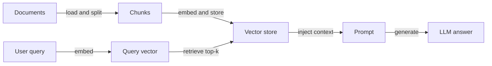
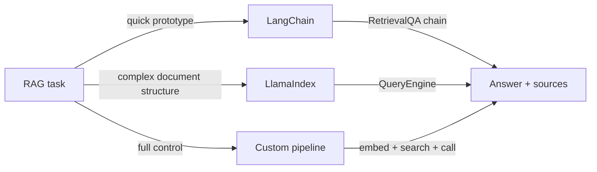

# RAG 示例

## 定义

本页收集了具体的 RAG 示例：简单问答、文档问答和混合搜索，附有可适配的代码。每个示例演示了从文档摄入到答案生成的完整可运行流程。

每个示例都遵循相同的 [RAG](/docs/rag) 流程——索引文档、嵌入查询、检索、生成——但使用不同的框架或选项。目标是提供可以放入自己项目并扩展的起点。根据您的数据量、领域和延迟要求调整[分块](/docs/rag/architecture)、[嵌入](/docs/rag/embeddings)和[向量存储](/docs/rag/vector-databases)。

选择正确的示例取决于您的技术栈：LangChain 适合具有许多内置集成的快速原型；LlamaIndex 擅长结构化文档摄入和多索引查询；自定义管道以更多样板代码为代价提供最大控制。三种方法都产生相同的概念输出——检索到的上下文馈入 LLM 调用。

## 工作原理

### 管道概述



### 框架选择



## 何时使用 / 何时不应使用

| 场景 | 使用这些示例 | 不使用 |
|---|---|---|
| 快速原型问答机器人 | 是——LangChain 示例是最简的 | 否——从头构建自定义管道会增加不必要的时间 |
| 具有自定义分块的生产应用 | 是——自定义管道示例 | 否——框架默认值可能与您的分块策略不匹配 |
| 对结构化数据进行多文档研究 | 是——LlamaIndex 示例 | 否——通用 LangChain 链可能错过文档结构 |
| 适合上下文窗口的单个文档 | 否——直接传递文档 | 是——检索管道是不必要的开销 |
| 混合搜索（语义 + 关键字） | 是——使用带 BM25 的 Chroma 或 Weaviate | 否——单向量搜索可能错过关键字关键查询 |

## 代码示例

### 示例 1：使用 LangChain 的最简 RAG

```python
from langchain_openai import OpenAIEmbeddings, ChatOpenAI
from langchain_community.vectorstores import Chroma
from langchain.text_splitter import RecursiveCharacterTextSplitter
from langchain.chains import RetrievalQA
from langchain_community.document_loaders import TextLoader

# Load and chunk
loader = TextLoader("my_document.txt")
docs = loader.load()
splitter = RecursiveCharacterTextSplitter(chunk_size=500, chunk_overlap=50)
chunks = splitter.split_documents(docs)

# Index
vectorstore = Chroma.from_documents(chunks, OpenAIEmbeddings())

# Retrieve and generate
qa = RetrievalQA.from_chain_type(
    llm=ChatOpenAI(model="gpt-4o-mini"),
    retriever=vectorstore.as_retriever(search_kwargs={"k": 4}),
    return_source_documents=True,
)

result = qa.invoke({"query": "Summarize the main points."})
print(result["result"])
for doc in result["source_documents"]:
    print("Source:", doc.metadata)
```

### 示例 2：使用 LlamaIndex 的文档问答

```python
from llama_index.core import VectorStoreIndex, SimpleDirectoryReader

# Load all documents from a folder
documents = SimpleDirectoryReader("./docs_folder").load_data()

# Build index (embeds and stores automatically)
index = VectorStoreIndex.from_documents(documents)

# Query
query_engine = index.as_query_engine()
response = query_engine.query("What is the refund policy?")
print(response)
```

### 示例 3：混合搜索（稠密 + 关键字）

```python
from langchain_community.retrievers import BM25Retriever
from langchain.retrievers import EnsembleRetriever
from langchain_community.vectorstores import Chroma
from langchain_openai import OpenAIEmbeddings

# Dense retriever
vectorstore = Chroma.from_documents(chunks, OpenAIEmbeddings())
dense_retriever = vectorstore.as_retriever(search_kwargs={"k": 4})

# Sparse (BM25) retriever
bm25_retriever = BM25Retriever.from_documents(chunks)
bm25_retriever.k = 4

# Hybrid: combine both with equal weight
hybrid_retriever = EnsembleRetriever(
    retrievers=[bm25_retriever, dense_retriever],
    weights=[0.5, 0.5],
)

results = hybrid_retriever.invoke("product return window")
for r in results:
    print(r.page_content[:200])
```

## 实用资源

- [LangChain – Question answering](https://python.langchain.com/docs/use_cases/question_answering/) — 使用 LangChain 组件的 RAG 完整演练
- [LlamaIndex – RAG tutorial](https://docs.llamaindex.ai/en/stable/getting_started/starter_example/) — 文档索引和查询的入门示例
- [Chroma – Quickstart](https://docs.trychroma.com/getting-started) — 为开发设置本地向量存储
- [OpenAI Cookbook – RAG](https://cookbook.openai.com/examples/question_answering_using_embeddings) — 使用 OpenAI embeddings 的分步 RAG 示例

## 另请参阅

- [RAG](/docs/rag)
- [RAG 架构](/docs/rag/architecture)
- [Tools: LangChain](/docs/tools/langchain)
- [Tools: LlamaIndex](/docs/tools/llamaindex)
