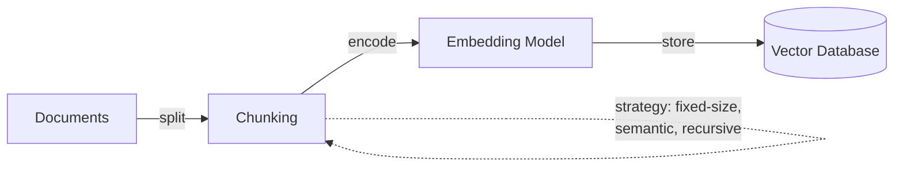
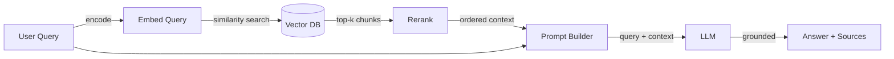

# 检索增强生成（RAG）

## 定义

**检索增强生成（RAG）**是一种用外部检索步骤增强大语言模型的技术：给定用户查询，系统首先从知识源（通常是向量存储或搜索索引）检索相关文档，然后将这些文档作为上下文传递给 LLM 以生成有根据的答案。这种方法通过将模型的输出锚定在真实可验证的数据中来减少幻觉，而不是仅仅依赖预训练期间编码的知识。

RAG 作为两个极端之间的实用折衷方案出现——使用没有领域知识的通用 LLM，以及在特定领域数据上微调模型。原始的 RAG 架构由 [Lewis et al. (2020)](https://arxiv.org/abs/2005.11401) 在 Facebook AI 提出，将检索器（基于稠密段落检索）与序列到序列生成器（BART）相结合。此后，该模式已演变为广泛采用的架构模式，在分块策略、检索方法和生成技术方面有许多变体。

RAG 在企业和生产环境中尤为重要，因为它使组织能够利用专有数据或频繁变化的数据，而无需模型微调的成本和复杂性。它还支持**来源引用**——系统可以指向告知其答案的确切文档，这对于法律、医疗和金融等领域的信任、合规性和可审计性至关重要。

## 工作原理

### 索引（离线）

在 RAG 能够回答查询之前，您的知识库必须被索引。文档被分割成块（段落、章节或滑动窗口），每个块使用[嵌入模型](/docs/rag/embeddings)转换为稠密向量，生成的向量存储在[向量数据库](/docs/rag/vector-databases)中。分块策略显著影响检索质量——块太大会稀释相关性，块太小会丢失上下文。



### 检索（查询时）

当用户发送查询时，使用相同的模型对其进行嵌入，系统对向量数据库执行相似性搜索（余弦或点积）以检索最相关的前 k 个块。高级 RAG 管道在初始检索后添加**重排序**步骤以提高精确度——交叉编码器模型对每个检索到的块与查询进行评分并重新排序。

### 生成（查询时）

检索到的块与原始查询一起作为上下文注入到 LLM 提示词中。LLM 生成基于此上下文的有根据的答案。提示词设计在这里很重要——"仅使用提供的上下文回答"等指令有助于减少幻觉，而"如果上下文不包含答案，请说明"则可以防止捏造。



## 何时使用 / 何时不应使用

| 适合使用 | 避免使用 |
|----------|------------|
| 知识频繁变化（文档、FAQ、政策），重新训练不切实际 | 知识是静态的，且足够小，可以完全放入提示词上下文窗口 |
| 需要基于私有或特定领域数据的答案 | 需要模型学习新的行为或风格（微调更好） |
| 来源引用和可审计性是要求 | 延迟极为关键，检索步骤增加了不可接受的延迟 |
| 希望保持低成本——不需要训练计算 | 该领域需要对整个语料库进行推理，而不仅仅是检索到的块 |
| 需要查询多个数据源（多索引 RAG） | 数据主要是结构化/表格形式（SQL 或结构化查询可能更合适） |

## 比较

| 标准 | RAG | 微调 |
|----------|-----|-------------|
| 知识更新速度 | 即时（更新索引） | 慢（重新训练模型） |
| 成本 | 低（推理 + 嵌入） | 高（训练计算 + 托管） |
| 幻觉控制 | 强（基于检索的文档） | 适中（取决于训练数据质量） |
| 来源引用 | 原生支持（检索到的块可追踪） | 不支持 |
| 自定义行为/风格 | 有限 | 强 |
| 配置复杂度 | 适中（分块 + 向量数据库 + 检索） | 高（数据集整理 + 训练管道） |

## 优缺点

| 优点 | 缺点 |
|------|------|
| 通过锚定真实数据减少幻觉 | 检索质量在很大程度上取决于分块和嵌入选择 |
| 知识变化时无需重新训练 | 检索步骤增加了延迟 |
| 支持来源引用，提高信任和合规性 | 需要维护向量数据库和索引管道 |
| 适用于任何 LLM（API 或自托管） | 上下文窗口限制了可以传递的块数量 |
| 对于大多数用例，成本低于微调 | "垃圾进，垃圾出"——文档质量差会传播到答案中 |

## 基准测试

- [RAGAS](https://docs.ragas.io/) — 评估 RAG 管道的框架（忠实度、答案相关性、上下文精确度/召回率）
- [MTEB Leaderboard](https://huggingface.co/spaces/mteb/leaderboard) — 与 RAG 检索质量相关的嵌入模型基准测试
- [RGB Benchmark](https://arxiv.org/abs/2309.01431) — 在噪声、拒绝、整合和反事实场景中对检索增强生成进行基准测试

## 代码示例

### 使用 LangChain 的基础 RAG 管道（Python）

```python
from langchain_community.vectorstores import Chroma
from langchain_openai import OpenAIEmbeddings, ChatOpenAI
from langchain_core.prompts import ChatPromptTemplate

# 1. Index documents (one-time or incremental)
embeddings = OpenAIEmbeddings(model="text-embedding-3-small")
vectorstore = Chroma.from_documents(documents, embeddings)

# 2. Retrieve relevant chunks
query = "What is retrieval-augmented generation?"
docs = vectorstore.similarity_search(query, k=4)
context = "\n\n".join(d.page_content for d in docs)

# 3. Generate grounded answer
prompt = ChatPromptTemplate.from_messages([
    ("system", "Answer using only the context below. If the context "
               "doesn't contain the answer, say 'I don't know'.\n\n{context}"),
    ("human", "{question}"),
])

llm = ChatOpenAI(model="gpt-4o")
chain = prompt | llm
answer = chain.invoke({"context": context, "question": query})
print(answer.content)
```

### 使用 LlamaIndex 的 RAG（Python）

```python
from llama_index.core import VectorStoreIndex, SimpleDirectoryReader

# 1. Load and index documents
documents = SimpleDirectoryReader("./data").load_data()
index = VectorStoreIndex.from_documents(documents)

# 2. Query with built-in retrieval + generation
query_engine = index.as_query_engine(similarity_top_k=4)
response = query_engine.query("What is RAG?")
print(response)

# Access source nodes for citation
for node in response.source_nodes:
    print(f"Source: {node.metadata['file_name']} (score: {node.score:.3f})")
```

## 实用资源

- [RAG paper — Lewis et al. (2020)](https://arxiv.org/abs/2005.11401) — 介绍检索增强生成的原始研究论文
- [LangChain RAG tutorial](https://python.langchain.com/docs/tutorials/rag/) — 使用 LangChain 构建 RAG 管道的分步指南
- [LlamaIndex RAG guide](https://docs.llamaindex.ai/en/stable/understanding/rag/) — 关于 RAG 概念和实现的官方 LlamaIndex 文档
- [Vertex AI RAG and grounding](https://cloud.google.com/vertex-ai/docs/generative-ai/grounding/overview) — Google Cloud 上使用 Vertex AI 的 RAG
- [Pinecone RAG guide](https://www.pinecone.io/learn/retrieval-augmented-generation/) — 涵盖分块、嵌入和检索策略的实用指南

## 另请参阅

- [RAG 架构](/docs/rag/architecture)
- [向量数据库](/docs/rag/vector-databases)
- [嵌入](/docs/rag/embeddings)
- [RAG 示例](/docs/rag/examples)
- [LLMs](/docs/llms)
- [LangChain](/docs/tools/langchain)
- [LlamaIndex](/docs/tools/llamaindex)
