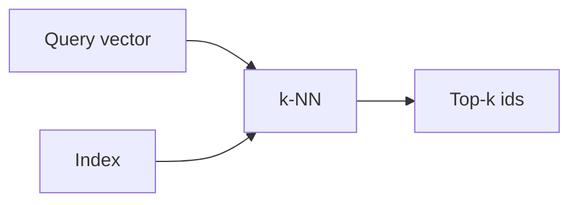

# 向量数据库

## 定义

向量数据库存储高维向量（嵌入）并支持快速相似性搜索 (例如 k-NN, approximate nearest neighbor). 它们是 the backbone of 检索 in RAG.

They 位于之间 [embeddings](/docs/rag/embeddings) (which produce the vectors) and the [RAG](/docs/rag) retriever (which needs the top-k chunks). 与…不同 keyword search, they support semantic similarity: “customer support” can match “help desk” if the [embedding](/docs/rag/embeddings) model maps them close together. See [RAG architecture](/docs/rag/architecture) for how the index fits into the full pipeline.

## 工作原理

Documents are [embedded](/docs/rag/embeddings) and their vectors 被写入一个 **index** (例如 HNSW, IVF, or flat for small datasets). At query time, the **query vector** is compared against the index via **k-NN** (or approximate k-NN for scale); the index returns **top-k ids** (and optionally the vectors or stored metadata). You then fetch the corresponding chunks and pass them to the LLM. Options include Pinecone, Weaviate, Chroma, pgvector, and others; choice depends on scale, latency, and whether you need metadata filtering.

## 应用场景

Vector stores are used whenever you need fast similarity search over many embeddings (RAG, recommendations, dedup).

- Storing and querying document embeddings for RAG
- Real-time similarity search at scale (例如 recommendations, dedup)
- Combining vector search with metadata filters (例如 by date, category)

## 外部文档

- [Chroma – Get started](https://docs.trychroma.com/getting-started)
- [Pinecone – Vector database docs](https://docs.pinecone.io/)
- [pgvector](https://github.com/pgvector/pgvector) — Vector similarity search in PostgreSQL

## 另请参阅

- [RAG](/docs/rag)
- [Embeddings](/docs/rag/embeddings)
- [Semantic search](/docs/semantic-search)
