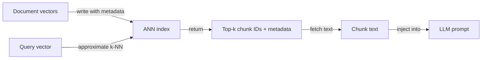
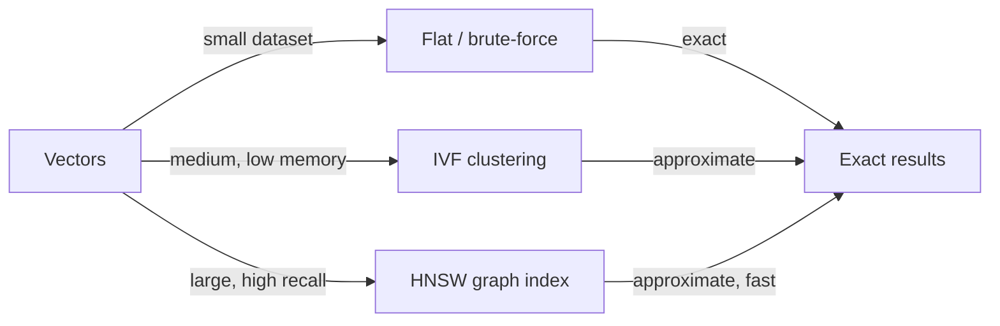

# 向量数据库

## 定义

向量数据库存储高维向量（[嵌入](/docs/rag/embeddings)）并使用 k 近邻（k-NN）和近似近邻（ANN）等算法支持快速相似性搜索。它们是 [RAG](/docs/rag) 系统中检索层的骨干，支持在数百万个文档块上进行大规模语义搜索。

它们位于[嵌入](/docs/rag/embeddings)（产生向量）和 [RAG](/docs/rag) 检索器（需要给定查询的 top-k 块）之间。与传统的基于关键字的数据库不同，向量数据库测量**语义距离**："客户支持"可以匹配"帮助台"，如果嵌入模型将它们放置在一起。大多数向量数据库也支持元数据过滤——您可以将检索限制为来自特定日期、类别或来源的文档。

选择正确的向量数据库取决于您的要求：托管与自托管、规模（数千与数亿向量）、元数据过滤功能、混合搜索支持（稠密 + 稀疏）以及是否需要多租户或访问控制。有关索引如何融入完整管道，请参阅 [RAG 架构](/docs/rag/architecture)。

## 工作原理

### 索引和查询



### 索引类型



文档被[嵌入](/docs/rag/embeddings)，其向量被写入**索引**（如 HNSW、IVF 或小数据集的平面索引）。在查询时，**查询向量**通过 **k-NN**（或大规模的近似 k-NN）与索引比较；索引返回 **top-k IDs** 和可选存储的元数据。然后您获取相应的块并将它们传递给 LLM。HNSW（层级可导航小世界）是最流行的 ANN 算法——它以高召回率提供亚线性查询时间。平面索引是精确的但 O(n)，只适用于小数据集。

## 何时使用 / 何时不应使用

| 场景 | 使用向量数据库 | 不使用向量数据库 |
|---|---|---|
| 对大型文档语料库进行语义搜索 | 是——ANN 索引处理规模 | 否——如果只需要精确短语匹配，则使用关键字搜索 |
| 具有数百万块的 RAG | 是——专为向量规模构建 | 否——带 pgvector 的关系型数据库在 ~1M 向量以下可能足够 |
| 混合搜索（语义 + BM25） | 是——Weaviate、Qdrant 原生支持混合 | 否——如果查询始终是语义的，则使用纯稠密 |
| 具有隔离命名空间的多租户 SaaS | 是——Pinecone 和 Weaviate 支持命名空间 | 否——自托管 FAISS 没有多租户 |
| 离线、本地开发 | 是——零基础设施的 Chroma 或 FAISS | 否——托管云数据库为开发增加了成本和网络延迟 |

## 比较

| 数据库 | 托管 | 规模 | 混合搜索 | 元数据过滤器 | 最适合 |
|---|---|---|---|---|---|
| **Pinecone** | 托管云 | 非常大（数十亿） | 是（稀疏 + 稠密） | 是 | 大规模生产，无基础设施管理 |
| **Chroma** | 自托管 / 嵌入式 | 小–中 | 否（仅稠密） | 是 | 本地开发、原型设计、Python 原生 |
| **Weaviate** | 自托管或云 | 大 | 是（BM25 + 稠密） | 是 | 具有混合搜索的生产 |
| **FAISS** | 自托管（库） | 大 | 否 | 否 | 研究、离线批量搜索 |
| **pgvector** | PostgreSQL 扩展 | 中 | 部分（带 FTS） | 是（SQL） | 已在 Postgres 上的团队 |
| **Qdrant** | 自托管或云 | 大 | 是 | 是 | 低延迟、基于 Rust、开源 |

## 优缺点

| 优点 | 缺点 |
|---|---|
| 使用 ANN 索引实现亚线性查询时间 | ANN 引入了与精确搜索的召回率权衡 |
| 开箱即用支持语义相似性 | 向量存储在非常高维度时代价昂贵 |
| 元数据过滤器允许组合语义 + 结构化查询 | 托管服务增加了持续的云成本 |
| 水平扩展以处理大型语料库 | 没有文本的原生理解——依赖嵌入质量 |

## 代码示例

```python
import chromadb
from openai import OpenAI

openai_client = OpenAI()
chroma_client = chromadb.Client()
collection = chroma_client.create_collection("my_docs")

# Helper: embed text
def embed(text: str) -> list[float]:
    return openai_client.embeddings.create(
        model="text-embedding-3-small",
        input=text,
    ).data[0].embedding

# Index documents
documents = [
    "Returns are accepted within 30 days of purchase.",
    "Shipping takes 3–5 business days.",
    "Contact support at support@example.com.",
]
collection.add(
    documents=documents,
    embeddings=[embed(d) for d in documents],
    ids=[f"doc_{i}" for i in range(len(documents))],
)

# Query
query = "What is the return window?"
results = collection.query(
    query_embeddings=[embed(query)],
    n_results=2,
)
for doc in results["documents"][0]:
    print(doc)
```

## 实用资源

- [Chroma – Get started](https://docs.trychroma.com/getting-started) — 适用于 Python 的嵌入式向量存储，非常适合本地开发
- [Pinecone – Vector database docs](https://docs.pinecone.io/) — 托管云向量数据库，具有无服务器和基于 pod 的选项
- [Weaviate – Documentation](https://weaviate.io/developers/weaviate) — 具有原生混合搜索的开源向量数据库
- [FAISS – GitHub](https://github.com/facebookresearch/faiss) — Facebook AI 相似性搜索库，用于本地高性能索引
- [pgvector – GitHub](https://github.com/pgvector/pgvector) — PostgreSQL 的向量相似性搜索扩展

## 另请参阅

- [RAG](/docs/rag)
- [嵌入](/docs/rag/embeddings)
- [RAG 架构](/docs/rag/architecture)
- [语义搜索](/docs/semantic-search)
