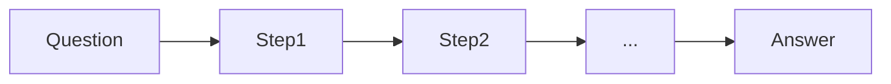

# 思维链 (CoT)

## 定义

思维链（CoT）提示要求模型输出中间推理步骤 before the final answer. This often improves accuracy on math, logic, and multi-step tasks.

它是 one of the simplest [推理 patterns](/docs/reasoning-patterns): 无工具或搜索，仅使用提示. 当…时使用 the task benefits from explicit steps (例如 arithmetic, deduction) and you want to avoid [fine-tuning](/docs/llms/fine-tuning). For exploring multiple solution paths, see [tree of thoughts](/docs/reasoning-patterns/tot); for tool-using agents, see [ReAct](/docs/reasoning-patterns/react).

## 工作原理

你给模型一个**问题**（或任务），让它逐步推理。模型产生**步骤1**、**步骤2**、… (intermediate 推理) and then the **answer**. **Zero-shot CoT**: add “Let’s think 逐步” (or similar) to the prompt. **Few-shot CoT**: include example (question, steps, answer) triples so the model mimics the format. The model generates the sequence in one pass; you can optionally parse the steps and verify or score them. Quality depends on [prompt engineering](/docs/llms/prompt-engineering) and model capability.

## 应用场景

Chain-of-thought 在任务受益于明确的中间步骤时最有用 (数学、逻辑、代码).

- Math and arithmetic where intermediate steps improve accuracy
- Logic puzzles and multi-step deduction
- Code or 设计 推理 where showing steps aids debugging

## 外部文档

- [Chain-of-Thought Prompting (Wei et al.)](https://arxiv.org/abs/2201.11903) — CoT paper
- [OpenAI – Prompt engineering](https://platform.openai.com/docs/guides/prompt-engineering) — Includes 推理 and step-by-step guidance

## 另请参阅

- [Tree of thoughts](/docs/reasoning-patterns/tot)
- [Prompt engineering](/docs/llms/prompt-engineering)
