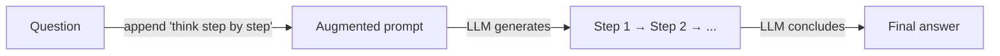
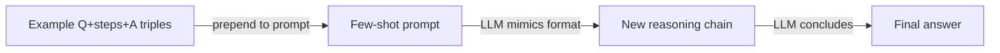

# 思维链（CoT）

## 定义

思维链（CoT）提示要求模型在最终答案之前输出中间推理步骤。通过强制模型使推理明确而不是直接跳到结论，这通常可以提高数学、逻辑和多步骤任务的准确性。

CoT 有效是因为语言模型是自回归的：每个生成的 token 都关注先前的 token。通过首先生成一系列推理步骤，模型本质上将其最终答案建立在更结构化和详细的上下文之上——减少了由于跳过步骤或做出隐含假设而导致的错误。

这是最简单的[推理模式](/docs/reasoning-patterns)之一：没有工具或搜索，只有提示词。当任务受益于明确的步骤时使用它（例如算术、演绎），并且您希望避免[微调](/docs/llms/fine-tuning)。要探索多个解决方案路径，请参阅[思维树](/docs/reasoning-patterns/tot)；对于使用工具的智能体，请参阅 [ReAct](/docs/reasoning-patterns/react)。

## 工作原理

### 零样本 CoT



### 少样本 CoT



您给模型一个**问题**（或任务），让它逐步推理。模型生成**步骤 1**、**步骤 2**、…（中间推理）然后是**答案**。**零样本 CoT**：在提示词中添加"让我们逐步思考"（或类似内容）——不需要示例。**少样本 CoT**：包含示例（问题、步骤、答案）三元组，使模型模仿格式。模型在一次传递中生成完整序列；您可以选择解析步骤并验证或评分。质量取决于[提示词工程](/docs/prompt-engineering)和模型能力。

## 何时使用 / 何时不应使用

| 场景 | 使用 CoT | 不使用 CoT |
|---|---|---|
| 多步算术或代数 | 是——中间步骤防止计算错误 | 否——简单的单步数学不需要 |
| 逻辑演绎或推理 | 是——明确的步骤使推理可审计 | 否——事实查找任务不受益 |
| 代码规划或设计决策 | 是——在代码之前写出步骤可以减少错误 | 否——从模板生成样板 |
| 高量低延迟推理 | 否——额外的 tokens 增加成本和延迟 | 是——对于简单的分类或提取要避免 |
| 具有强大内置推理的模型 | 也许——较新的模型在内部推理（o1、o3） | 是——在思考模型上强制明确的 CoT 增加了冗余 |

## 比较

| 标准 | CoT | 自我一致性 | 退步提示 |
|---|---|---|---|
| 核心思想 | 单一推理链 | 多个 CoT 路径 + 多数投票 | 先抽象问题，然后回答 |
| 可靠性 | 适中——一个路径可能出错 | 高——投票过滤错误 | 高——抽象减少混乱 |
| 成本（API 调用） | 1 次调用 | N 次调用（通常 5–20） | 2 次调用 |
| 最适合 | 数学、逻辑、多步骤任务 | 具有可验证答案的任务 | 知识密集型、复杂问题 |
| 可组合性 | 独立或作为构建块 | 在 CoT 基础上构建 | 在 CoT 基础上构建 |

## 优缺点

| 优点 | 缺点 |
|---|---|
| 简单实现——只需提示词工程 | 增加输出长度和 token 成本 |
| 不需要微调或特殊训练 | 模型可能生成合理但错误的步骤 |
| 使推理可检查和可调试 | 对需要外部信息的任务没有帮助 |
| 适用于许多领域（数学、逻辑、代码） | 对小模型的效益低于大模型 |

## 代码示例

```python
from openai import OpenAI

client = OpenAI()

SYSTEM_PROMPT = (
    "You are a careful reasoning assistant. "
    "When solving problems, always show your reasoning step by step "
    "before giving the final answer."
)

def cot_query(question: str) -> str:
    response = client.chat.completions.create(
        model="gpt-4o-mini",
        messages=[
            {"role": "system", "content": SYSTEM_PROMPT},
            {"role": "user", "content": question},
        ],
    )
    return response.choices[0].message.content

# Few-shot example
FEW_SHOT = """
Q: Roger has 5 tennis balls. He buys 2 more cans of tennis balls. Each can has 3 balls. How many does he have?
A: Roger starts with 5 balls. He buys 2 cans × 3 balls = 6 balls. Total: 5 + 6 = 11 balls.

Q: {question}
A:"""

def few_shot_cot(question: str) -> str:
    response = client.chat.completions.create(
        model="gpt-4o-mini",
        messages=[{"role": "user", "content": FEW_SHOT.format(question=question)}],
    )
    return response.choices[0].message.content

print(cot_query("A store has 40 apples. They sell 15 and receive 3 new shipments of 10. How many are left?"))
```

## 实用资源

- [Chain-of-Thought Prompting (Wei et al.)](https://arxiv.org/abs/2201.11903) — 介绍 CoT 提示词的原始论文
- [OpenAI – Prompt engineering](https://platform.openai.com/docs/guides/prompt-engineering) — 包括推理和逐步指导
- [Self-consistency improves CoT (Wang et al.)](https://arxiv.org/abs/2203.11171) — 多个 CoT 路径的多数投票以提高可靠性

## 另请参阅

- [推理模式](/docs/reasoning-patterns)
- [思维树](/docs/reasoning-patterns/tot)
- [提示词工程](/docs/prompt-engineering)
- [自我一致性](/docs/prompt-engineering/self-consistency)
- [退步提示](/docs/prompt-engineering/step-back-prompting)
