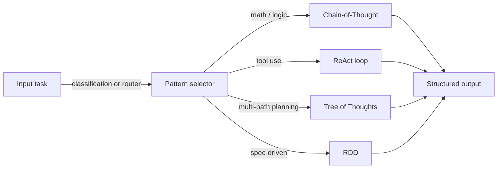
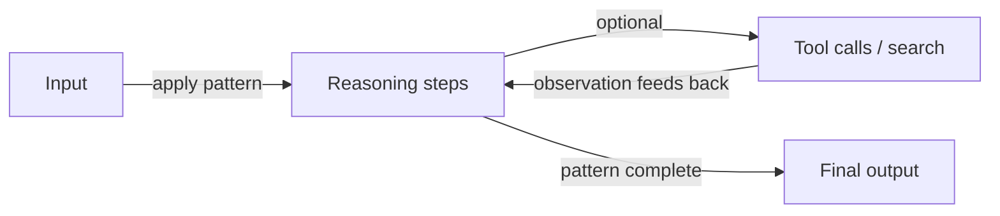

# 推理模式

## 定义

推理模式是引出或组织模型推理的结构化方式：思维链（逐步）、思维树（探索分支）、ReAct（推理 + 行动）和 RDD（检索-决策-设计），等等。使用清晰的模式可以提高**可靠性**（更一致的推理）和**可调试性**（您可以检查步骤或操作）。

它们用于[提示工程](/docs/prompt-engineering)（例如 CoT）和[智能体](/docs/agents)内部（例如 ReAct、RDD）。没有推理模式，模型往往会产生跳过步骤的扁平、无结构的响应——推理模式充当支架，使模型的思维过程明确、可检查和可纠正。模式也可以组合：CoT 可以在 ReAct 智能体的思考步骤中运行，ToT 可以将候选项输入 RDD 决策循环。

选择模式取决于任务复杂性、可用计算量以及系统是否能访问外部工具或知识。CoT 是成本最低的起点；ReAct 增加了工具使用；ToT 增加了对多个路径的搜索；RDD 增加了基于规范的合规性。大多数生产系统至少组合两种模式。

## 工作原理

### 模式选择



### 通用推理循环



您将**输入**（问题、任务）送入**模式**：模式限制了模型如何推理或行动（例如"逐步思考"，或思想-行动-观察循环）。模型产生**输出**（答案、动作序列）。提示词或系统设计鼓励模型展示推理（例如"逐步思考"）或将思想与行动交织。模式可以组合（例如 [CoT](/docs/reasoning-patterns/cot) 在[智能体](/docs/agents)循环中）。有关每个模式的详细信息，请参阅链接页面。

## 何时使用 / 何时不应使用

| 场景 | 使用推理模式 | 不使用 |
|---|---|---|
| 多步数学、逻辑或编码 | 是——CoT 显著提高准确性 | 否——单次提示通常在复杂推理上失败 |
| 使用工具的智能体 | 是——ReAct 用思想结构化每个动作 | 否——不经推理直接调用工具会增加错误 |
| 规划许多解决方案分支 | 是——ToT 探索和评分替代方案 | 否——如果通常有一个路径是正确的，CoT 更便宜 |
| 需要规范合规的任务 | 是——RDD 执行检索到的规范 | 否——创意开放式任务的自由生成 |
| 简单的事实查找 | 否——推理模式增加不必要的成本 | 是——直接检索或查找更快 |

## 比较

| 模式 | 核心机制 | 成本 | 最佳任务类型 | 可组合 |
|---|---|---|---|---|
| 思维链（CoT） | 顺序推理步骤 | 低（1 次调用） | 数学、逻辑、演绎 | ReAct、ToT、RDD |
| 思维树（ToT） | 分支、评分、扩展 | 高（N 次调用） | 规划、搜索、创意 | 每分支 CoT |
| ReAct | 思想–行动–观察循环 | 中（1 次调用 + 工具） | 使用工具的智能体 | CoT、RDD |
| RDD | 检索规范 → 决策 → 生成 → 验证 | 中–高 | 合规、规范驱动生成 | ReAct、RAG |

## 优缺点

| 优点 | 缺点 |
|---|---|
| 使模型推理明确且可检查 | 增加 tokens（成本和延迟） |
| 显著提高结构化任务的准确性 | 为任务选择错误的推理模式会损害质量 |
| 通过检查中间步骤实现调试 | 并非所有模型都可靠地遵循模式 |
| 可组合——模式可以嵌套或组合 | 复杂组合增加了提示工程的工作量 |

## 代码示例

```python
from openai import OpenAI

client = OpenAI()

def chain_of_thought(question: str) -> str:
    """Zero-shot CoT: append 'Let's think step by step' to elicit reasoning."""
    response = client.chat.completions.create(
        model="gpt-4o-mini",
        messages=[
            {
                "role": "user",
                "content": f"{question}\n\nLet's think step by step.",
            }
        ],
    )
    return response.choices[0].message.content

answer = chain_of_thought("If a train travels 60 km/h for 2.5 hours, how far does it go?")
print(answer)
```

## 实用资源

- [Chain-of-Thought Prompting (Wei et al.)](https://arxiv.org/abs/2201.11903) — 建立逐步推理的原始 CoT 论文
- [ReAct: Synergizing Reasoning and Acting (Yao et al.)](https://arxiv.org/abs/2210.03629) — 介绍思想-行动-观察循环的 ReAct 论文
- [Tree of Thoughts (Yao et al.)](https://arxiv.org/abs/2305.10601) — 关于多路径推理和搜索的 ToT 论文
- [Anthropic – Prompt engineering overview](https://docs.anthropic.com/en/docs/build-with-claude/prompt-engineering/overview) — CoT 和结构化推理的实用指南

## 另请参阅

- [思维链](/docs/reasoning-patterns/cot)
- [思维树](/docs/reasoning-patterns/tot)
- [ReAct](/docs/reasoning-patterns/react)
- [RDD](/docs/reasoning-patterns/rdd)
