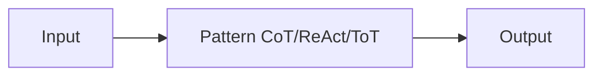

# 推理模式

## 定义

推理模式是引出或组织模型推理的结构化方法: chain-of-thought (step-by-step), tree-of-thoughts (explore branches), ReAct (reason + act), and RDD (检索-决策-设计), among others. Using a clear pattern improves **reliability** (more consistent 推理) and **debuggability** (you can inspect steps or actions).

它们是 used in [prompt engineering](/docs/prompt-engineering) (例如 CoT) and inside [agents](/docs/agents) (例如 ReAct, RDD). Choosing a pattern depends on the task: CoT for math/推理, ReAct for tool use, ToT for search/planning, RDD for spec compliance.

## 工作原理

You feed **input** (question, task) into a **pattern**: the pattern constrains how the model reasons or acts (例如 “think 逐步”, or thought–action–observation loops). The model produces an **output** (answer, action sequence). Prompts or system 设计 encourage the model to show 推理 (例如 “Think 逐步”) or to interleave thought and action. Patterns can be combined (例如 [CoT](/docs/reasoning-patterns/cot) inside an [agent](/docs/agents) loop). See the linked pages for each pattern’s details.

## 应用场景

Different patterns suit different needs: CoT for stepwise 推理, ReAct for tool use, ToT for search and planning.

- CoT: math, logic, and multi-step 推理 tasks
- ReAct: tool-using agents that reason before each action
- ToT: search and planning over multiple solution branches

## 外部文档

- [Chain-of-Thought Prompting (Wei et al.)](https://arxiv.org/abs/2201.11903) — CoT paper
- [ReAct: Synergizing Reasoning and Acting (Yao et al.)](https://arxiv.org/abs/2210.03629) — ReAct paper
- [Tree of Thoughts (Yao et al.)](https://arxiv.org/abs/2305.10601) — ToT paper

## 另请参阅

- [Chain-of-thought](/docs/reasoning-patterns/cot)
- [Tree of thoughts](/docs/reasoning-patterns/tot)
- [ReAct](/docs/reasoning-patterns/react)
- [RDD](/docs/reasoning-patterns/rdd)
