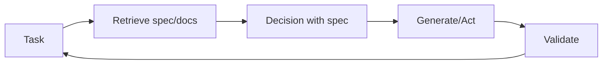

# 检索-决策-设计 (RDD)

## 定义

**RDD (检索-决策-设计)** 是一种将以下内容联系在一起的推理模式 **检索** (fetching relevant specs, docs, or examples), **决策** (making choices aligned with specs or policies), and **设计** (producing outputs that satisfy requirements). 它是 often used in spec-driven development: behavior is guided by explicit specifications that are retrieved and enforced during generation.

## 工作原理

1. **Retrieval:** Given the current task, retrieve relevant specification fragments, examples, or constraints (例如 from a vector store or structured specs).
2. **Decision:** Use the retrieved context to decide next steps, allowed actions, or output format.
3. **设计：**按照规范生成或执行；可选地针对规范验证输出。

这可以在[代理](/docs/agents)循环中实现：检索规范 → 在上下文中使用规范推理 → 行动或生成 → validate → repeat. The diagram below shows the cycle: **task** triggers **retrieve**; retrieved spec feeds **决策**; **generate/act** produces output; **validate** checks against the spec and can loop back to the task (例如 retry or refine).

## 应用场景

RDD is a fit when outputs must align with retrievable specs (compliance, policy, or documented requirements).

- Spec-driven agents that retrieve requirements and validate outputs
- Compliance and policy-aware generation (例如 legal, safety)
- Code or config generation aligned with documented specs

## 优缺点

| Pros | Cons |
|------|------|
| Outputs align with specs | Requires good spec coverage and 检索 |
| Reduces drift and ad-hoc behavior | Extra 检索 and validation cost |
| Fits regulated or safety-critical flows | Spec 设计 and maintenance overhead |

## 外部文档

- [RAG paper (Lewis et al.)](https://arxiv.org/abs/2005.11401) — Retrieval component used in RDD
- [LangChain – Agents and tools](https://python.langchain.com/docs/concepts/agents/) — Orchestration patterns

## 另请参阅

- [Spec-driven development](/docs/spec-driven-development)
- [RAG](/docs/rag)
- [Agents](/docs/agents)
- [ReAct](/docs/reasoning-patterns/react)
