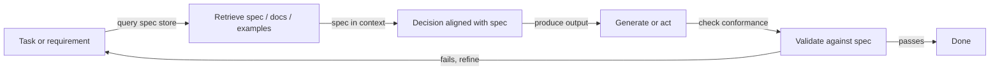
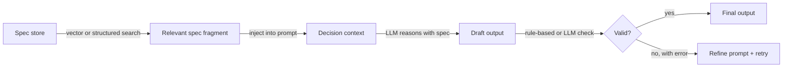

# 检索-决策-设计（RDD）

## 定义

**RDD（检索-决策-设计）** 是一种将**检索**（获取相关规范、文档或示例）、**决策**（做出与规范或策略一致的决定）和**设计**（生成满足要求的输出）结合在一起的推理模式。它常用于规范驱动的开发中：行为由显式规范指导，这些规范在生成过程中被检索和执行。

与从模型内部知识生成推理的 [CoT](/docs/reasoning-patterns/cot)，或将推理与任意工具调用交织的 [ReAct](/docs/reasoning-patterns/react) 不同，RDD 将每个决策约束在检索到的真实来源上。这使其特别适合受监管的领域（法律、合规、安全）或代码或配置必须符合文档规范的工程工作流。

RDD 可以实现为单步管道（检索 → 决策 → 生成 → 验证），也可以作为[智能体](/docs/agents)中的循环，验证失败会触发重新检索和细化。该模式是可组合的：RDD 的检索步骤可以由 [RAG](/docs/rag) 管道驱动，其智能体循环可以使用 [ReAct](/docs/reasoning-patterns/react) 进行步骤级推理。

## 工作原理

### RDD 循环



### 详细步骤



1. **检索：** 给定当前任务，检索相关的规范片段、示例或约束（例如从向量存储或结构化规范中）。
2. **决策：** 使用检索到的上下文来决定下一步、允许的操作或输出格式——在推理过程中规范始终在上下文中。
3. **设计：** 根据规范生成或执行；可选地在返回之前根据规范验证输出。

这可以在[智能体](/docs/agents)循环中实现：检索规范 → 在上下文中使用规范进行推理 → 行动或生成 → 验证 → 重复。验证失败会触发重新检索（可能使用不同的查询）或提示词细化。

## 何时使用 / 何时不应使用

| 场景 | 使用 RDD | 不使用 RDD |
|---|---|---|
| 生成必须符合 API 规范的代码 | 是——检索规范、生成、验证 | 否——没有正式约束的自由编码 |
| 合规驱动的文档生成 | 是——检索策略，生成对齐的输出 | 否——没有严格规则的创意写作 |
| 在受监管领域（法律、安全）中运行的智能体 | 是——每个决策都基于检索到的策略 | 否——没有合规要求的临时问答 |
| 使用版本化设计文档的工程 | 是——规范会变化；RDD 总是检索最新版本 | 否——没有正式规范的简单 CRUD |
| 具有严格延迟预算的实时推理 | 否——检索 + 验证会增加延迟 | 是——直接生成对于无约束任务更快 |

## 比较

| 模式 | 使用检索的知识 | 验证输出 | 规范驱动 | 最适合 |
|---|---|---|---|---|
| CoT | 否（模型内部知识） | 否 | 否 | 数学、逻辑 |
| ReAct | 通过工具调用 | 否 | 否 | 使用工具的通用智能体 |
| RAG | 是（文档） | 否 | 否 | 知识问答 |
| RDD | 是（规范和文档） | 是 | 是 | 合规、规范驱动的生成 |

## 优缺点

| 优点 | 缺点 |
|---|---|
| 输出与明确检索到的规范对齐 | 需要维护良好、可查询的规范存储 |
| 减少偏差和随意行为 | 额外的检索和验证增加成本和延迟 |
| 审计跟踪：规范片段可在输出中追溯 | 规范覆盖的空白导致约束不足的决策 |
| 可与 RAG 和 ReAct 组合 | 规范设计和维护是其自身持续的工作量 |
| 适合受监管或安全关键的工作流 | 验证逻辑必须与规范更新保持同步 |

## 代码示例

```python
from openai import OpenAI
from langchain_community.vectorstores import Chroma
from langchain_openai import OpenAIEmbeddings

client = OpenAI()
# Assume a Chroma vector store pre-loaded with spec fragments
spec_store = Chroma(
    collection_name="api_spec",
    embedding_function=OpenAIEmbeddings(),
)

def rdd_generate(task: str) -> str:
    # 1. Retrieve relevant spec fragments
    spec_docs = spec_store.similarity_search(task, k=3)
    spec_context = "\n\n".join(d.page_content for d in spec_docs)

    # 2. Decision + Design: generate with spec in context
    prompt = (
        f"You must follow the specifications below exactly.\n\n"
        f"SPECIFICATIONS:\n{spec_context}\n\n"
        f"TASK: {task}\n\n"
        f"Generate an output that strictly complies with the specifications."
    )
    response = client.chat.completions.create(
        model="gpt-4o-mini",
        messages=[{"role": "user", "content": prompt}],
    )
    draft = response.choices[0].message.content

    # 3. Validate (simple: ask model to check conformance)
    validation_prompt = (
        f"Check if the following output complies with the spec. "
        f"Reply with PASS or FAIL and a brief reason.\n\n"
        f"SPEC:\n{spec_context}\n\nOUTPUT:\n{draft}"
    )
    validation = client.chat.completions.create(
        model="gpt-4o-mini",
        messages=[{"role": "user", "content": validation_prompt}],
    ).choices[0].message.content

    if "FAIL" in validation.upper():
        return f"[Validation failed: {validation}]\nDraft:\n{draft}"
    return draft

result = rdd_generate("Generate a JSON API request to create a new user.")
print(result)
```

## 实用资源

- [RAG paper (Lewis et al.)](https://arxiv.org/abs/2005.11401) — 检索组件，用作 RDD 规范检索步骤的基础
- [LangChain – Agents and tools](https://python.langchain.com/docs/concepts/agents/) — 构建 RDD 风格循环的编排模式
- [Constitutional AI (Anthropic)](https://arxiv.org/abs/2212.08073) — 相关思路：使用检索到的原则来指导和验证模型输出

## 另请参阅

- [规范驱动的开发](/docs/spec-driven-development)
- [RAG](/docs/rag)
- [智能体](/docs/agents)
- [ReAct](/docs/reasoning-patterns/react)
