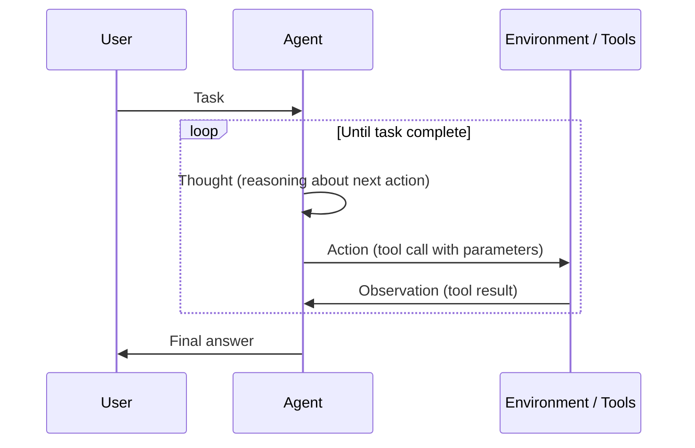
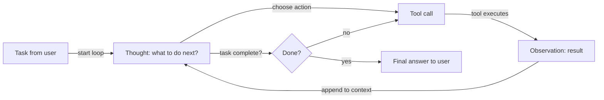

# ReAct (Reasoning + Acting)

## 定义

ReAct 是一种范式，模型交替进行**推理**（接下来做什么、为什么）和**行动**（工具调用）。来自环境的观察反馈到下一个推理步骤中，形成一个循环直到任务完成。这种交织减少了由盲目或重复工具使用引起的错误，因为每个行动前都有明确的理由。

ReAct 论文的核心贡献是证明在单个 LLM 调用中结合推理轨迹和行动步骤的效果优于单独使用任一方法：纯推理（CoT）缺乏事实依据，纯行动（无思考的工具调用）容易出错且难以调试。通过使思考可见，ReAct 还生成了人类可以检查和纠正的可解释智能体轨迹。

这是使用工具的[智能体](/docs/agents)的标准模式。通常与[思维链](/docs/reasoning-patterns/cot)（在思考步骤内推理）结合，以及与 [RDD](/docs/reasoning-patterns/rdd) 结合（当检索到的规范应指导每个决策时）。

## 工作原理

### 思考–行动–观察循环



### 智能体决策流程



提示词格式是**思考 → 行动 → 观察 → 思考 → … → 最终答案**。**用户**给出**任务**；**智能体**产生**思考**（关于做什么的推理），然后是**行动**（例如工具调用）。**环境/工具**返回**观察**，将其追加到下一个思考的上下文中。模型决定何时调用工具以及何时得出结论。LangChain 和 LlamaIndex 等框架实现了带有工具注册和消息处理的 ReAct 风格智能体。

## 何时使用 / 何时不使用

| 场景 | 使用 ReAct | 不使用 ReAct |
|---|---|---|
| 智能体使用多个工具（搜索、计算器、API） | 是——行动前的思考减少工具误用 | 否——如果只需要一个工具，更简单的函数调用就足够了 |
| 需要可调试的智能体行为 | 是——思考轨迹可检查和记录 | 否——对于不需要轨迹的黑盒管道 |
| 具有不断变化上下文的多步骤研究 | 是——每个观察为下一个思考提供信息 | 否——一次性检索 + 生成更快更便宜 |
| 高可靠性任务（例如代码执行） | 是——行动前推理能捕获可能的错误 | 否——对于没有歧义的简单 CRUD 任务 |
| 非常低的延迟要求 | 否——每步生成思考会增加 token | 是——当推理不必要时，直接函数调用更快 |

## 比较

| 模式 | 有明确思考 | 有工具使用 | 循环 | 最适合 |
|---|---|---|---|---|
| CoT | 是 | 否 | 否 | 静态推理任务 |
| ReAct | 是 | 是 | 是 | 使用工具的智能体 |
| 函数调用（无思考） | 否 | 是 | 否 | 简单、确定性的工具调用 |
| RDD | 是（规范引导） | 是 | 是 | 合规和规范驱动的智能体 |

## 优缺点

| 优点 | 缺点 |
|---|---|
| 减少盲目或重复的工具调用 | 每步额外 token（思考开销） |
| 生成可解释、可调试的轨迹 | 如果停止条件弱，循环可能运行过长 |
| 与 LangChain/LlamaIndex 开箱即用配合良好 | 需要定义良好的工具架构和错误处理 |
| 自然处理多步骤任务 | 思考质量取决于底层模型 |

## 代码示例

```python
from langchain_openai import ChatOpenAI
from langchain.agents import create_react_agent, AgentExecutor
from langchain_community.tools import DuckDuckGoSearchRun
from langchain import hub

# Load a pre-built ReAct prompt template
prompt = hub.pull("hwchase17/react")

# Define tools
tools = [DuckDuckGoSearchRun()]

# Create ReAct agent
llm = ChatOpenAI(model="gpt-4o-mini", temperature=0)
agent = create_react_agent(llm=llm, tools=tools, prompt=prompt)
executor = AgentExecutor(agent=agent, tools=tools, verbose=True, max_iterations=5)

# Run — the agent will produce Thought/Action/Observation traces
result = executor.invoke({"input": "What is the current population of Tokyo?"})
print(result["output"])
```

## 实用资源

- [ReAct: Synergizing Reasoning and Acting in LLMs (Yao et al.)](https://arxiv.org/abs/2210.03629) — 原始 ReAct 论文，包含 HotpotQA、Fever 和 ALFWorld 基准测试
- [LangChain – ReAct agent](https://python.langchain.com/docs/concepts/agents/) — LangChain 中带工具注册的 ReAct 风格智能体
- [Anthropic – Tool use guide](https://docs.anthropic.com/en/docs/build-with-claude/tool-use) — Claude 的原生工具使用，遵循 ReAct 风格的思考-行动模式

## 另请参阅

- [智能体](/docs/agents)
- [推理模式](/docs/reasoning-patterns)
- [思维链](/docs/reasoning-patterns/cot)
- [RDD](/docs/reasoning-patterns/rdd)
