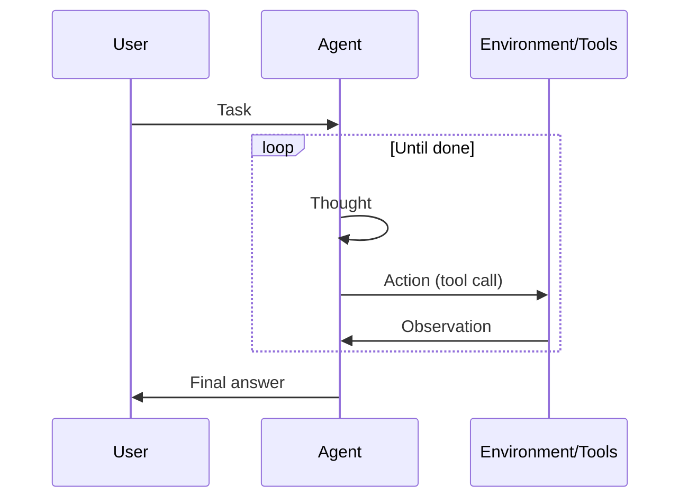

# ReAct (Reasoning + Acting)

## 定义

ReAct 是一种范式，其中模型交替进行**推理**（接下来做什么、为什么）和**行动**（工具调用). 来自环境的观察 feeds back into the next 推理 step, forming a loop until the task is done.

它是 the standard pattern for [agents](/docs/agents) that use tools: each action is preceded by a thought, which reduces blind or repetitive tool use. Often combined with [chain-of-thought](/docs/reasoning-patterns/cot) (推理 inside the thought) and with [RDD](/docs/reasoning-patterns/rdd) when specs guide 决策s.

## 工作原理

提示格式为**思考 → 行动 → 观察 → 思考 → … → 最终答案**。**用户**给出一个**任务**；**代gent** produces a **thought** (推理 about what to do), then an **action** (例如 tool call). The **environment/tools** return an **observation**, which is appended to the context for the next thought. The loop continues until the agent outputs a final answer. The model decides when to call tools and when to conclude, which reduces arbitrary or repetitive actions. The sequence diagram below summarizes this flow; frameworks like LangChain implement ReAct-style agents with tool registration and message handling.

## 应用场景

ReAct fits agent workflows where each tool call should be preceded by a clear 推理 step.

- Agents that use tools (search, calculator, API) with explicit 推理
- Reducing arbitrary or repetitive 工具调用 by interleaving thought
- Debuggable agent behavior via visible thought–action–observation traces

## 外部文档

- [ReAct: Synergizing Reasoning and Acting in LLMs (Yao et al.)](https://arxiv.org/abs/2210.03629) — Original ReAct paper
- [LangChain – ReAct agent](https://python.langchain.com/docs/concepts/agents/) — ReAct-style agents in LangChain

## 另请参阅

- [Agents](/docs/agents)
- [Chain-of-thought](/docs/reasoning-patterns/cot)
- [RDD](/docs/reasoning-patterns/rdd)
