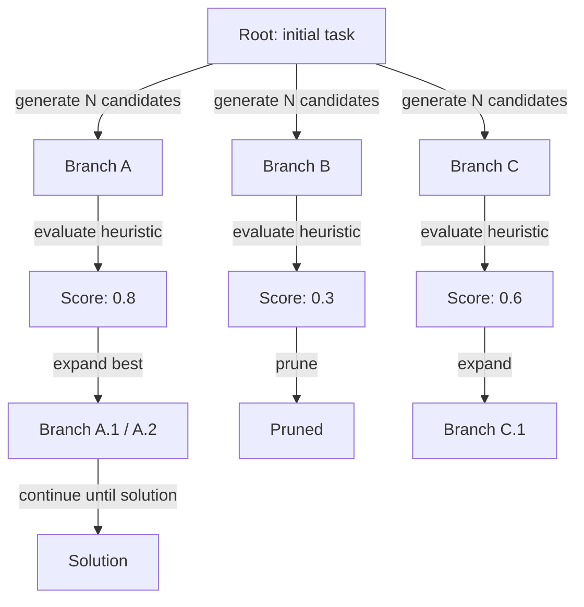
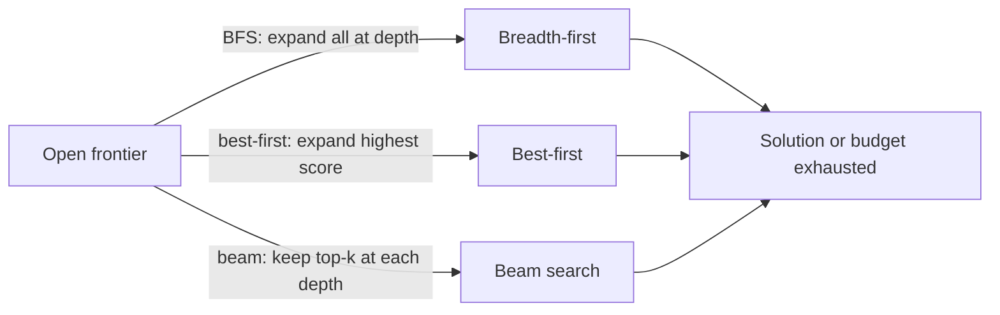

# Tree of thoughts (ToT)

## 定义

思维树（ToT）通过同时维护多条推理分支来扩展 CoT。在每个步骤中，模型生成多个候选续写；启发式函数或独立的评估模型对这些候选进行评分，搜索算法（最优优先、束搜索或 BFS）决定哪些分支需要进一步展开。

核心洞察在于，困难问题——规划、博弈、复杂证明——可能需要回溯或在做出决策前探索多种备选方案。单条[思维链](/docs/reasoning-patterns/cot)路径没有从糟糕的中间步骤中恢复的机制；ToT 则明确维护一个有前途的分支前沿，并修剪无前途的分支，类似于应用于语言生成的经典树搜索算法（MCTS、A*）。

当单条[思维链](/docs/reasoning-patterns/cot)路径可能陷入困境（例如博弈走法、多步规划）且可以承担多次 LLM 调用的代价时使用它。它以算力换取对解空间更好的搜索。完整选项请参见[推理模式](/docs/reasoning-patterns)。

## 工作原理

### 树展开与修剪



### 搜索策略



从**根节点**（例如问题或初始状态）开始。**分支**：在每一步生成若干续写（例如下一个推理步骤或走法）。用启发式函数或独立模型调用对每个分支进行**评分**（例如"这个部分解决方案在 1–10 分的尺度上有多大希望？"）。**展开**最优节点并重复；修剪低分分支以控制成本。树以增量方式构建，直到找到解决方案或达到深度/预算限制。分支因子和最大深度是控制成本/质量权衡的关键超参数。

## 何时使用 / 何时不使用

| 场景 | 使用 ToT | 不使用 ToT |
|---|---|---|
| 涉及多步走法的博弈或谜题求解 | 是——探索分支至关重要 | 否——单路径谜题用 CoT 即可 |
| 需要回溯的复杂多步规划 | 是——ToT 可以从死路中恢复 | 否——简单任务不需要回溯 |
| 有多种有效选项的创意生成 | 是——生成并评分多个草稿 | 否——单一创意输出不需要此方法 |
| 高吞吐量生产推理 | 否——多次 LLM 调用代价高昂 | 是——改用 CoT 或直接提示 |
| 严格的实时约束 | 否——ToT 延迟较高 | 是——不适合亚秒级响应场景 |

## 比较

| 方法 | 探索路径数 | 评分方式 | 成本 | 最适合 |
|---|---|---|---|---|
| CoT | 1 | 无 | 低（1 次调用） | 线性多步任务 |
| 自一致性 | N（并行） | 多数投票 | 中等（N 次调用） | 有可验证答案的任务 |
| ToT | N（顺序，有修剪） | 启发式/模型 | 高（N+ 次调用） | 规划、搜索、创意 |
| MCTS（经典） | N（模拟） | 奖励信号 | 非常高 | 有明确奖励的博弈 AI |

## 优缺点

| 优点 | 缺点 |
|---|---|
| 可探索并从死路中恢复 | token 和 API 成本非常高 |
| 在困难任务上产出质量更高的解答 | 需要一个良好的评分/评估函数 |
| 与经典搜索相似——有原则且可适应 | 与 CoT 相比实现复杂 |
| 分支因子可调以权衡成本与质量 | 并非所有任务都能从多路径搜索中获益 |

## 代码示例

```python
from openai import OpenAI

client = OpenAI()

def generate_thoughts(state: str, n: int = 3) -> list[str]:
    """Generate N candidate next steps from the current state."""
    response = client.chat.completions.create(
        model="gpt-4o-mini",
        messages=[
            {
                "role": "user",
                "content": (
                    f"Current reasoning state:\n{state}\n\n"
                    f"Generate {n} distinct possible next reasoning steps. "
                    "Number each one."
                ),
            }
        ],
    )
    raw = response.choices[0].message.content
    # Simple parse: split on numbered lines
    return [line.strip() for line in raw.split("\n") if line.strip() and line[0].isdigit()]

def score_thought(state: str, thought: str) -> float:
    """Score a thought's promise on a 0-1 scale."""
    response = client.chat.completions.create(
        model="gpt-4o-mini",
        messages=[
            {
                "role": "user",
                "content": (
                    f"Rate how promising this reasoning step is for solving the task "
                    f"(0 = dead end, 1 = very promising).\n\n"
                    f"State: {state}\nThought: {thought}\n\nScore (0.0–1.0):"
                ),
            }
        ],
    )
    try:
        return float(response.choices[0].message.content.strip())
    except ValueError:
        return 0.5

# Simple best-first ToT (depth 2, branching factor 3)
task = "Plan 3 steps to build a minimal RAG chatbot."
candidates = generate_thoughts(task, n=3)
scored = [(thought, score_thought(task, thought)) for thought in candidates]
best = max(scored, key=lambda x: x[1])
print("Best next step:", best[0])
```

## 实用资源

- [Tree of Thoughts (Yao et al.)](https://arxiv.org/abs/2305.10601) — ToT 原始论文，包含 24 点游戏和创意写作基准测试
- [LangChain – Agents and planning](https://python.langchain.com/docs/concepts/agents/) — ToT 及相关规划模式
- [Princeton NLP – ToT repository](https://github.com/princeton-nlp/tree-of-thought-llm) — 论文作者的参考实现

## 另请参阅

- [思维链](/docs/reasoning-patterns/cot)
- [推理模式](/docs/reasoning-patterns)
- [智能体](/docs/agents)
