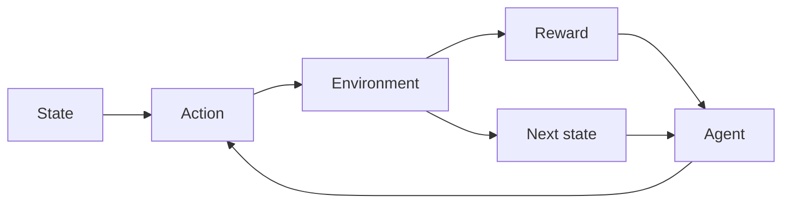

# Reinforcement learning (RL)

## 定义

强化学习训练智能体以最大化累积奖励 in an environment. The agent takes actions, receives observations and rewards, and improves its policy (例如 value-based, policy gradient, actor-critic).

它不同于 [supervised](/docs/fundamentals/machine-learning) and [unsupervised](/docs/fundamentals/machine-learning) learning 因为反馈是 sparse and delayed (rewards), and the agent must explore. Used in games, robotics, and [LLM](/docs/llms) alignment (RLHF). For high-dimensional states/actions, see [deep RL](/docs/drl).

## 工作原理

设置通常是一个 **MDP**：**代理**看到一个**状态**，选择一个**动作**，**环境**返回s a **reward** and **next state**. The agent improves its policy (mapping from state to action) to maximize cumulative reward. **Value-based** methods (例如 Q-learning, DQN) learn a value function and derive the policy; **policy gradient** methods (例如 PPO, SAC) optimize the policy directly. Exploration (例如 epsilon-greedy, entropy bonus) is needed because rewards are only observed for actions taken. Algorithms differ in how they handle off-policy data, continuous actions, and scaling to large state spaces.

## 应用场景

Reinforcement learning applies wherever an agent learns from rewards and sequential 决策s (games, control, alignment).

- Game playing (例如 Atari, Go, poker) and simulation
- Robotics control and continuous control (例如 manipulation)
- LLM alignment (例如 RLHF) and sequential 决策 systems

## 外部文档

- [Reinforcement Learning (Sutton & Barto)](http://incompleteideas.net/book/the-book-2nd.html) — Free online book
- [Spinning Up in Deep RL (OpenAI)](https://spinningup.openai.com/)

## 另请参阅

- [Deep RL](/docs/drl)
- [Machine learning](/docs/fundamentals/machine-learning)
- [Agents](/docs/agents)
